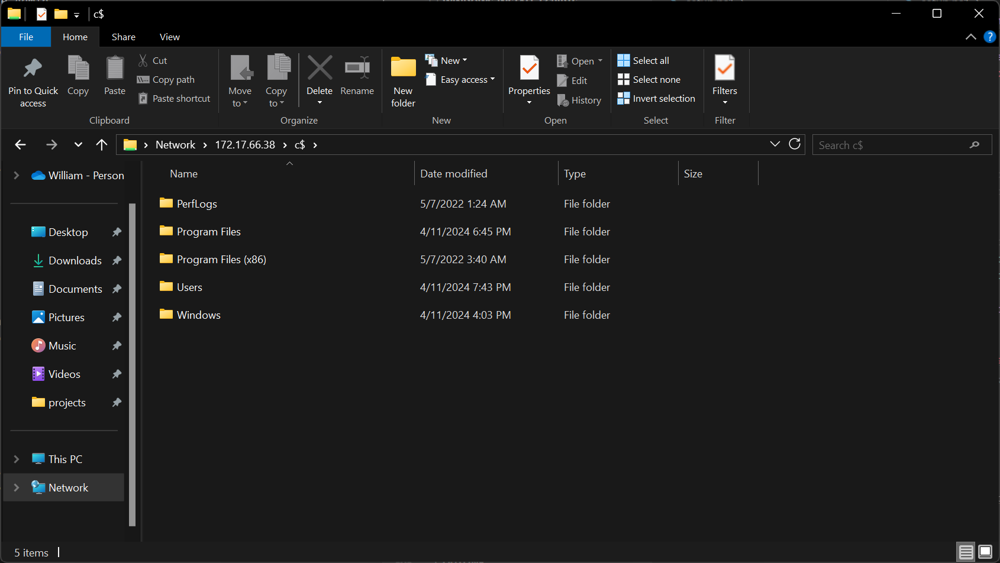

# C$

There are hidden 'administrative' drive shares on every Windows installation. You can view a list of configured shares with the `net share` command:

```txt
C:\Users\liam>net share

Share name   Resource                        Remark

-------------------------------------------------------------------------------
C$           C:\                             Default share
IPC$                                         Remote IPC
ADMIN$       C:\Windows                      Remote Admin
```

You can make use of these for stuff. Some of that stuff is a good idea.

I use this primarily for (fairly) direct filesystem access to guest VMs from my workstations (over an internal network).

# Enabling

This configuration is for the machine hosting the shares you want access to.

File and Printer Sharing must be enabled for the network you're using. You can use PowerShell, netsh, or a MMC (not covered here.)

```Powershell
# yes, this needs to be True, not $true
Set-NetFirewallRule -DisplayGroup 'File And Printer Sharing' -Enabled True -Profile Any
```

netsh:
```txt
netsh advfirewall firewall set rule group="File and Printer Sharing" new enable=Yes
```

If you would like to connect using local account credentials from the guest, the "LocalAccountTokenFilterPolicy" (controls remote access to members of the Administrators group) 32 bit Registry key must be set to "1".

This sidesteps remote access restrictions for privileged accounts which is, of course, a security risk (this whole thing works without granting permissions because local Administrators have access to the drive$ shares, but are blocked from getting at them by default.)

The machines and networks I'd consider doing this on and in are of zero importance. I would recommend figuring something else out if this is not the case for you.

```Powershell
New-ItemProperty 'HKLM:\SOFTWARE\Microsoft\Windows\CurrentVersion\Policies\System' -Name LocalAccountTokenFilterPolicy -Value 1 -PropertyType DWORD -Force
```

For your ^C ^V pleasure:

```PowerShell
Set-NetFirewallRule -DisplayGroup 'File And Printer Sharing' -Enabled True -Profile Any

$PoliciesSystemPath = 'HKLM:\SOFTWARE\Microsoft\Windows\CurrentVersion\Policies\System'
$LATFP = 'LocalAccountTokenFilterPolicy'

$PathAndName = @{
    Path = $PoliciesSystemPath
    Name = $LATFP
}

if (-not (Test-Path $PoliciesSystemPath) ) {
    New-Item $PoliciesSystemPath
}

if (-not (Get-ItemProperty @PathAndName) ) {
    New-ItemProperty -Name $LATFP -Value 1 -PropertyType DWORD
}

if ((Get-ItemProperty @PathAndName).$LATFP -ne 1) {
    Set-ItemProperty @PathAndName -Value 1
}
```

You can access the administrative shares by navigating to `\\computer\drive-letter$` (here `\\172.17.66.38\C$`):



# Disabling

```Powershell
Remove-ItemProperty 'HKLM:\SOFTWARE\Microsoft\Windows\CurrentVersion\Policies\System' -Name LocalAccountTokenFilterPolicy
```

Optionally, disable file and printer sharing:

```Powershell
Set-NetFirewallRule -DisplayGroup "File And Printer Sharing" -Enabled False -Profile Any
```