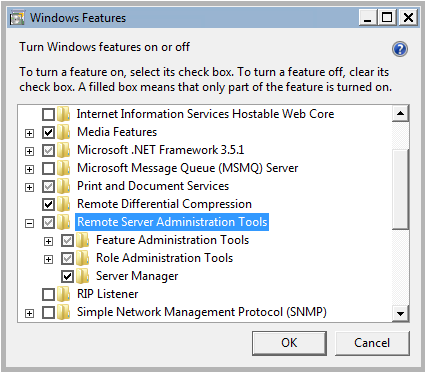
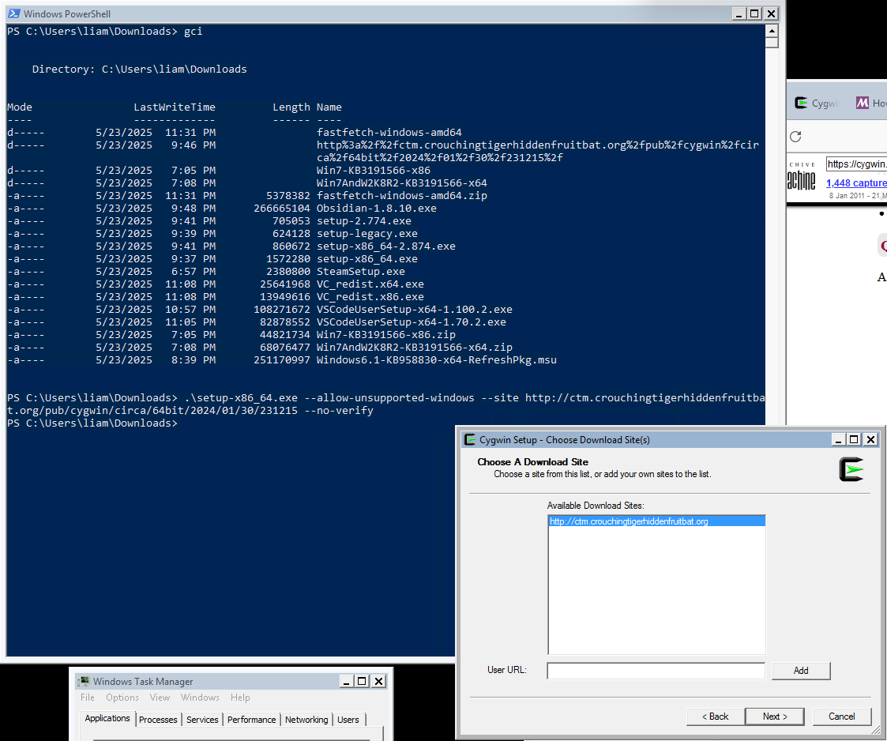
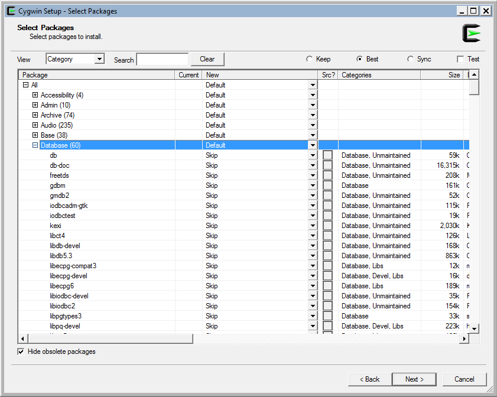
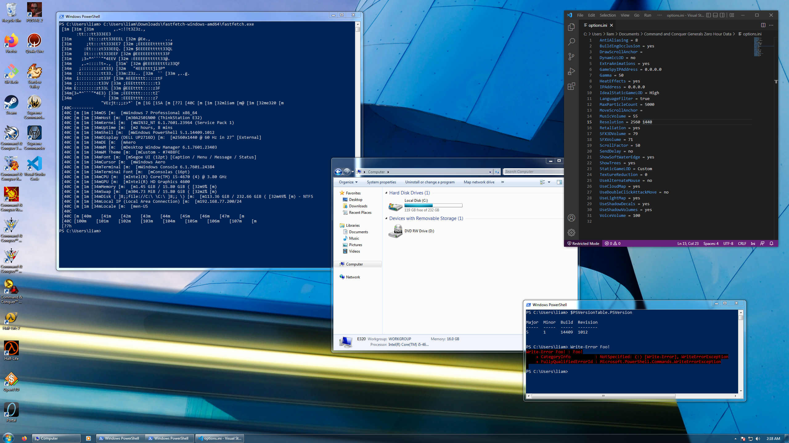

## Why on earth would you want to do that?

Windows 7 is great and I would love it if the whole world knew what kind of Content I watch. More seriously, I wanted to briefly play an old Command & Conquer game and didn't feel like tinkering with my Windows 11 box. Plus, nostalgia.

## Hardware

I will be using relatively appropriate hardware.

I briefly tried a NUC7, but it doesn't really have any USB 2 ports, so getting through setup is annoying.

Previously, I've run W7 on my ThinkPad T430 (fully supported, works great!) but it's a bit slow (has an i5-3320m), the screen sucks, and the battery is long shot.

Today, we'll be using a machine out of my stack of (6) ThinkStation E32s - these are old LGA 1150, DDR3, 4th generation Intel Core (Haswell) "workstation" desktops (they're just ThinkCentres with a massive array of card readers on the front and a C226 chipset that supports E3 v3 baby Xeons alongside fourth-gen Core processors).

I've got a mix of quad-core i5s and quad-core *hyperthreaded* (woo) i7s. I've used an i5-4670 for this because it was closest to the edge of the shelf when I went looking for a machine to use. I've paired it with 16gb of DDR3 that's probably running at 1600 MT/s.

I'll be installing to a spare 256gb Samsung 860 Evo SATA SSD. More than adequate for an OS designed to run off an 80gb spinny guy.

This would have been a *fancy* rig back in 2014! I think I'd just gotten my Phenom II X6 1055T around this time (if not a year or two later).

Anyway, the install itself was quite unremarkable. USB 3 worked in setup, and all the system's drives were properly detected. I installed Windows 7 Pro 64-bit in EFI mode from a Ventoy SSD (over USB). After about fifteen minutes and a few restarts, I was on the desktop.

I believe just about everything worked out of the box, with the possible exception of networking. Quite far from the experience nearly-toddler-me had with Windows 7 non-SP1 on my old inherited socket 939 machine, though I think most of the time I spent on those old installs was hunting down wireless drivers for whatever 802.11g NIC I had managed to scrounge up, and trying to get the thing activated.

## Software

I'm using a Windows 7 Pro amd64 Service Pack 1 ISO acquired from Archive.org.

As SP1 (KB976932) is pretty ancient, I needed to manually install a few updates before I could use Windows Update to install the rest:
- [KB3020369](https://support.microsoft.com/en-us/topic/april-2015-servicing-stack-update-for-windows-7-and-windows-server-2008-r2-437ee749-51e0-6265-be9e-73fbd115d315) - April 2015 servicing stack update. Changes needed for [security update 3042058](https://support.microsoft.com/en-us/topic/microsoft-security-advisory-update-to-default-cipher-suite-priority-order-may-12-2015-bb018496-3161-2a28-d2e1-7c82cfef7a55) (cipher suite changes) and later security updates
- [KB3125574](https://support.microsoft.com/en-us/topic/convenience-rollup-update-for-windows-7-sp1-and-windows-server-2008-r2-sp1-da9b2435-2a1c-e7fa-43f5-6bfb34767d65) - May 2016 rollup. Updates your Windows 7 installation to roughly May 2016 standards. I believe this includes newer root certificates.
- [KB3138612](https://support.microsoft.com/en-us/topic/windows-update-client-for-windows-7-and-windows-server-2008-r2-march-2016-31422d0a-8818-cfdd-140e-e27883c7a2c5) - March 2016 Windows Update update. Not sure what this one does.

If you are not using a SP1 ISO, you'll likely also want KB2533552, which resolves a bug in the SP1 installer. Obviously, you'll also want SP1 itself, which is a prerequisite for the above trio.

I collected a handful of drivers from [Lenovo's support page for the machine type, still available at the time of writing](https://pcsupport.lenovo.com/us/en/products/workstations/thinkstation-e-series-workstations/thinkstation-e32/downloads/driver-list):
- AMT driver `k8amtd4us17_ts.exe`
- Audio driver `g7aud12us17.exe`
- LAN driver (for the Intel i217) `k2etna5us17_764_ts.exe`
- USB 3.0 driver (for the front integrated combo card reader) `c1usb02us17.exe`
- H87 chipset driver `t1chp06us17.exe`

The ACPI driver (`c1acp21us17.exe`) is not listed under the E32's Lenovo support page, but [is available from Lenovo via direct download here.](https://support.lenovo.com/us/en/downloads/ds035697) Its HWID is (ACPI\\LEN4001, \*LEN4001) which may be helpful for searching.

The graphics driver for 4th generation Intel Core processors' integrated graphics is [still available from Intel.](https://www.intel.com/content/www/us/en/download/18424/intel-graphics-driver-for-windows-7-8-1-15-36.html) I grabbed version 15.36.5180 for Windows 7, 64-bit, from 4/14/21.

Until you install a few updates, Windows will block this driver due to an untrusted signature, and you'll be lacking your Aero (the horror!)

## Firefox ESR 115

Firefox ESR 115 is, I believe, the latest version of any major browser supporting Windows 7. At the time of writing, it's slated to hit its end-of-support and stop receiving security updates in September 2025. Firefox ESR 115 can be downloaded [from Mozilla's releases archive](https://ftp.mozilla.org/pub/firefox/releases/115.0esr/) and can be installed as you'd normally install Windows software.

Post-install, you'll have to apply updates and restart Firefox a few times before you can install extensions, as some root certificates shipped with 115 have expired.

I would highly recommend installing [uBlock Origin](https://ublockorigin.com/) if you intend to use your browser at all (especially considering how far past EOS Windows 7 is).

### PowerShell 5.1

Of course, we can't have Windows without some PowerShell (what, do you want me to use Perl? Go away.)

Windows 7 comes with PowerShell 2 by default, which is missing.. a lot. Like, it's missing Invoke-WebRequest. That's annoying.

```txt
PS C:\Users\liam> $PSVersionTable

Name                           Value
----                           -----
CLRVersion                     2.0.50727.8762
BuildVersion                   6.1.7601.23403
PSVersion                      2.0
WSManStackVersion              2.0
PSCompatibleVersions           {1.0, 2.0}
SerializationVersion           1.1.0.1
PSRemotingProtocolVersion      2.1
```

Now, it's perfectly reasonable to slap Windows PowerShell 5.1 on a Windows 7 box, so let's do that. We'll need to install  the Windows Management Framework 5.1, which includes PowerShell, PowerShell DSC, WinRM, and WMI updates.

You can [grab the update from Microsoft](https://www.microsoft.com/en-us/download/details.aspx?id=54616) - make sure you download the 64-bit `Win7AndW2K8R2-KB3191566-x64.zip` file if you have a 64-bit system.

You do not need the PowerShell script - just run the update file.

Quick aside - that script just checks to see if you're running something not Windows 7 through 8.1 (anything else is unsupported and gets a fail) and looks at installed .NET versions (older than 4.5 or not present gets a fail). Really not sure why they bundled it with the update.

Anyway, we'll need .NET 4.5 or newer for this; the update will fail on a fresh Windows 7 install for this reason.

.NET 4.8 will be automatically installed via Windows Update - if the WMF 5.1 update fails to install, try applying updates.

Otherwise, you can find the [offline installer for .NET 4.5.2 hosted by Microsoft here](https://www.microsoft.com/en-us/download/details.aspx?id=42642) if needed.

You can check what version of .NET 4 is currently installed with PowerShell:

```txt
PS C:\Users\liam> Get-ItemProperty 'HKLM:\Software\Microsoft\NET Framework Setup\NDP\v4\Full'


Version       : 4.8.03761
TargetVersion : 4.0.0
Install       : 1
MSI           : 1
Servicing     : 0
InstallPath   : C:\Windows\Microsoft.NET\Framework64\v4.0.30319\
Release       : 528049
PSPath        : Microsoft.PowerShell.Core\Registry::HKEY_LOCAL_MACHINE\Software\Microsoft\NET Framework
                Setup\NDP\v4\Full
PSParentPath  : Microsoft.PowerShell.Core\Registry::HKEY_LOCAL_MACHINE\Software\Microsoft\NET Framework Setup\NDP\v4
PSChildName   : Full
PSDrive       : HKLM
PSProvider    : Microsoft.PowerShell.Core\Registry
```

Once you've updated PowerShell, you can write the $PSVersionTable object to your terminal once more to see version info:

```txt
PS C:\Users\liam> $PSVersionTable

Name                           Value
----                           -----
PSVersion                      5.1.14409.1005
PSEdition                      Desktop
PSCompatibleVersions           {1.0, 2.0, 3.0, 4.0...}
BuildVersion                   10.0.14409.1005
CLRVersion                     4.0.30319.42000
WSManStackVersion              3.0
PSRemotingProtocolVersion      2.3
SerializationVersion           1.1.0.1
```

## VSCode

The last version of VSCode that will run on Windows 7 is 1.70.3. I believe this is related to Electron/Chromium dropping support for W7. You can [find VSCode 1.70.2 on the VSCode site here](https://code.visualstudio.com/updates/v1_70).

### Visual C++ Redistributable 

Both 32- and 64-bit builds of Visual C++ Redist 2015 - 22 install as usual. No drama here.

### Steam games

Steam no longer supports Windows 7, and the Steam client fails to update on first launch with an unsupported OS warning. Well, that's fine. There are two ways around this:

#### Fix the Steam client

https://www.reddit.com/r/windows7/comments/1hf976r/full_guide_on_how_to_install_steam_after/

You can get the Steam GUI client working pretty quickly.

Install Steam from the normal installer that you can get from steampowered.com. Run it after installation. It will download some updates, then fail with an 'unsupported OS' error.

Navigate to `C:\Program Files (x86)\Steam\package` and delete its contents. Alternatively, with PowerShell:

```txt
Get-ChildItem 'C:\Program Files (x86)\Steam\package' | Remove-Item
```

Then, run the Steam client again. It should successfully launch.

#### Use SteamCMD to grab your games

Rather than install the desktop Steam app, we can use the SteamCMD CLI utility to grab our games.

Download the SteamCMD binary from akamaihd.net, then extract it from its archive and run it. On first run, it'll download some updates.

```txt
PS C:\Users\liam> Invoke-WebRequest -Uri 'https://steamcdn-a.akamaihd.net/client/installer/steamcmd.zip' -OutFile 'steamcmd.zip'
PS C:\Users\liam> Expand-Archive .\steamcmd.zip
PS C:\Users\liam> & .\steamcmd\steamcmd.exe
```

Of course, this is going to complain that we're using Windows 7. Thankfully, it tells us how to tell it to not complain about Windows 7, unlike the desktop app!

```txt
[----] Update complete, launching...
Redirecting stderr to 'C:\Users\liam\steamcmd\logs\stderr.txt'
Logging directory: 'C:\Users\liam\steamcmd/logs'
[----] Verifying installation...
[  0%] Downloading update...
[  0%] Checking for available updates...
[----] !!! Fatal Error: Steamcmd is no longer supported on your operating system version.
You may override this check by passing -overrideminos.
Steamcmd may not run properly and support for this override may be removed in the future.
Please update to a supported OS version for continued usage.
```

Let's obey!

```txt
PS C:\Users\liam> & .\steamcmd\steamcmd.exe -overrideminos
Redirecting stderr to 'C:\Users\liam\steamcmd\logs\stderr.txt'
Logging directory: 'C:\Users\liam\steamcmd/logs'
Looks like steam didn't shutdown cleanly, scheduling immediate update check
[----] Verifying installation...
[  0%] Downloading update...
[  0%] Checking for available updates...
Steam Console Client (c) Valve Corporation - version 1747702063
-- type 'quit' to exit --
Loading Steam API...OK

Steam>
```

Well, that looks good to me. Let's try to download a game.

If you'd like to install this somewhere that is not the current directory, set the `force_install_dir` now, like so:

```txt
Steam>force_install_dir C:\Games
```

Next, log in with the aptly-named `login` command.

```txt
Steam>login l1am335
Cached credentials not found.

password:
Proceeding with login using username/password.
Logging in user 'l1am335' [U:1:0] to Steam Public...Retrying...
This account is protected by a Steam Guard mobile authenticator.
Please confirm the login in the Steam Mobile app on your phone.

Waiting for confirmation...
Waiting for confirmation...OK
Waiting for client config...OK
Waiting for user info...OK

Steam>
```

C&C Generals Zero Hour's AppID is 2732960. Type `app_update 2732960 validate` to install it.

```txt
Steam>app_update 2732960 validate
 Update state (0x3) reconfiguring, progress: 0.00 (0 / 0)
 Update state (0x61) downloading, progress: 0.03 (1048576 / 3042652651)
 Update state (0x61) downloading, progress: 0.75 (22924571 / 3042652651)
...
 Update state (0x81) verifying update, progress: 42.96 (1307256543 / 3042652651)
 Update state (0x81) verifying update, progress: 61.96 (1885336442 / 3042652651)
Success! App '2732960' fully installed.

Steam>
```

You can then (hopefully) run the game with `app_run 2732960`.

```txt
Steam>app_run 2732960
```

This doesn't work for games that use Steam for DRM, but might work for some stuff. C&C Generals Zero Hour installed this way does *not* work.

### Remote Server Administration Tools (RSAT) utilities

RSAT for Windows 7 has been removed from Microsoft's site, but can still be found [via archive.org](https://web.archive.org/web/20150114140323/http://www.microsoft.com/en-us/download/details.aspx?id=7887).

Download and run the `.msu`, then run the 'Turn Windows features on and off' wizard and select 'Remote Server Administration Tools':



Alternatively, enable the RSAT features with `DISM.exe`. Here's a list of features queried via `DISM /Online /Get-Features`:

```txt
Feature Name : RemoteServerAdministrationTools
State : Disabled

Feature Name : RemoteServerAdministrationTools-ServerManager
State : Disabled

Feature Name : RemoteServerAdministrationTools-Roles
State : Disabled

Feature Name : RemoteServerAdministrationTools-Roles-CertificateServices
State : Disabled

Feature Name : RemoteServerAdministrationTools-Roles-CertificateServices-CA
State : Disabled

Feature Name : RemoteServerAdministrationTools-Roles-CertificateServices-OnlineResponder
State : Disabled

Feature Name : RemoteServerAdministrationTools-Roles-AD
State : Disabled

Feature Name : RemoteServerAdministrationTools-Roles-AD-DS
State : Disabled

Feature Name : RemoteServerAdministrationTools-Roles-AD-DS-SnapIns
State : Disabled

Feature Name : RemoteServerAdministrationTools-Roles-AD-DS-AdministrativeCenter
State : Disabled

Feature Name : RemoteServerAdministrationTools-Roles-AD-DS-NIS
State : Disabled

Feature Name : RemoteServerAdministrationTools-Roles-AD-LDS
State : Disabled

Feature Name : RemoteServerAdministrationTools-Roles-AD-Powershell
State : Disabled

Feature Name : RemoteServerAdministrationTools-Roles-DHCP
State : Disabled

Feature Name : RemoteServerAdministrationTools-Roles-DNS
State : Disabled

Feature Name : RemoteServerAdministrationTools-Roles-FileServices
State : Disabled

Feature Name : RemoteServerAdministrationTools-Roles-FileServices-Dfs
State : Disabled

Feature Name : RemoteServerAdministrationTools-Roles-FileServices-Fsrm
State : Disabled

Feature Name : RemoteServerAdministrationTools-Roles-FileServices-StorageMgmt
State : Disabled

Feature Name : RemoteServerAdministrationTools-Roles-HyperV
State : Disabled

Feature Name : RemoteServerAdministrationTools-Roles-RDS
State : Disabled

Feature Name : RemoteServerAdministrationTools-Features
State : Disabled

Feature Name : RemoteServerAdministrationTools-Features-BitLocker
State : Disabled

Feature Name : RemoteServerAdministrationTools-Features-Clustering
State : Disabled

Feature Name : RemoteServerAdministrationTools-Features-GP
State : Disabled

Feature Name : RemoteServerAdministrationTools-Features-LoadBalancing
State : Disabled

Feature Name : RemoteServerAdministrationTools-Features-SmtpServer
State : Disabled

Feature Name : RemoteServerAdministrationTools-Features-StorageExplorer
State : Disabled

Feature Name : RemoteServerAdministrationTools-Features-StorageManager
State : Disabled

Feature Name : RemoteServerAdministrationTools-Features-Wsrm
State : Disabled

The operation completed successfully.
```

Doesn't seem like there's a way to enable them all at once, but you can go nuts if you'd like:

```txt
PS C:\Windows\system32> & DISM.exe /Online /Enable-Feature /FeatureName:RemoteServerAdministrationTools

Deployment Image Servicing and Management tool
Version: 6.1.7600.16385

Image Version: 6.1.7601.23403

Enabling feature(s)
[==========================100.0%========================= ]
The operation completed successfully.
```

### Cygwin

Cygwin ended support for Windows 7 back at the very beginning of 2024, with the release of version 3.5. The latest version that officially supports Windows 7 is 3.4.10.

At the time of writing, to install Cygwin 3.4.10 on Windows 7 ([per the Cygwin landing page](https://web.archive.org/web/20250513020806/https://cygwin.com/install.html#unsupported)), one would download the latest Cygwin setup-x86_64.exe package manager, then run it from a command line with the `--allow-unsupported-windows --no-verify --site http://ctm.crouchingtigerhiddenfruitbat.org/pub/cygwin/circa/64bit/2024/01/30/231215` arguments (the site being a public mirror of old snapshots of the Cygwin repositories).

For example:

```txt
PS C:\Users\liam\Downloads> gci


    Directory: C:\Users\liam\Downloads


Mode                LastWriteTime         Length Name
----                -------------         ------ ----
-a----        5/23/2025   9:37 PM        1572280 setup-x86_64.exe


PS C:\Users\liam\Downloads> .\setup-x86_64.exe --allow-unsupported-windows --site http://ctm.crouchingtigerhiddenfruitbat.org/pub/cygwin/circa/64bit/2024/01/30/231215 --no-verify
```

This will run Cygwin setup with the CrouchingTigerHiddenFruitBat URL as the only option in the download site list.



You can then select your desired packages, as normal:



### Git

At the time of writing, Git 2.46.2 is available from the [git-for-windows Github release page](https://github.com/git-for-windows/git/releases/tag/v2.46.2.windows.1). This is the final version to support Windows 7 as it depends on Cygwin, which, as described just above, dropped its support for Windows 7 in early 2024.

### Obsidian.md

The Markdown editor Obsidian's latest version (at the time of writing), 1.8.10, will install on Windows 7, but does not run. The bundled version of Electron is too new.

[A Reddit commenter has a fix](https://www.reddit.com/r/ObsidianMD/comments/139d2qy/new_version_127_cant_run_on_windows_7/jl8la1v/) (slightly adjusted below):

>
> Regardless of whether or not using Windows 7 is a good idea, it's possible to run new versions \[of Obsidian], at least for now.
>
> So, Obsidian is powered by Electron, which is a framework that uses Google Chromium - this is the reason it won't run. However, we can just use an older version of Electron that uses an older version of Chromium.
>
> Download the last version of Electron that runs on \[Windows] 7, v22.3.9: https://github.com/electron/electron/releases/download/v22.3.9/electron-v22.3.9-win32-x64.zip
>
> Obsidian is installed to '`C:\Users\%USER%\AppData\Local\Obsidian`'. So, delete everything in that directory but the resources subdirectory and the '`uninstall_obsidian.exe`' file.
>
> Then, extract and copy all but the Resources directory from the previously downloaded Chromium .zip archive into the '`C:\Users\%USER%\AppData\Local\Obsidian`' directory.
>
> Optionally, create a shortcut from electron.exe named 'Obsidian', right click the shortcut, click 'Properties', click 'Change Icon'. Browse to '`uninstall_obsidian.exe`' and select its icon. Then, pin your new Obsidian shortcut anywhere you'd like to launch Obsidian from.
>

The latest version of Obsidian that works without the above tinkering is *probably* 1.1.16, but I haven't tested this as I don't really feel like bothering with it.

## Conclusion

I'm a bit surprised by how much stuff *doesn't* support Windows 7 anymore. I'm also a bit surprised about the lack of networking-related PowerShell cmdlets (none of the Net* cmdlets exist!)

To be fair, I didn't use Windows 7 as a system administrator.. I guess I'm too much of a PowerShell hippie to appreciate `netsh`.

I do quite enjoy the Aero experience and positively adore the general snappiness of Windows 7 (this i5-4670 and 16gb of DDR3 1600 running W7 feels more responsive than my i9-12900KS with 64gb of DDR5 6400 running W11 LTSC).

This machine is going to be kept in an isolated network and used just for plinking around with from now on. I may toss some 2008R2 servers up to keep it company.. more on that later.

Finally, here's the obligatory fastfetch - just don't mind the carnage in its output caused by the classic Console Host:



I plan on mirroring the files I used to install software on this box somewhere, and I mean to post a link here when that's done. This may or may not actually happen.