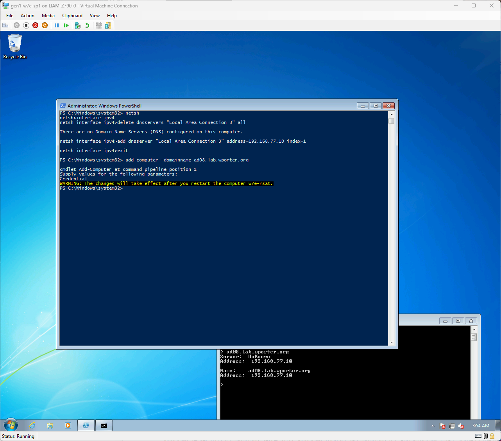
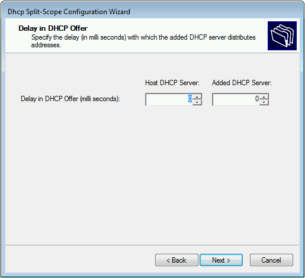
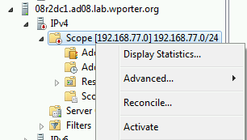

## Why are you doing this?

Fun!

## Goal

DNS, DHCP and AD DS installed and working for a FL 2008 AD domain that we can then join physical Hyper-V Server 2008 R2 machines to.

I'll be installing a couple of VMs on my desktop/main Windows server running 24H2 (Windows 11 Enterprise LTSC and Windows Server 2025). These have an i9-12900KS and a pair of E5-2698 v3 CPUs, respectively, which are both x86-64-v3 (this is a newer 12900 without AVX512). Then, we'll think about standing up a Hyper-V Server 2008R2 machine.. or a cluster of them.. in another post.

## Getting started

### Hyper-V configuration

Windows 7-based VMs will not boot on the Hyper-V UEFI ("Generation 2" VM platform). You will need to create them as a Generation 1 VM. Dynamic memory (ballooning) does not appear to function by default, though the VM will still work if it is enabled. Current network adapters (non-legacy) do appear to work out of the box.

You do not need to toggle CPU compatibility mode with modern Intel CPUs. I don't have anything AMD online and running Hyper-V to test with, but I would expect that Ryzen CPUs also work fine.

So, I've created a Gen 1 VM for my "dc0" Active Directory Domain Controller that I'll use to install the forest. It has 4 GB of RAM and the default 8 vCPU allocation (Hyper-V Manager will create VMs with half of your available logical CPUs by default in 24H2).

I've also created a Gen 1 VM "w7e-rsat" so I can run the Remote Server Administration Tools on my Server Core machines.

### OS installation

For installation media, I'm using:

- Windows 7 Enterprise SP1 amd64 MDSN ISOs [from Archive.org](https://archive.org/details/windows-7-sp1-sp0-enterprise-msdn-en-de-ru-tr-x86-x64)
- [en_windows_7_enterprise_with_sp1_x64_dvd_u_677651.iso](https://archive.org/download/en_windows_7_enterprise_with_sp1_x64_dvd_u_677651_202006/en_windows_7_enterprise_with_sp1_x64_dvd_u_677651.iso)
- Windows Server 2008 R2 amd64 MSDN ISOs, [from Archive.org](https://archive.org/details/Windows_Server_2008_R2_x64.iso_reupload)
- [Windows_Server_2008_R2_x64.iso](https://archive.org/download/Windows_Server_2008_R2_x64.iso_reupload/Windows_Server_2008_R2_x64.iso)

Our trusty guide will be the ["Deploy Windows Server 2008 R2" manual, available from MS Learn](https://learn.microsoft.com/en-us/previous-versions/windows/it-pro/windows-server-2008-r2-and-2008/ee344846(v=ws.10)). It includes a section on Server Core that will be of some use, as there's not much elsewhere on the Internet (and, of course, we're using Core.)

I will not go through setup step-by-step - I assume you've seen a Windows setup screen a few times. I will briefly touch on the 2008R2-specific things (namely our available versions of Windows Server).


There are actually quite a few versions of Server 2008 R2 in a standard ISO. They, as always, differ mostly by feature restrictions (licensing). I'm going to go ahead and run full-fat Datacenter, because I certainly don't intend to activate these machines, but the differences between all these SKUs, [as found in era-appropriate Microsoft.com comparisons](https://web.archive.org/web/20091211210713/http://www.microsoft.com/windowsserver2008/en/us/r2-compare-specs.aspx), are:

#### Windows Web Server 2008 R2

- Low-cost SKU intended solely for public-facing web hosting that does not require CALs for access, but does not allow for IAS, RRAS, RDS, or availability features. Also likely omits most Windows Server features with the exception of IIS 7.5.
- Maximum of 32 GB of system memory, and 4 physical CPUs (sockets).

#### Windows Server 2008 R2 Standard

- Low-cost SKU likely intended for SMB or lightly virtualized environments that do not require DFS or failover clustering.
- Provides licensing for a host and a single Windows Server 2008 R2 Standard guest virtual machine.
- Maximum of 32 GB of system memory, and 4 physical CPUs (sockets).

#### Windows Server 2008 R2 Enterprise

- Mid-tier SKU that includes some software availability features and does not limit RRAS, IAS, or RDS Gateway connections.
- Provides licensing for a host and four Windows Server 2008 R2 Enterprise guest virtual machines.
- Maximum of 2 TB of system memory, and 8 physical CPUs (sockets).

#### Windows Server 2008 R2 Datacenter

- The range-topper Windows Server license including all the bells and whistles.
- Provides licensing for a host and *unlimited* Windows Server 2008 R2 Datacenter guest virtual machines (sound familiar? Still a Datacenter feature today).
- Maximum of 2 TB of system memory, and 64 physical CPUs (sockets).

There are three other editions - Itanium (for HP/Intel Itanic servers.. you haven't heard of them for a reason), Foundation (closer to today's Essentials, with a low connection and memory limit) and HPC (Standard, but allows for 128 GB of system memory).

## Configuration

Alright! Now we've got an installed Windows Server. Let's get configuring!

### Networking

We'll set up our networking with `netsh`, since PowerShell isn't a thing in Server Core (and those networking cmdlets aren't a thing in Windows pre-10).

In my floating command prompt (dc0's Server Core install) I shall type:

```cmd
netsh interface ipv4 set address name="the adapter's display name" static ipv4.address dotted.subnet.mask ipv4.gateway
```

Like so:

```cmd
netsh interface ipv4 set address name="Local Area Connection" static 192.168.77.10 255.255.255.0 192.168.77.254
```

To temporarily configure a DNS server, we'll:

```cmd
netsh interface ipv4 add dnsserver "Local Area Connection" address=172.27.254.254 index=1
```

In my case I'm just using a local caching resolver.


I'll assign the 192.168.77.198 IP to my Windows 7 Enterprise jumpbox the same way. We'll come back and change DNS once we have our DCs up.

### Updating guest Hyper-V Integration Services

You can download the Hyper-V Integration updates for Server 2008 R2, Windows 7 SP1, or newer OSes running on Windows 10-based Hyper-V hosts. [Here is the relevant support article](https://support.microsoft.com/en-us/topic/hyper-v-integration-components-update-for-windows-virtual-machines-8a74ffad-576e-d5a0-5a2f-d6fb2594f990).

Note that *"This update is provided as a Recommended update on Windows Update."* I was under the impression that networking wouldn't work until I installed this update because my VMSwitch was broken, so I decided to chuck this at the VM manually.. you don't have to do it this way, but I'll leave it here.

To get drivers for the Windows 10 version of Hyper-V working, we will need to download and install the KB3063109 "hypervintegrationservices" update for Windows 6.x (Windows 7 x64). The same update applies to both Server 2008 R2 and Windows 7 (links to respective download center entry - file is identical).

To get this on our old VM, we'll create an ISO containing the .cab and feed said ISO to the VM (alternatively, you could use a VHD). I'll be using `oscdimg.exe`, a command-line utility that's part of the Windows Deployment Tools kit. For a detailed overview of the several ways you can get `oscdimg`, have a look at the "Installing Dependencies" section of my [Hyper-V Cloud-init post](https://wporter.org/getting-started-with-cloud-init-on-hyper-v/).

For completeness, I will recommend getting your hands on the Windows Deployment Tools utilities by running the ADK setup wizard, and selecting the 'deployment tools' feature:

```PowerShell
(irm https://go.microsoft.com/fwlink/?linkid=2196127 -method GET -outfile adksetup.exe) |
.\adksetup.exe
```


If you *install* the Deployment Tools, `oscdimg.exe` will, by default, be at: `C:\Program Files (x86)\Windows Kits\10\Assessment and Deployment Kit\Deployment Tools\amd64\Oscdimg\oscdimg.exe`.

If you *download* the Deployment Tools, you won’t be prompted to select which features you want, but can then just run the `oscdimg.exe` installer `Oscdimg (DesktopEditions)-x86_en-us.msi`.

Anyway, I've dropped that .cab into a directory called "integrationservices", and I can turn it into an ISO with the following command:

```PowerShell
C:\ISOs
❯ & 'C:\Program Files (x86)\Windows Kits\10\Assessment and Deployment Kit\Deployment Tools\amd64\Oscdimg\oscdimg.exe' -j1 -lIntegSvcs -r .\integrationservices .\win6.x-integration-services.iso
```

Explanation:

```txt
-j1 : Joliet format, with fallback to ISO9660 filenames
-l  : volume label
-r  : resolve symbolic links
.\integrationservices : the directory to convert to an ISO
.\win6.x-integration-services.iso : the output file
```

You can then attach the ISO to a VM (Media > Insert Disk in Hyper-V Manager if you have a virtual disk drive on the VM), and use `DISM` to install the package with the command:

```cmd
dism /online /add-package /packagepath:"D:\windows6.x-hypervintegrationservices-x64.cab"
```


Restarting the machine will install the package.

### Patching 2008 R2

[As I found a few nights ago](https://wporter.org/setting-up-a-windows-7-box-in-mid-2025/), Windows Update doesn't work out of the box in Windows 7 SP1 nowadays. We'll need to patch the machines before they can update themselves to update certificate stores, among other things.

We're going to do the same trick with making an ISO out of our Windows updates. Why? Why not!

On our W7 box, I'm going to be installing:

```PowerShell
C:\ISOs\Windows
❯ gci '.\Windows 7 critical updates\' | Select Name

Name
----
windows6.1-kb3020369-x64_5393066469758e619f21731fc31ff2d109595445.msu
windows6.1-kb3125574-v4-x64_2dafb1d203c8964239af3048b5dd4b1264cd93b9.msu
windows6.1-kb3138612-x64_f7b1de8ea7cf8faf57b0138c4068d2e899e2b266.msu

```

On our 2008R2 box, I'm going to be installing:

```PowerShell
C:\ISOs\Windows
❯ gci .\server-2k8r2-critical-updates\ | select Name

Name
----
Windows6.1-2008R2-KB3138612-x64.msu
windows6.1-kb3020369-x64_5393066469758e619f21731fc31ff2d109595445.msu
windows6.1-kb3125574-v4-x64_2dafb1d203c8964239af3048b5dd4b1264cd93b9.msu
```

There's a different version of the [March 2016 Windows Update client updates](https://support.microsoft.com/en-us/topic/windows-update-client-for-windows-7-and-windows-server-2008-r2-march-2016-31422d0a-8818-cfdd-140e-e27883c7a2c5) [for Server 2008 R2 available here](https://www.microsoft.com/en-us/download/details.aspx?id=51206).

```cmd
C:\ISOs\Windows
❯ & 'C:\Program Files (x86)\Windows Kits\10\Assessment and Deployment Kit\Deployment Tools\amd64\Oscdimg\oscdimg.exe' -j1 -lCritUpdates -r -m '.\Windows 7 critical updates\' .\windows6.x-wupdate-deps.iso
```

Explanation:

```txt
-j1 : Joliet format, with fallback to ISO9660 filenames
-l  : volume label
-r  : resolve symbolic links
-m  : ignore 'too large' errors
'.\Windows 7 critical updates\' : the directory to convert to an ISO
.\windows6.x-wupdate-deps.iso   : the output file
```

I'll mount the ISO the same way we did before (Media > DVD Drive in Hyper-V, or PowerShell) and install the updates on both machines.

Windows 7 will require a reboot after the final update. Once this is done, your Windows Update client should work.

Attempting to install KB3138612 on Server 2008R2 (Core or non-Core) produced a "The update is not applicable to your computer" error. I first thought that maybe it was missing dependencies?


KB3020369 will install successfully.

Attempting to install KB3125574-v4 on Server 2008R2 (Core or non-Core) will produce the same "The update is not applicable to your computer" error.

So, I went hunting on the MS Update Catalog for older rollups.

9/13/2016 rollup KB3172605 fails with a "The update is not applicable to your computer" error.

2019 Servicing Stack Update K4490628 fails with "The update is not applicable to your computer"

KB4534310 will give a 0x800b0109 certificate error:


[KB3004394](https://support.microsoft.com/en-us/topic/support-for-urgent-trusted-root-updates-for-windows-root-certificate-program-in-windows-a4ac4d6c-7c62-3b6e-dfd2-377982bf3ea5) similarly returns a 'not applicable' error (a Rapid Certificate Update Update)

It was at this point, after about an hour and a half, that I realized that my ISOs didn't actually include SP1. I'd thought they did, but after installing a Server non-Core machine I popped open `winver` to see:


7600! Drat!

If you're stuck on a command line, you can use the `ver` command for build information:

```cmd
Microsoft Windows [Version 10.0.26100.4061]
(c) Microsoft Corporation. All rights reserved.

C:\Users\liam>ver

Microsoft Windows [Version 10.0.26100.4061]
```


Anyway, one quick [trip to support.microsoft.com for a copy of the Service Pack 1 installer](https://support.microsoft.com/en-us/topic/information-about-service-pack-1-for-windows-7-and-for-windows-server-2008-r2-df044624-55b8-3a97-de80-5d99cb689063) later, and we were off to the races. My updates were no longer failing.


I wound up installing:

1. KB3020369 (April 2015 servicing stack update)
2. KB976932 (Windows 7 Service Pack 1)
3. KB4490628 (March 2019 Servicing Stack update - I doubt this is necessary)
4. KB3125574 (Windows 7 "Service Pack 2")

At this point, Windows Update will now work (might take a while to enumerate available updates). We can also successfully install KB4534310, the 2020-01 Security Monthly Quality Rollup for Windows 6.1 that was giving us a certificate error earlier.


### Renaming DC0

We'll rename the machine with `netdom`, as Server Core doesn't have Control Panel or PowerShell and `hostname -s` doesn't work in 2008 R2.

```cmd
C:\Users\Administrator>netdom renamecomputer WIN-SRJ2TMQJ5BH /newname:08r2dc0
```

### Configuring Active Directory Domain Services on DC0

[Here's the relevant section in the Windows Server 2008 R2 Core deployment manual.](https://learn.microsoft.com/en-us/previous-versions/windows/it-pro/windows-server-2008-r2-and-2008/ee441260(v=ws.10))

Reminder - you can see the full list of Windows features available to the current image with a DISM command:

```cmd
dism /online /get-features
```

You can install a Windows feature with another command:

```cmd
dism /online /enablefeature /featurename:foobar
```

Not quite the PowerShell you might be used to, but works just fine. Still works in more modern builds of Windows, too.

That said, I think they *have* changed the feature names over the years. The one we're after is `DirectoryServices-DomainController-ServerFoundation`, not `AD-Domain-Services` (if you're following along on a non-Server Core install, the feature names are different - try `DirectoryServices-DomainController` instead).

To install the `DomainController` feature on our server, simply type:

```cmd
dism /online /enablefeature /featurename:DirectoryServices-DomainController-ServerFoundation
```

Ha! Joke's on you. It'll fail; we need the `NetFx3-ServerCore` and `NetFx2-ServerCore` packages installed first. You can install them with:

```cmd
dism /online /enablefeature /featurename:NetFx2-ServerCore
dism /online /enablefeature /featurename:NetFx3-ServerCore
```

Now, let's try to install the (breathe in) `DirectoryServices-DomainController-ServerFoundation` (breathe out) feature again. Worked this time, right? I hope?

We didn't actually *need* to do that. You can just `dcpromo`. But that would just install it anyway, so I digress.

But wait. Another gotcha. We need to [write a `dcpromo` unattend](https://learn.microsoft.com/en-us/windows-server/identity/ad-ds/deploy/dcpromo)!

Here we go... for our first DC:

```txt
[DCINSTALL]
InstallDNS=yes  
NewDomain=forest  
NewDomainDNSName=ad08.lab.wporter.org
DomainNetBiosName=ad08
SiteName=headquarters 
ReplicaOrNewDomain=domain  
ForestLevel=4
DomainLevel=4
DatabasePath=%systemroot%\\NTDS
LogPath=%systemroot%\\NTDS
RebootOnCompletion=yes
SYSVOLPath=%systemroot%\\SYSVOL
SafeModeAdminPassword=$rainbows5unicorns7victory3against08
```

Believe it or not, I'm going to go back to my favorite tool (`oscdimg`) and chuck this at the VM as an ISO. Because of course I am.

Okay...

One more dcpromo:

```cmd
dcpromo /unattend:D:\initial-unattend.txt
```

Let it do its stuff.. reboot.. and:


We have an Active Directory! Woo!

### Installing RSAT and PS 5.1, joining the domain with our W7 Enterprise machine

Now, let's hop over to our Windows 7 Enterprise VM and get some RSAT going.

I've fully updated this VM by installing:

1. KB3020369 (April 2015 servicing stack update)
2. KB3125574-v4 ("SP2")
3. KB3138612 (Windows Update Client for Windows 7 and Windows Server 2008 R2: March 2016)

Then running Windows Update.

Once that's done, we'll install RSAT by first installing the KB958830 package, then either running DISM a bunch or checking all the RSAT options in the 'Turn Windows features on or off' dialog (hit Start, type the former). I'm going to grab everything; of course you can only grab what you want.


While we're at it, I'm also going to drop PowerShell 5.1 on this VM. That's one more Windows update - [KB3191566](https://www.microsoft.com/en-us/download/details.aspx?id=54616) - for WMF 5.1. Another case of 'just-run-the-file'.


One reboot later, and we'll have PS 5.1.

Now, let's join that domain. First, we'll clear our existing DNS server entries from the DNS client's config:

```cmd
netsh interface ipv4 delete dnsservers "Local Area Connection" all
```

Then, we'll register our DC:

```cmd
netsh interface ipv4 add dnsserver "Local Area Connection 3" address=192.168.77.10 index=1
```

Once we've confirmed that we can resolve the domain, we'll join it!


We can just `Add-Computer` here. Now that we've got a modern version of PowerShell, things are great (though I have no idea if this was a thing in PS 2)!




Awesome! Now, let's reboot, sign in to our lonely AD account, and have a look!


We can, with our new *remote* Domain Admin powers, fire up some MMCs and Active Directory PowerShell!


### Configuring DHCP on our DC0

Alright! Just about one thing left (well, we'll still want a second DC...) - DHCP! We'll toss this on our DC0.

One more DISM call:

```cmd
dism /online /enable-feature /featurename:DHCPServerCore
```

Then, enable and start the service with:

```cmd
sc config dhcpserver start= auto
net start dhcpserver
```


Then, hop back over to our RSAT box, pop open the DHCP MMC, and add the DC to the AD authorized DHCP servers list. This is necessary, or the server won't be able to start a scope and assign IPs.

Click 'Action' > 'Manage authorized servers...'


Click 'Authorize', enter the hostname or IP of the server you'd like to authorize, then click OK. Confirm the server's details are correct, and click OK again.


The server will be added to the 'Authorized' list. Click it, then click 'OK' to add it to your DHCP MMC.


Once we create a scope - I've chosen 192.168.77.0/24, with the range 192.168.77.100 through 192.168.77.150, and configured options 3, 6, and 15 (router, DNS servers, DNS domain name, respectively) - and activated it, the DC will begin serving DHCP.

Removing our W7E machine's static IP lets us quickly verify this:


It's working! Great!

### Building a second 08 R2 SP1 DC

Now, let's dcpromo a second Server 2008 box to have as a secondary DC.

I'll install the same four updates I did earlier on DC0:

1. KB3063109
2. KB3020369
3. KB4490628
4. KB3125574

Then automatically update the system:


We'll rename the server to `08r2dc1` with `netdom`:

```cmd
netdom renamecomputer WIN-UKNLO5PGTHV /newname:08r2dc1
```


Then, we'll [write a new `dcpromo` answer file](https://learn.microsoft.com/en-us/windows-server/identity/ad-ds/deploy/dcpromo):

```txt
[DCINSTALL]  
UserName=Administrator
UserDomain=ad08
Password=foobarbaz
SiteName=headquarters
ReplicaOrNewDomain=replica  
ReplicaDomainDNSName=ad08.lab.wporter.org
DatabasePath=%systemroot%\\NTDS
LogPath=%systemroot%\\NTDS
SYSVOLPath=%systemroot%\\SYSVOL
InstallDNS=yes  
ConfirmGC=yes  
SafeModeAdminPassword=$rainbows5unicorns7victory3against08svr1
RebootOnCompletion=yes  
```

Feed it to the VM as (yep, you guessed it) another ISO, and we can promote the standalone server to a domain controller in the "ad08" domain.


One reboot later..

And I forgot that I never set this server's IP to 192.168.77.11! It's at 101, in the DHCP scope! Thankfully, AD doesn't really care about addressing, so long as it exists.

We'll first set the interface's address to a static 192.168.77.11...


Then, we'll clear the registered DNS servers, and add just the ones we want back.


Alright! All set! If we now pop open DNS Manager on our Windows 7 box, we can connect to our new DC1!


### Configuring split-scope DHCP for high availability

Server 2008 R2 doesn't support the ["DHCP failover" feature introduced in Server 2012](https://learn.microsoft.com/en-us/previous-versions/windows/it-pro/windows-server-2012-r2-and-2012/dn338978(v=ws.11)) (not to be confused with DHCP failover *clustering*) so, to get 'simple' HA, we'll have to split our DHCP scope across two servers.

We'll install the role on DC1 with the same commands we used on DC0:

```cmd
dism /online /enable-feature /featurename:DHCPServerCore
```

Then, enable and start the service with:

```cmd
sc config dhcpserver start= auto
net start dhcpserver
```

We'll then jump back over to our Windows 7 box and, as before, authorize the server and add it to our DHCP MMC.


There's actually a "split-scope wizard" available by right-clicking on a DHCP scope.

I suppose this is intended to make up for the inability to modify DHCP scopes on the fly (you have to delete and recreate them), but it'll also copy exclusions, reservations, and options over, and ask you if you'd like to delay DHCP Offers from a server (the first server to respond will typically "win" and assign an IP to the requester.)

Well, let's use it! I right-clicked on my 08r2dc0 machine's IPv4 scope 192.168.77.0/24, and selected 'split scope'.


Punch in the other server's details..


Tell the wizard *how* you'd like to split the scope..


And, optionally, configure a delay, so one server will respond first (giving it priority):



Finally, take a look at the configured settings:


Once we've clicked 'Finish', the wizard will spit out a log.


Refresh the console, and you should now see that your second server has a DHCP scope configured, but deactivated:


To enable it, simply right-click the scope and click 'Activate'.



It took restarting the DHCP server service on my DC1 to get the MMC to properly show that it was up after activating the scope, but it *was* serving requests.

If we deactivate DC0's DHCP scope, then release our DHCP lease on our Windows 7 box, we can get an IP from DC1 (note how it's .125 rather than .101):


Going forward, the server that responds first will hand out an IP. Note that split-scope DHCP may be the cause of intermittent connectivity issues for dynamic clients if your DHCP scope configurations drift (they will now have to be managed separately on DC0 and DC1), though there are certainly plenty of other reasons that could happen, too.

## Conclusion

Anyway, that's enough for now. This is getting a bit long!

In this post, we've:

1. Configured a Server 2008 R2 Core domain controller
2. Installed a forest and a domain in said forest
3. Set up Windows DHCP
4. Configured a Windows 7 Enterprise SP1 machine to use for remote administration (via RSAT and PowerShell)
5. Configured a second Server 2008 R2 Core domain controller
6. Split our DHCP scopes for highly-available DHCP across both our domain controllers

This leaves us with a great starting point for more 2008 R2 shenanigans.

Next up - Hyper-V Server 2008 R2!
