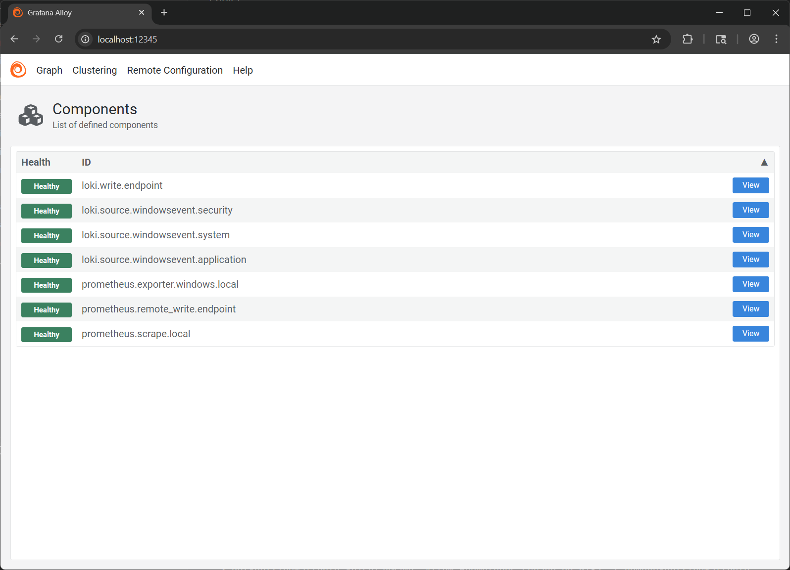
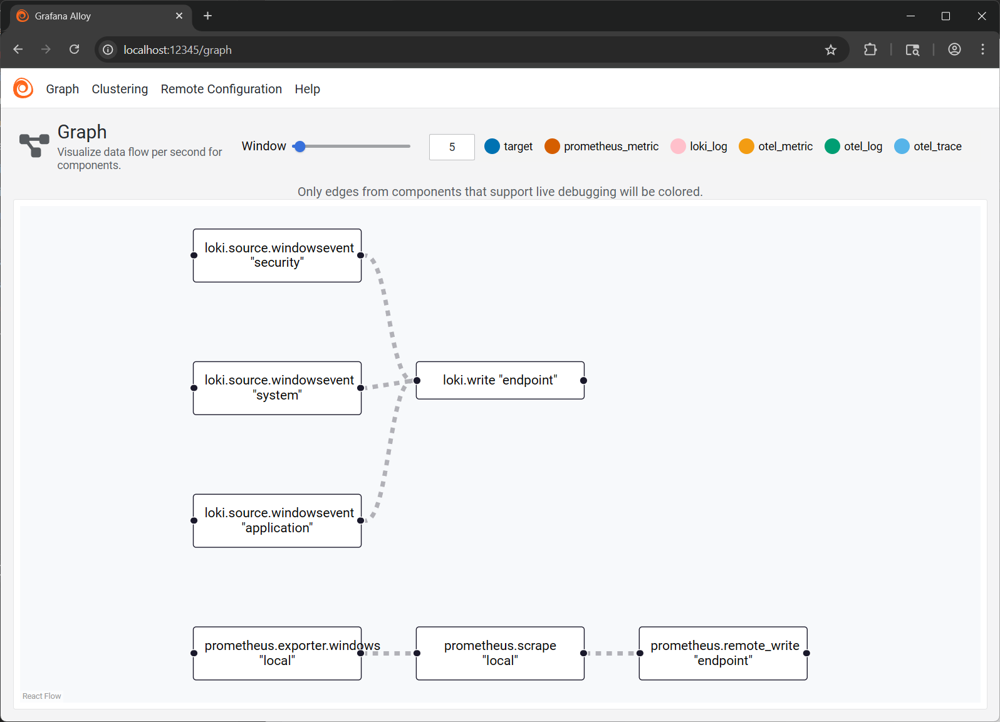

Grafana Alloy is a multi-use exporter that we can run on our hosts to expose metrics for Prometheus. It also does other stuff, like send logs to Loki. It's got a lot of features - [you can read more it at grafana.com/docs](https://grafana.com/docs/alloy/latest/).

Essentially, Grafana Alloy is an Open Telemetry-compatible collector that serves as a unified telemetry agent for popular services like Loki and Prometheus.

Some relevant points about Alloy:

1. We can replace the Prometheus Windows Exporter with Alloy, as Alloy for Windows has the Prometheus Windows Exporter built in.
2. We can use Alloy as a collector/forwarder to push metrics to Prometheus (rather than the default pull) which may be desirable, depending on your specific environment and firewalling
3. Grafana Alloy replaced the older Grafana Agent.
4. Alloy allows us collect and push logs to Loki in addition to collecting and pushing metrics to Prometheus.
5. Alloy has a considerable memory footprint compared to the much leaner Windows Exporter, but is necessary if you would like to push metrics to Prometheus. I've noticed Alloy consuming an order of magnitude (20x, in this case) more memory than the standalone Exporter (~370 mb vs ~20 mb).

## Installing Alloy on Windows

There is not yet a Winget package for Grafana Alloy (thought there was, but couldn't find it). You can download and (silently) install it with the following PowerShell:

```PowerShell
$Cwd = "$($env:TEMP)\Alloy"
$Zip = "$Cwd\Alloy.zip"

New-Item -Path $Cwd -ItemType Directory -Force

Invoke-WebRequest 'https://github.com/grafana/alloy/releases/download/v1.9.1/alloy-installer-windows-amd64.exe.zip' -OutFile $Zip

Expand-Archive -Path $Zip -DestinationPath $Cwd

Start-Process "$Cwd\alloy-installer-windows-amd64.exe" -ArgumentList '/S'
```

## Configuring Alloy to push metrics to a Prometheus server

For full configuration notes, [see the docs](https://grafana.com/docs/alloy/latest/configure/windows/), though I'll briefly discuss what we're setting up.

By default, the Alloy configuration is read from `$env:PROGRAMFILES\GrafanaLabs\Alloy\config.alloy`. This can be changed via a registry value if you'd like.

We'll put together a quick Alloy configuration that enables the `windows_exporter` with the collectors we used before adding Alloy to the mix. We will be setting this up so our client can *push* metrics to Prometheus, rather than having the Prometheus server scrape the client - for this purpose, we'll have Alloy scrape its built-in Windows Exporter for us, then push the metrics along. Later on, we'll configure Loki similarly (though it works this way by default, unlike Prometheus).

The key parts of this config file:

- We define an exporter "local",
- We define a job to scrape "local"
  - This job targets the collectors enabled in "local",
  - Forwards the collected data to our remote_write target named "endpoint",
  - and has a defined interval of 15s, with a timeout of 10s.
- We define a remote_write target "endpoint"
  - This is just our Prometheus server. You do need to enable this feature - more on that in a bit.
- We'll enable debug logging. This will help you out if stuff breaks, but I would recommend changing this to 'info' or 'warning' in a proper deployment - Alloy can be very chatty if you ask it to be.

```json
prometheus.exporter.windows "local" {
  enabled_collectors = [
  "cache","cpu","cpu_info","diskdrive",
  "license","logical_disk","memory",
  "net","os","pagefile","physical_disk",
  "process","scheduled_task","service",
  "system","tcp","thermalzone","time",
  "update","hyperv"]
}

prometheus.scrape "local" {
  targets = prometheus.exporter.windows.local.targets
  forward_to = [prometheus.remote_write.endpoint.receiver]
  scrape_interval = "15s"
  scrape_timeout = "10s"
}

prometheus.remote_write "endpoint" {
  endpoint {
  url = "http://prometheus:9090/api/v1/write"
  }
}

logging {
  level = "debug"
}
```

To set said config file, we can use a quick bit of PowerShell:

```PowerShell
$ConfigFile = Get-Item $env:PROGRAMFILES\GrafanaLabs\Alloy\config.alloy
[string]$ConfigContents = @"
prometheus.exporter.windows "local" {
  enabled_collectors = [
  "cache","cpu","cpu_info","diskdrive",
  "license","logical_disk","memory",
  "net","os","pagefile","physical_disk",
  "process","scheduled_task","service",
  "system","tcp","thermalzone","time",
  "update","hyperv"]
}

prometheus.scrape "local" {
  targets = prometheus.exporter.windows.local.targets
  forward_to = [prometheus.remote_write.endpoint.receiver]
  scrape_interval = "15s"
  scrape_timeout = "10s"
}

prometheus.remote_write "endpoint" {
  endpoint {
  url = "http://prometheus:9090/api/v1/write"
  }
}

logging {
  level = "debug"
}
"@

Set-Content $ConfigFile $ConfigContents

Restart-Service Alloy
```

### Removing a previously installed Windows Exporter

Since Alloy has its own Windows Exporter, you'll no longer need the standalone Windows Exporter if you'd previously installed it.

To disable the service, remove the program, and remove an (example - adjust to suit) firewall rule, you can:

```PowerShell
Administrator in ~
❯ set-service windows_exporter -startuptype manual

Administrator in ~
❯ stop-service windows_exporter

Administrator in ~
❯ winget remove windows_exporter

Administrator in ~
❯ get-netfirewallrule -DisplayName 'Allow Prometheus scrape on 9182'

Name                          : {481053ce-8b63-4271-93c2-219a9d45ae5f}
DisplayName                   : Allow Prometheus scrape on 9182
Description                   :
DisplayGroup                  :
Group                         :
Enabled                       : True
Profile                       : Any
Platform                      : {}
Direction                     : Inbound
Action                        : Allow
EdgeTraversalPolicy           : Block
LooseSourceMapping            : False
LocalOnlyMapping              : False
Owner                         :
PrimaryStatus                 : OK
Status                        : The rule was parsed successfully from the store. (65536)
EnforcementStatus             : NotApplicable
PolicyStoreSource             : PersistentStore
PolicyStoreSourceType         : Local
RemoteDynamicKeywordAddresses : {}
PolicyAppId                   :
PackageFamilyName             :


Administrator in Local\Temp\alloy
❯ get-netfirewallrule -DisplayName 'Allow Prometheus scrape on 9182' | remove-netfirewallrule
```

## Configure Alloy to forward logs to Loki

Foreword: I have dropped Loki as it requires a lot of legwork to get the nasty, XML-formatted Windows event logs into a usable format. For example, here's what you see in Grafana Explore for an event log from Loki:

```json
{"source":"Microsoft-Windows-DistributedCOM","channel":"System","computer":"liam-z790-0","event_id":10016,"level":3,"levelText":"Warning","opCodeText":"Info","keywords":"Classic","timeCreated":"2025-06-17T23:50:22.6686308Z","eventRecordID":82111,"correlation":{"activityID":"{349323a3-db33-0000-ae46-0d3533dbdb01}"},"execution":{"processId":1036,"threadId":64700,"processName":"svchost.exe"},"security":{"userId":"S-1-5-21-1781022449-2347738344-2560323332-1001","userName":"LIAM-Z790-0\\wporter"},"event_data":"\u003cData Name='param1'\u003eapplication-specific\u003c/Data\u003e\u003cData Name='param2'\u003eLocal\u003c/Data\u003e\u003cData Name='param3'\u003eActivation\u003c/Data\u003e\u003cData Name='param4'\u003e{2593F8B9-4EAF-457C-B68A-50F6B8EA6B54}\u003c/Data\u003e\u003cData Name='param5'\u003e{15C20B67-12E7-4BB6-92BB-7AFF07997402}\u003c/Data\u003e\u003cData Name='param6'\u003eLIAM-Z790-0\u003c/Data\u003e\u003cData Name='param7'\u003ewporter\u003c/Data\u003e\u003cData Name='param8'\u003eS-1-5-21-1781022449-2347738344-2560323332-1001\u003c/Data\u003e\u003cData Name='param9'\u003eLocalHost (Using LRPC)\u003c/Data\u003e\u003cData Name='param10'\u003eUnavailable\u003c/Data\u003e\u003cData Name='param11'\u003eUnavailable\u003c/Data\u003e","message":"The application-specific permission settings do not grant Local Activation permission for the COM Server application with CLSID \r\n{2593F8B9-4EAF-457C-B68A-50F6B8EA6B54}\r\n and APPID \r\n{15C20B67-12E7-4BB6-92BB-7AFF07997402}\r\n to the user LIAM-Z790-0\\wporter SID (S-1-5-21-1781022449-2347738344-2560323332-1001) from address LocalHost (Using LRPC) running in the application container Unavailable SID (Unavailable). This security permission can be modified using the Component Services administrative tool."}
```

Here's the same thing pretty-printed (NOT what you'll be looking at in Grafana):

```json
{
  "source": "Microsoft-Windows-DistributedCOM",
  "channel": "System",
  "computer": "liam-z790-0",
  "event_id": 10016,
  "level": 3,
  "levelText": "Warning",
  "opCodeText": "Info",
  "keywords": "Classic",
  "timeCreated": "2025-06-17T23:50:22.6686308Z",
  "eventRecordID": 82111,
  "correlation": {
    "activityID": "{349323a3-db33-0000-ae46-0d3533dbdb01}"
  },
  "execution": {
    "processId": 1036,
    "threadId": 64700,
    "processName": "svchost.exe"
  },
  "security": {
    "userId": "S-1-5-21-1781022449-2347738344-2560323332-1001",
    "userName": "LIAM-Z790-0\\wporter"
  },
  "event_data": "<Data Name='param1'>application-specific</Data><Data Name='param2'>Local</Data><Data Name='param3'>Activation</Data><Data Name='param4'>{2593F8B9-4EAF-457C-B68A-50F6B8EA6B54}</Data><Data Name='param5'>{15C20B67-12E7-4BB6-92BB-7AFF07997402}</Data><Data Name='param6'>LIAM-Z790-0</Data><Data Name='param7'>wporter</Data><Data Name='param8'>S-1-5-21-1781022449-2347738344-2560323332-1001</Data><Data Name='param9'>LocalHost (Using LRPC)</Data><Data Name='param10'>Unavailable</Data><Data Name='param11'>Unavailable</Data>",
  "message": "The application-specific permission settings do not grant Local Activation permission for the COM Server application with CLSID \r\n{2593F8B9-4EAF-457C-B68A-50F6B8EA6B54}\r\n and APPID \r\n{15C20B67-12E7-4BB6-92BB-7AFF07997402}\r\n to the user LIAM-Z790-0\\wporter SID (S-1-5-21-1781022449-2347738344-2560323332-1001) from address LocalHost (Using LRPC) running in the application container Unavailable SID (Unavailable). This security permission can be modified using the Component Services administrative tool."
}
```

Admittedly, once it's prettified, this doesn't look nearly as bad, but there are no usable fields in the log contents by default, and it was quite annoying to read this big block of `\u003e` and `\u003c` escaped brackets. In the interest of not reinventing the wheel, I moved on from Loki (for Windows, at least for now). Here's what I did to get Loki going in the first place:

We'll have to add a Loki block to our Alloy configuration:

```json
loki.source.windowsevent "application"  {
  eventlog_name = "Application"
  forward_to = [loki.write.endpoint.receiver]
}

loki.source.windowsevent "security"  {
  eventlog_name = "Security"
  forward_to = [loki.write.endpoint.receiver]
}

loki.source.windowsevent "system"  {
  eventlog_name = "System"
  forward_to = [loki.write.endpoint.receiver]
}

loki.write "endpoint" {
  endpoint {
  url = "http://loki:3100/loki/api/v1/push"
  }
}
```

We'll update our little PowerShell setter to include our Loki config:

```PowerShell
$ConfigFile = Get-Item $env:PROGRAMFILES\GrafanaLabs\Alloy\config.alloy
[string]$ConfigContents = @"
prometheus.exporter.windows "local" {
  enabled_collectors = [
  "cache","cpu","cpu_info","diskdrive",
  "license","logical_disk","memory",
  "net","os","pagefile","physical_disk",
  "process","scheduled_task","service",
  "system","tcp","thermalzone","time",
  "update","hyperv"]
}

prometheus.scrape "local" {
  targets = prometheus.exporter.windows.local.targets
  forward_to = [prometheus.remote_write.endpoint.receiver]
  scrape_interval = "15s"
  scrape_timeout = "10s"
}

prometheus.remote_write "endpoint" {
  endpoint {
  url = "http://prometheus:9090/api/v1/write"
  }
}

loki.source.windowsevent "application"  {
  eventlog_name = "Application"
  forward_to = [loki.write.endpoint.receiver]
}

loki.source.windowsevent "security"  {
  eventlog_name = "Security"
  forward_to = [loki.write.endpoint.receiver]
}

loki.source.windowsevent "system"  {
  eventlog_name = "System"
  forward_to = [loki.write.endpoint.receiver]
}

loki.write "endpoint" {
  endpoint {
  url = "http://loki:3100/loki/api/v1/push"
  }
}

logging {
  level = "debug"
}
"@

Set-Content $ConfigFile $ConfigContents

Restart-Service Alloy
```

### Labeling local Loki logs with Alloy

And, well, this is great - my logs are reaching the Loki server - but we have, like, no labels to play with! Be aware that, as labels are indexed, you don't want to add too many (it's best practice to rely on text searching for the majority of your filtering). The default is a little stingy, though. Let's add some! [Docs here (grafana.com/docs/loki)](https://grafana.com/docs/loki/latest/get-started/labels/).

Here, I've made some changes to my Alloy configuration to relabel some of the Event Logs we'll be sending over to Loki.

```json
loki.source.windowsevent "application" {
  eventlog_name = "Application"
  forward_to = [loki.process.labeler.receiver]
}

loki.source.windowsevent "security" {
  eventlog_name = "Security"
  forward_to = [loki.process.labeler.receiver]
}

loki.source.windowsevent "system" {
  eventlog_name = "System"
  forward_to = [loki.process.labeler.receiver]
}

loki.process "labeler" {
  stage.json {
    expressions = {
      service_name = "source",
      event_id = "event_id",
      level = "level",
      source = "source",
    }
  }
  stage.labels {
    values = {
    service_name = "service_name",
      event_id = "event_id",
      level    = "level",
    }
  }
  forward_to = [loki.write.endpoint.receiver]
}

loki.write "endpoint" {
  endpoint {
    url = "http://loki:3100/loki/api/v1/push"
  }
}
```

Here's an example of a PowerShell script to set this configuration.

```PowerShell
$ConfigFile = Get-Item $env:PROGRAMFILES\GrafanaLabs\Alloy\config.alloy
[string]$ConfigContents = @"
prometheus.exporter.windows "local" {
  enabled_collectors = [
  "cache","cpu","cpu_info","diskdrive",
  "license","logical_disk","memory",
  "net","os","pagefile","physical_disk",
  "process","scheduled_task","service",
  "system","tcp","thermalzone","time",
  "update","hyperv"]
}

prometheus.scrape "local" {
  targets = prometheus.exporter.windows.local.targets
  forward_to = [prometheus.remote_write.endpoint.receiver]
  scrape_interval = "15s"
  scrape_timeout = "10s"
}

prometheus.remote_write "endpoint" {
  endpoint {
  url = "http://prometheus:9090/api/v1/write"
  }
}

loki.source.windowsevent "application" {
  eventlog_name = "Application"
  forward_to = [loki.process.labeler.receiver]
}

loki.source.windowsevent "security" {
  eventlog_name = "Security"
  forward_to = [loki.process.labeler.receiver]
}

loki.source.windowsevent "system" {
  eventlog_name = "System"
  forward_to = [loki.process.labeler.receiver]
}

loki.process "labeler" {
  stage.json {
    expressions = {
      service_name = "source",
      event_id = "event_id",
      level = "level",
      source = "source",
    }
  }
  stage.labels {
    values = {
      service_name = "service_name",
      event_id = "event_id",
      level    = "level",
    }
  }
  forward_to = [loki.write.endpoint.receiver]
}

loki.write "endpoint" {
  endpoint {
    url = "http://loki:3100/loki/api/v1/push"
  }
}

logging {
  level = "debug"
}
"@

Set-Content $ConfigFile $ConfigContents

Restart-Service Alloy
```

## Troubleshooting Alloy

Once Alloy is going, you should see metrics begin to arrive at your Prometheus server. The "instance" tag on each metric is the local hostname by default, so you can filter by this to confirm a specific host is sending stuff over. If you need to troubleshoot, the Alloy service runs an interface at `http://localhost:12345` by default, where you can see defined components and their states:



This has a handy graph of what's been configured, too:



If you enable debugging, you can view debug events at http://localhost:12345/debug (this is not on in my config).

You can also view Prometheus metrics from your exporter at http://localhost:12345/metrics (rather than the 9182/metrics you'd get from the Windows Exporter).

```PowerShell
~
❯ ((iwr 127.0.0.1:12345/metrics).Content -split "`n") | select -First 3
# HELP alloy_build_info A metric with a constant '1' value labeled by version, revision, branch, goversion from which alloy was built, and the goos and goarch for the build.
# TYPE alloy_build_info gauge
alloy_build_info{branch="HEAD",goarch="amd64",goos="windows",goversion="go1.24.3",revision="d3d7931",tags="builtinassets",version="v1.9.1"} 1
```
