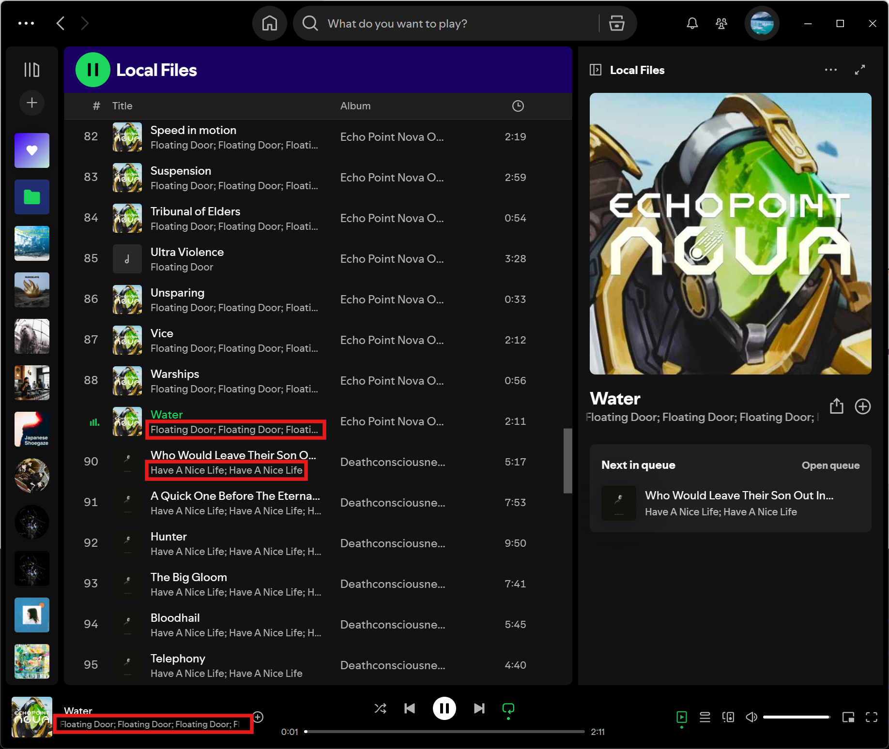
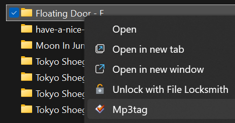
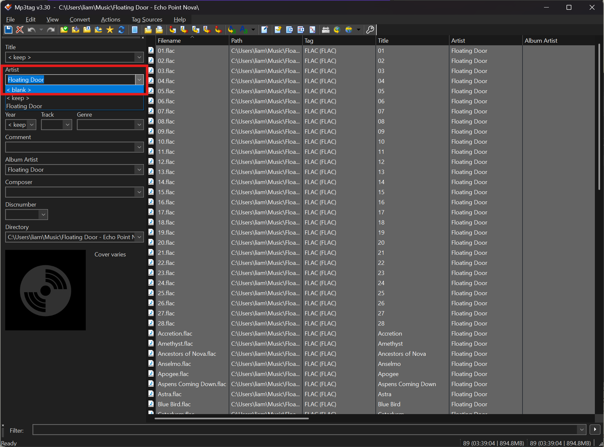
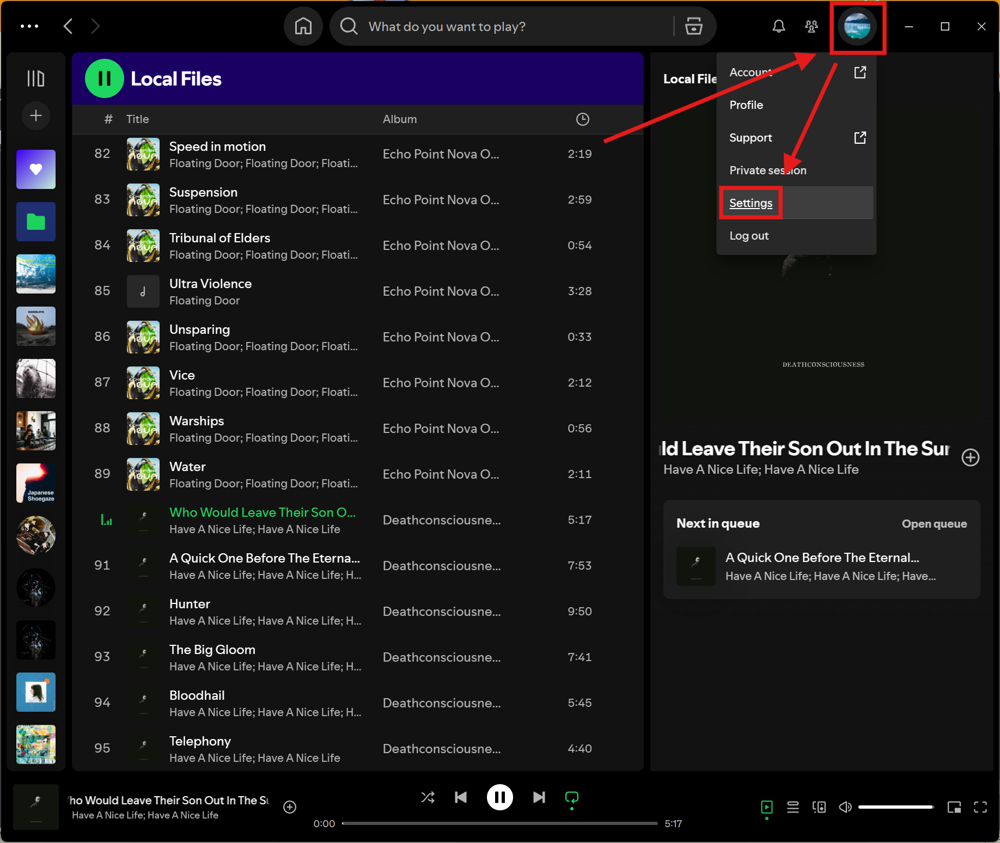
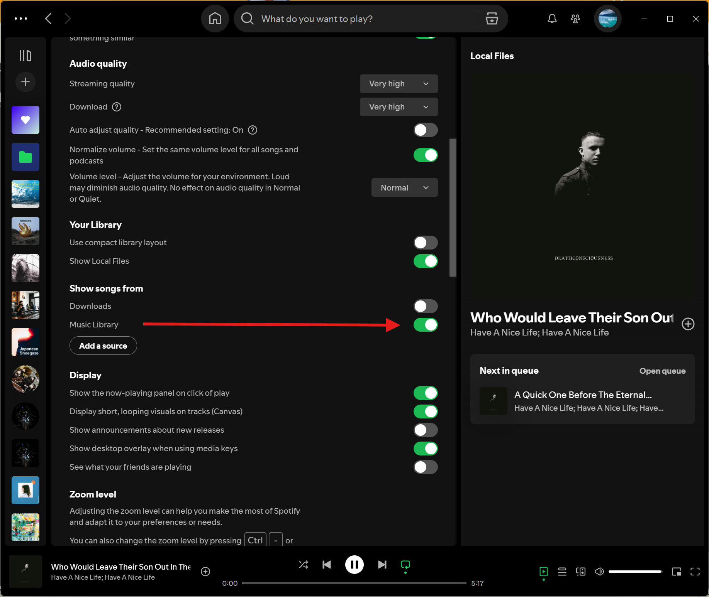
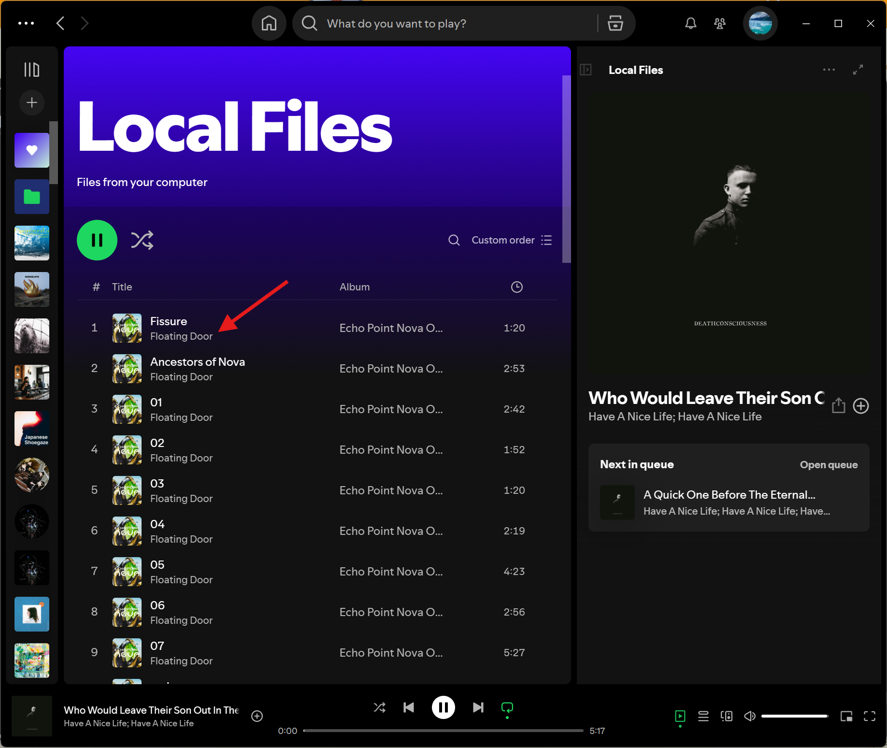

Spotify has a bug where it'll duplicate artist names if they're listed more than once in the metadata of a FLAC file (e.g., in the Artist and Album Artist fields). See below:



This has been a problem since at least 2022 - see [this Spotify Community post by yule from 2022-11-09](https://community.spotify.com/t5/Your-Library/If-a-local-file-is-FLAC-the-artist-name-repeats-with-a-semicolon/td-p/5455212), so I doubt it's going to get fixed. This bug doesn't occur with MP3s; only FLAC files.

To fix it, you can remove some of the 'artist' fields. To easily do this for a bunch of songs at once, you can use the MP3Tag program, which is freeware by Florian Heidenreich. You can find the project (and Windows binaries) at [mp3tag.de](https://www.mp3tag.de/en/). There's also a Winget package available:

```txt
~
❯ winget search mp3tag
Name          Id                        Version Match               Source
---------------------------------------------------------------------------
Mp3tag        9NN77TCQ1NC8              Unknown                     msstore
Mp3TagCleaner 9PB9BXXB3QL7              Unknown                     msstore
Mp3tag        FlorianHeidenreich.Mp3tag 3.3     ProductCode: mp3tag winget

~ took 2s
❯ winget install FlorianHeidenreich.Mp3tag
Found Mp3tag [FlorianHeidenreich.Mp3tag] Version 3.30
This application is licensed to you by its owner.
Microsoft is not responsible for, nor does it grant any licenses to, third-party packages.
Downloading https://download.mp3tag.de/mp3tagv330-x64-setup.exe
  ██████████████████████████████  4.97 MB / 4.97 MB
Successfully verified installer hash
Starting package install...
The installer will request to run as administrator. Expect a prompt.
Successfully installed

~ took 8s
❯
```

To use MP3Tag, you can either point it at a directory or selection of audio files:



Select them all, then blank the Artist fields:



Then, hop back over to Spotify, and reload your local library to force a rescan.






