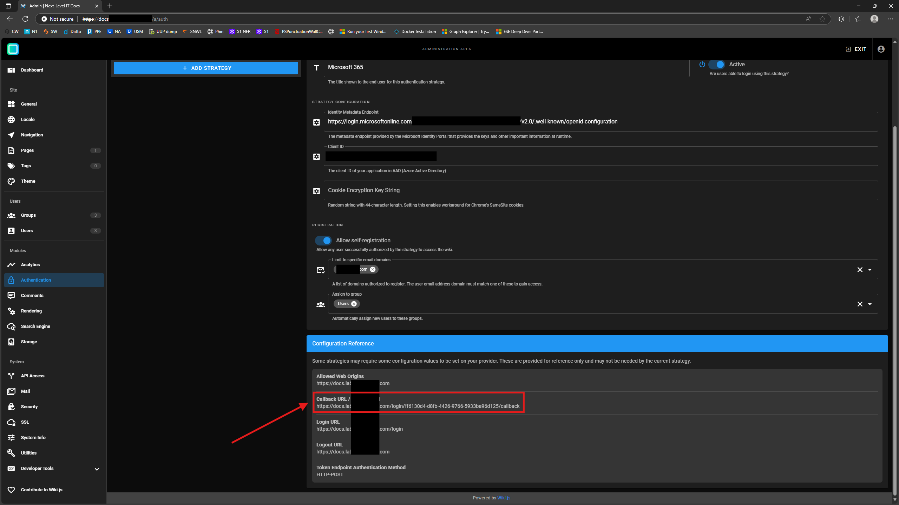
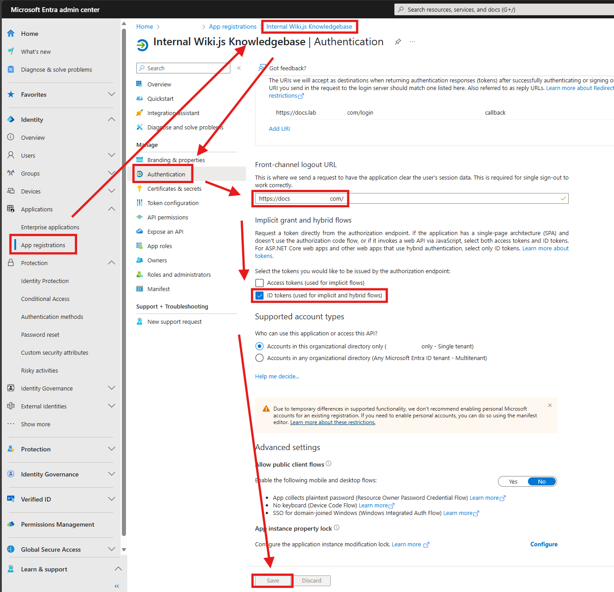
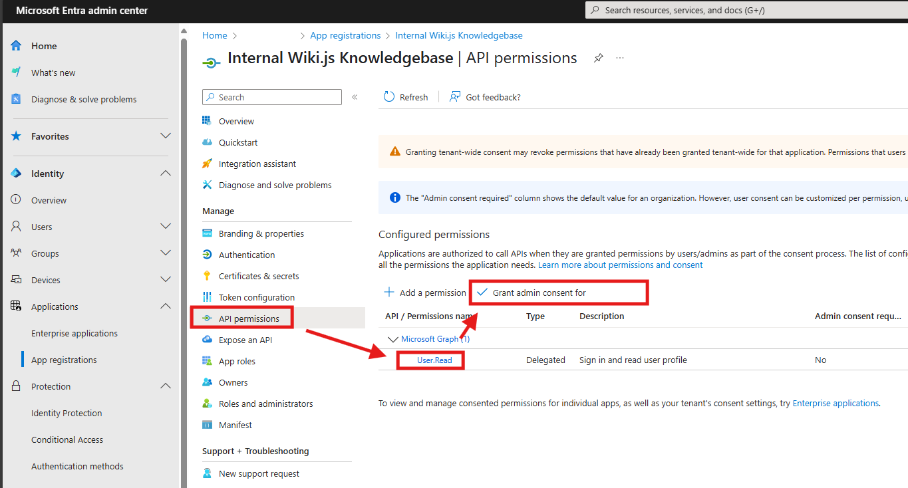

This guide demonstrates installing Wiki.js, the NGINX reverse proxy, and a backing PostgreSQL database on an AlmaLinux 10 server.

Wiki.js is a Node.js application that relies on a database - we'll be using PostgreSQL.

We'll put a NGINX reverse proxy in front of the Wiki.js web application to handle SSL, and configure Wiki.js to listen on only localhost (127.0.0.1:3000) so that only NGINX is exposed to the outside world.

## Install the PostgreSQL database server

Wiki.js depends on a database - PostgreSQL is the recommended option, and will be the *only* option in Wiki.js 3, so we'll use PostgreSQL.

Install PostgreSQL, initialize the database, and enable the service so the database server runs at startup:

```sh
sudo dnf install -y postgresql-server
sudo postgresql-setup --initdb
sudo systemctl enable --now postgresql.service
```

Perform the minimal configuration for Wiki.js:

```sql
[wporter@wikijs ~]$ sudo -u postgres psql
psql (16.8)
Type "help" for help.

postgres=# CREATE USER wikijs WITH PASSWORD 'redacted';
CREATE ROLE
postgres=# CREATE DATABASE wiki WITH OWNER wikijs ENCODING 'UTF8' LC_COLLATE='en_US.UTF-8' LC_CTYPE='en_US.UTF-8' TEMPLATE=template0;
CREATE DATABASE
postgres=# GRANT ALL PRIVILEGES ON DATABASE wiki TO wikijs;
GRANT
postgres=# \q
[wporter@wikijs ~]$
```

Configure the Wiki.js Postgres user to use a password to authenticate to the database server (default is host auth) by adding two `host` lines to the `/var/lib/pgsql/data/pg_hba.conf` file (controlling host-based authentication):

```sh
sudo sed -i '/^# TYPE/ a\
# wiki.js - use md5\
host    wiki            wikijs          127.0.0.1/32            md5\
host    wiki            wikijs          ::1/128                 md5
' /var/lib/pgsql/data/pg_hba.conf
```

## Download and configure the Wiki.js application

Now, let's download and install Wiki.js as a service.

Install dependencies. I only needed `wget` and `nodejs` on an AlmaLinux 10 Generic Cloud image:

```sh
sudo dnf install -y wget nodejs
```

Download the latest version of Wiki.js:

```sh
wget https://github.com/Requarks/wiki/releases/latest/download/wiki-js.tar.gz
```

Extract the package to the final destination of your choice:

```sh
sudo mkdir /srv/wiki
sudo tar xzf wiki-js.tar.gz -C /srv/wiki
cd /srv/wiki
```

Rename the sample config file to `config.yml`:

```sh
mv config.sample.yml config.yml
```

Edit the config file. Specify your database settings ([Configuration Reference](images/https://docs.requarks.io/install/config)):

```sh
vi config.yml
```

```yaml
db:
  type: postgres

  # PostgreSQL / MySQL / MariaDB / MS SQL Server only:
  host: localhost
  port: 5432
  user: wikijs
  pass: !replaceme!
  db: wiki
  ssl: false

  # Optional - PostgreSQL / MySQL / MariaDB only:
  # -> Uncomment lines you need below and set `auto` to false
  # -> Full list of accepted options: https://nodejs.org/api/tls.html#tls_tls_createsecurecontext_options
  sslOptions:
    auto: true
    # rejectUnauthorized: false
    # ca: path/to/ca.crt
    # cert: path/to/cert.crt
    # key: path/to/key.pem
    # pfx: path/to/cert.pfx
    # passphrase: xyz123

  # Optional - PostgreSQL only:
  schema: public

  # SQLite only:
  storage: path/to/database.sqlite
```

## Configure Wiki.js to run as a service

We'll create a unit file, and configure systemd to run Wiki.js at startup (as a service).

Create a system user for Wiki.js that is not allowed to log in to the system:

```sh
sudo useradd --system --no-create-home --shell /usr/sbin/nologin wikijs
sudo chown wikijs:wikijs /srv/wiki -R
```

Create the unit file for Wiki.js:

```ini
sudo tee /etc/systemd/system/wiki.service > /dev/null << 'EOT'
[Unit]
Description=Wiki.js
After=network.target

[Service]
Type=simple
ExecStart=/usr/bin/node server
Restart=always
User=wikijs
Environment=NODE_ENV=production
WorkingDirectory=/srv/wiki

[Install]
WantedBy=multi-user.target
EOT
```

Reload the system's units:

```sh
sudo systemctl daemon-reload
```

Start the service (and enable it to run at startup):

```sh
sudo systemctl enable --now wiki
```

To view Wiki.js's logs, run `journalctl -xeu wiki`.

On first startup, the setup interface will be accessible at `http://YOUR-SERVER-IP:3000/`. Navigate there, create your admin user, and then log on to Wiki.js for the first time.

## Configuring the NGINX reverse proxy

We'll put NGINX in front of Wiki.js to handle external traffic and SSL. This is good practice for any web services - NGINX is a robust reverse proxy designed to handle naughty Internet users (usually a better bet than whatever you intend to put behind it), and NGINX is extremely common (reducing the amount of application-specific config that's needed).

Install NGINX:

```sh
sudo dnf install -y nginx
```

Set the SELinux boolean to allow webservers to make network connections to allow NGINX to proxy requests to Wiki.js:

```sh
sudo setsebool -P httpd_can_network_connect 1
```

Set the NGINX configuration. I lifted this one from [nullrend.com](images/https://nullrend.com/15788/wiki-js-2-with-nginx-installation/):

```nginx
domain=wikijs.myorganization.tld

sudo tee /etc/nginx/conf.d/10-wiki.conf > /dev/null << EOT
map \$http_upgrade \$connection_upgrade {
	default upgrade;
	'' close;
}

upstream wiki {
	server 127.0.0.1:3000;
}

server {

	listen 443 ssl;
	listen [::]:443 ssl;
	server_name ${domain};

	# SSL
	ssl_certificate /etc/pki/wiki/${domain}/cert.pem;
	ssl_certificate_key /etc/pki/wiki/${domain}/privkey.pem;
	#ssl_trusted_certificate /etc/letsencrypt/live/wiki.domain.invalid/chain.pem;

	# . files
	location ~ /\.(?!well-known) {
			deny all;
	}

	# logging
	access_log /var/log/nginx/${domain}.access.log;
	error_log /var/log/nginx/${domain}.error.log warn;

	location / {
		proxy_pass                  http://127.0.0.1:3000;
		proxy_http_version          1.1;
		proxy_set_header Upgrade    \$http_upgrade;
		proxy_set_header Connection "upgrade";
		proxy_set_header Host       \$http_host;
		proxy_set_header X-Real-IP  \$remote_addr;
	}

	gzip on;
	gzip_vary on;
	gzip_proxied any;
	gzip_comp_level 6;
	gzip_types text/plain text/css text/xml application/json application/javascript application/rss+xml application/atom+xml image/svg+xml;

}

# http redirect
server {

    listen 80;
    listen [::]:80;

    server_name ${domain};
    
    location / {
        return 301 https://${domain}\$request_uri;
    }

}
EOT
```

If you need a self-signed certificate, you can quickly generate one with:

```sh
domain=wikijs.myorganization.tld

# generate a self-signed certificate
openssl req -x509 -newkey rsa:4096 -keyout key.pem -out cert.pem -sha256 -days 3650 -nodes -subj "/C=XX/ST=State/L=City/O=Company/OU=CompanySectionName/CN=$domain"

# move certificate and privkey to /etc/pki
sudo mkdir /etc/pki/wiki/"$domain"/ -p

sudo mv key.pem /etc/pki/wiki/"$domain"/privkey.pem
sudo mv cert.pem /etc/pki/wiki/"$domain"/cert.pem

# adjust owner and make sure permissions on private key are restrictive
sudo chown nginx:root /etc/pki/wiki/"$domain" -R
sudo chmod 600 /etc/pki/wiki/"$domain"/privkey.pem
sudo chmod 644 /etc/pki/wiki/"$domain"/cert.pem

# update SELinux context so NGINX can read cert and privkey
sudo restorecon -v /etc/pki/wiki/"$domain"/{cert,privkey}.pem

# restart nginx to apply config
sudo systemctl restart nginx.service
```

Otherwise, if you're using Certbot or a certificate stored somewhere else, specify its path as I did in the NGINX configuration.

Ensure that the NGINX service is enabled and started:

```sh
sudo systemctl enable --now nginx.service
```

Finally, reconfigure Wiki.js so it only listens on localhost (rather than the default, all interfaces):

```sh
sudo sed -i "s/^bindIP:.*/bindIP: 127.0.0.1/" /srv/wiki/config.yml
```

Restart Wiki.js to apply the configuration change:

```sh
sudo systemctl restart wiki.service
```

## Configuring single sign on with Microsoft Entra ID

See the docs: https://docs.requarks.io/auth/azure.

In the Wiki.js administration interface, navigate to Module > Authentication. Create a new Azure Active Directory identity provider (click "Add Strategy").

Scroll down to the bottom of the page, and copy the redirect URI provided in the "Configuration Reference":



Create an Application Registration in the Entra admin center. Enter a name, the redirect URI from the Configuration Reference in Wiki.js, and click Register.

Copy the Client ID from your Application Registration and use it to populate Wiki.js's Azure AD IDP Client ID field.

Configure the Identity Metadata Endpoint in Wiki.js for the Azure AD IDP to "`https://login.microsoftonline.com/$tenantid/v2.0/.well-known/openid-configuration`" (replacing "`$tenantid`" with your Entra tenant/directory ID).

Then, hop back over to the Entra admin center, and navigate to "Authentication" under your application registration.

Populate the "Front-channel logout URL" with the FQDN of your Wiki.js server (`https://YOUR-WIKI.DOMAIN.COM`) and, under "Implicit grant", check the "ID tokens" checkbox, then click Save.



Click over to "API permissions" for the app registration, and confirm that the User.Read permission is listed. Click "Grant admin consent" to authorize this permission for all users in your M365 tenant.



That's it with Entra!

Back in Wiki.js, be sure to add a group to the "Assign to group" field for the IDP.

Now, log out of your admin account, and attempt to sign on with your Microsoft 365 credentials by clicking the alternate identity provider on the logon screen.
