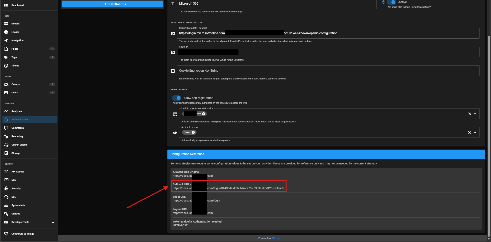

This guide demonstrates installing Wiki.js, the NGINX reverse proxy, Certbot (an ACME client that we'll use for automated SSL certificate renewal), a backing PostgreSQL database, and a supporting Elasticsearch container on an AlmaLinux 10 server.

Wiki.js is a Node.js application that relies on a database - we'll be using PostgreSQL.

We'll put a NGINX reverse proxy in front of the Wiki.js web application to handle SSL, and configure Wiki.js to listen on only localhost (127.0.0.1:3000) so that only NGINX is exposed to the outside world.

Then, we'll configure single sign on (SSO) so our users don't need a separate set of credentials to connect to the server.

Finally, we can configure Elasticsearch to add full-text search capabilities to our wiki.

## Install the PostgreSQL database server

Wiki.js depends on a database - PostgreSQL is the recommended option, and will be the *only* option in Wiki.js 3, so we'll use PostgreSQL.

Install PostgreSQL, initialize the database, and enable the service so the database server runs at startup:

```sh
sudo dnf install -y postgresql-server
sudo postgresql-setup --initdb
sudo systemctl enable --now postgresql.service
```

Perform the minimal configuration for Wiki.js:

```sql
[wporter@wikijs ~]$ sudo -u postgres psql
psql (16.8)
Type "help" for help.

postgres=# CREATE USER wikijs WITH PASSWORD 'redacted';
CREATE ROLE
postgres=# CREATE DATABASE wiki WITH OWNER wikijs ENCODING 'UTF8' LC_COLLATE='en_US.UTF-8' LC_CTYPE='en_US.UTF-8' TEMPLATE=template0;
CREATE DATABASE
postgres=# GRANT ALL PRIVILEGES ON DATABASE wiki TO wikijs;
GRANT
postgres=# \q
[wporter@wikijs ~]$
```

Configure the Wiki.js Postgres user to use a password to authenticate to the database server (default is host auth) by adding two `host` lines to the `/var/lib/pgsql/data/pg_hba.conf` file (controlling host-based authentication):

```sh
sudo sed -i '/^# TYPE/ a\
# wiki.js - use md5\
host    wiki            wikijs          127.0.0.1/32            md5\
host    wiki            wikijs          ::1/128                 md5
' /var/lib/pgsql/data/pg_hba.conf
```

## Download and configure the Wiki.js application

Now, let's download and install Wiki.js as a service.

Install dependencies. I only needed `wget` and `nodejs` on an AlmaLinux 10 Generic Cloud image:

```sh
sudo dnf install -y wget nodejs
```

Download the latest version of Wiki.js:

```sh
wget https://github.com/Requarks/wiki/releases/latest/download/wiki-js.tar.gz
```

Extract the package to the final destination of your choice:

```sh
sudo mkdir /srv/wiki
sudo tar xzf wiki-js.tar.gz -C /srv/wiki
cd /srv/wiki
```

Rename the sample config file to `config.yml`:

```sh
mv config.sample.yml config.yml
```

Edit the config file. Specify your database settings ([Configuration Reference](images/https://docs.requarks.io/install/config)):

```sh
vi config.yml
```

```yaml
db:
  type: postgres

  # PostgreSQL / MySQL / MariaDB / MS SQL Server only:
  host: localhost
  port: 5432
  user: wikijs
  pass: !replaceme!
  db: wiki
  ssl: false

  # Optional - PostgreSQL / MySQL / MariaDB only:
  # -> Uncomment lines you need below and set `auto` to false
  # -> Full list of accepted options: https://nodejs.org/api/tls.html#tls_tls_createsecurecontext_options
  sslOptions:
    auto: true
    # rejectUnauthorized: false
    # ca: path/to/ca.crt
    # cert: path/to/cert.crt
    # key: path/to/key.pem
    # pfx: path/to/cert.pfx
    # passphrase: xyz123

  # Optional - PostgreSQL only:
  schema: public

  # SQLite only:
  storage: path/to/database.sqlite
```

## Configure Wiki.js to run as a service

We'll create a unit file, and configure systemd to run Wiki.js at startup (as a service).

Create a system user for Wiki.js that is not allowed to log in to the system:

```sh
sudo useradd --system --no-create-home --shell /usr/sbin/nologin wikijs
sudo chown wikijs:wikijs /srv/wiki -R
```

Create the unit file for Wiki.js:

```ini
sudo tee /etc/systemd/system/wiki.service > /dev/null << 'EOT'
[Unit]
Description=Wiki.js
After=network.target

[Service]
Type=simple
ExecStart=/usr/bin/node server
Restart=always
User=wikijs
Environment=NODE_ENV=production
WorkingDirectory=/srv/wiki

[Install]
WantedBy=multi-user.target
EOT
```

Reload the system's units:

```sh
sudo systemctl daemon-reload
```

Start the service (and enable it to run at startup):

```sh
sudo systemctl enable --now wiki
```

To view Wiki.js's logs, run `journalctl -xeu wiki`.

On first startup, the setup interface will be accessible at `http://YOUR-SERVER-IP:3000/`. Navigate there, create your admin user, and then log on to Wiki.js for the first time.

## Configuring the NGINX reverse proxy

We'll put NGINX in front of Wiki.js to handle external traffic and SSL. This is good practice for any web services - NGINX is a robust reverse proxy designed to handle naughty Internet users (usually a better bet than whatever you intend to put behind it), and NGINX is extremely common (reducing the amount of application-specific config that's needed).

Install NGINX:

```sh
sudo dnf install -y nginx
```

Set the SELinux boolean to allow webservers to make network connections to allow NGINX to proxy requests to Wiki.js:

```sh
sudo setsebool -P httpd_can_network_connect 1
```

Set the NGINX configuration. I lifted this one from [nullrend.com](https://nullrend.com/15788/wiki-js-2-with-nginx-installation/):

```nginx
domain=wikijs.myorganization.tld

sudo tee /etc/nginx/conf.d/10-wiki.conf > /dev/null << EOT
map \$http_upgrade \$connection_upgrade {
  default upgrade;
  '' close;
}

upstream wiki {
  server 127.0.0.1:3000;
}

server {

  listen 443 ssl;
  listen [::]:443 ssl;
  server_name ${domain};

  # SSL
  ssl_certificate /etc/pki/wiki/${domain}/cert.pem;
  ssl_certificate_key /etc/pki/wiki/${domain}/privkey.pem;
  #ssl_trusted_certificate /etc/letsencrypt/live/wiki.domain.invalid/chain.pem;

  # . files
  location ~ /\.(?!well-known) {
      deny all;
  }
  
  # max file size
  client_max_body_size 100M;

  # logging
  access_log /var/log/nginx/${domain}.access.log;
  error_log /var/log/nginx/${domain}.error.log warn;

  location / {
    proxy_pass                  http://127.0.0.1:3000;
    proxy_http_version          1.1;
    proxy_set_header Upgrade    \$http_upgrade;
    proxy_set_header Connection "upgrade";
    proxy_set_header Host       \$http_host;
    proxy_set_header X-Real-IP  \$remote_addr;
  }

  gzip on;
  gzip_vary on;
  gzip_proxied any;
  gzip_comp_level 6;
  gzip_types text/plain text/css text/xml application/json application/javascript application/rss+xml application/atom+xml image/svg+xml;

}

# http redirect
server {

    listen 80;
    listen [::]:80;

    server_name ${domain};
    
    # certbot
    location ^~ /.well-known/acme-challenge/ {
        default_type "text/plain";
        root /var/www/letsencrypt;
        allow all;
        add_header Cache-Control "no-store";
    }
    
    location / {
        return 301 https://${domain}\$request_uri;
    }

}
EOT
```

### Self-signed cert

If you need a self-signed certificate, you can quickly generate one with:

```sh
domain=wikijs.myorganization.tld

# generate a self-signed certificate
openssl req -x509 -newkey rsa:4096 -keyout ~/key.pem -out ~/cert.pem -sha256 -days 3650 -nodes -subj "/C=XX/ST=State/L=City/O=Company/OU=CompanySectionName/CN=$domain"

# move certificate and privkey to /etc/pki
sudo mkdir /etc/pki/wiki/"$domain"/ -p

sudo mv ~/key.pem /etc/pki/wiki/"$domain"/privkey.pem
sudo mv ~/cert.pem /etc/pki/wiki/"$domain"/cert.pem

# adjust owner and make sure permissions on private key are restrictive
sudo chown nginx:root /etc/pki/wiki/"$domain" -R
sudo chmod 600 /etc/pki/wiki/"$domain"/privkey.pem
sudo chmod 644 /etc/pki/wiki/"$domain"/cert.pem

# update SELinux context so NGINX can read cert and privkey
sudo restorecon -v /etc/pki/wiki/"$domain"/{cert,privkey}.pem

# restart nginx to apply config
sudo systemctl restart nginx.service
```

If you are not using Certbot, remove the `.well-known/acme-challenge` `location {}` block in the NGINX configuration.

### Certbot (ACME)

Alternatively, you can configure Certbot to automatically retrieve a valid certificate if your internal PKI supports ACME.

In this environment, I have a `step-ca` at `intermediate-ca.lab.fqdn.com`. If you need to add the certificate to the machine's trusted store, that process looks something like this:

```sh
sudo mv root-ca-a.crt /etc/pki/ca-trust/source/anchors/
sudo update-ca-trust
```

Certbot is an EPEL package, so install EPEL if you don't have it, then install Certbot:

```sh
sudo dnf install -y epel-release certbot
```

Create a directory for Let's Encrypt to serve from, set ownership, relabel SELinux context:

```sh
sudo mkdir -p /var/www/letsencrypt/.well-known/acme-challenge
sudo chown -R nginx:nginx /var/www/letsencrypt
sudo chcon -Rt httpd_sys_content_t /var/www/letsencrypt
```

Get a certificate by answering a challenge on port 80:

```sh
sudo certbot certonly \
  --webroot -w /var/www/letsencrypt \
  --preferred-challenges http \
  --server https://acme-ca.lab.foobar.com/acme/acme/directory \
  --no-eff-email \
  --agree-tos \
  --non-interactive \
  -d wikijs.lab.foobar.com
```

Symlink your ACME certs to the path you told NGINX to use for the cert and private key, then set ownership, permissions, and relabel contexts:

```sh
fqdn="wikijs.lab.foobar.com"

sudo ln -s /etc/letsencrypt/live/"$fqdn"/fullchain.pem /etc/pki/wiki/"$fqdn"/cert.pem
sudo ln -s /etc/letsencrypt/live/"$fqdn"/privkey.pem /etc/pki/wiki/"$fqdn"/privkey.pem

# adjust owner and make sure permissions on private key are restrictive
sudo chown nginx:root /etc/pki/wiki/"$fqdn" -R
sudo chmod 600 /etc/pki/wiki/"$fqdn"/privkey.pem
sudo chmod 644 /etc/pki/wiki/"$fqdn"/cert.pem

# update SELinux context so NGINX can read cert and privkey
sudo restorecon -v /etc/pki/wiki/"$fqdn"/{cert,privkey}.pem
```

Add a hook to the Certbot unit's environment file to reload NGINX if certificates are renewed:

```sh
sudo sed -i "s|^DEPLOY_HOOK=\".*|DEPLOY_HOOK=\"--deploy-hook 'systemctl reload nginx.service'\"|" /etc/sysconfig/certbot
```

If you don't intend to restart the server before the cert would expire, start the systemd timer for the renewal (it's enabled, but not started):

```sh
sudo systemctl start certbot-renew.timer
```

Finally, restart NGINX to apply your changes:

```sh
sudo systemctl restart nginx.service
```

### Reconfigure Wiki.js

Finally, reconfigure Wiki.js so it only listens on localhost (rather than the default, all interfaces):

```sh
sudo sed -i "s/^bindIP:.*/bindIP: 127.0.0.1/" /srv/wiki/config.yml
```

Restart Wiki.js to apply the configuration change:

```sh
sudo systemctl restart wiki.service
```

## Configuring single sign on with Microsoft Entra ID

See the docs: [requarks.io](https://docs.requarks.io/auth/azure).

In the Wiki.js administration interface, navigate to Module > Authentication. Create a new Azure Active Directory identity provider (click "Add Strategy").

Scroll down to the bottom of the page, and copy the redirect URI provided in the "Configuration Reference":



Create an Application Registration in the Entra admin center. Enter a name, the redirect URI from the Configuration Reference in Wiki.js, and click Register.

Copy the Client ID from your Application Registration and use it to populate Wiki.js's Azure AD IDP Client ID field.

Configure the Identity Metadata Endpoint in Wiki.js for the Azure AD IDP to "`https://login.microsoftonline.com/$tenantid/v2.0/.well-known/openid-configuration`" (replacing "`$tenantid`" with your Entra tenant/directory ID).

Then, hop back over to the Entra admin center, and navigate to "Authentication" under your application registration.

Populate the "Front-channel logout URL" with the FQDN of your Wiki.js server (`https://YOUR-WIKI.DOMAIN.COM`) and, under "Implicit grant", check the "ID tokens" checkbox, then click Save.


Click over to "API permissions" for the app registration, and confirm that the User.Read permission is listed. Click "Grant admin consent" to authorize this permission for all users in your M365 tenant.


That's it with Entra!

Back in Wiki.js, be sure to add a group to the "Assign to group" field for the IDP.

Now, log out of your admin account, and attempt to sign on with your Microsoft 365 credentials by clicking the alternate identity provider on the logon screen.

## Adding Elasticsearch

Wiki.js has built-in search. It sort of works. But Elastic works better.

We can quickly and easily add Elasticsearch to our Wiki.js deployment by running an (or another, depending on how you've set up Wiki.js itself) Podman container on the wiki server and configuring it as a service. Since this won't be exposed, we can keep it very simple and hopefully add little overhead to our wiki.

We'll be using the latest available Elastic 7.x release. At the time of writing, this container tag is `elastic/elasticsearch:7.17.29`. My host is running AlmaLinux 10:

```text
[wporter@wikijs ~]$ uname -a
Linux wikijs 6.12.0-55.9.1.el10_0.x86_64_v2 #1 SMP PREEMPT_DYNAMIC Sat May 24 16:46:29 UTC 2025 x86_64 GNU/Linux
```

### Prerequisites

- Podman
- container-selinux
- A recent version of systemd (239+)

To install `podman` and `container-selinux`, it's one DNF call:

```sh
sudo dnf install -y podman container-selinux
```

To pull (download) the Elastic container, so you're not waiting later:

```sh
podman pull docker.io/elastic/elasticsearch:7.17.29
```

### Test Elastic

Before we deal with setting it up as a service, let's stand up a container to test with.

We'll have to specify that this is a single-node cluster (Elastic doesn't like this, but it's fine for our use case) and tell it to listen only on localhost - we'll bind the container to port 9200 and 9300 on 127.0.0.1.

Since we're running Elastic, we need to pass `--ulimit nofile` to allow more files than the default to be opened by the process at a time.

```sh
podman run --name elastic \
  -e "discovery.type=single-node" \
  -p 127.0.0.1:9200:9200 \
  -p 127.0.0.1:9300:9300 \
  --ulimit nofile=65536:65536 \
  --rm \
  docker.io/elastic/elasticsearch:7.17.29
```

Go ahead and fire that bad boy up. The container will dump out a bunch of logs to your terminal as Elastic starts up - once it calms down, it's ready to respond to requests. To verify it's working properly, you can use `curl` to make a GET to its ports:

```txt
[wporter@wikijs ~]$ curl http://127.0.0.1:9200
{
  "name" : "0ec887c1a47f",
  "cluster_name" : "docker-cluster",
  "cluster_uuid" : "suVkG_zeTqCimUcTTaD9Og",
  "version" : {
    "number" : "7.17.29",
    "build_flavor" : "default",
    "build_type" : "docker",
    "build_hash" : "580aff1a0064ce4c93293aaab6fcc55e22c10d1c",
    "build_date" : "2025-06-19T01:37:57.847711500Z",
    "build_snapshot" : false,
    "lucene_version" : "8.11.3",
    "minimum_wire_compatibility_version" : "6.8.0",
    "minimum_index_compatibility_version" : "6.0.0-beta1"
  },
  "tagline" : "You Know, for Search"
}
[wporter@wikijs ~]$ curl http://127.0.0.1:9300
curl: (1) Received HTTP/0.9 when not allowed
```

To test Elastic from Wiki.js, configure the Search Engine in Administration to use Elastic version 7.x on host `http://localhost:9200`. Disable TLS verification and do not specify a password - since this is not exposed and not handling sensitive content, it's.. relatively OK to run it without authentication in the name of simplicity.

Anyway, once you're satisfied, kill your test container (it'll get cleaned up automatically, since we specified `--rm`), and we'll move on to installing the container as a service.

### Install the Elastic container as a systemd service

Now, we'll define the container with Quadlet (a systemd generator that takes a container definition and turns it into a unit file, allowing you to declaratively define containers as systemd services). This means writing a .container file (not to be confused with a Containerfile).

We're basically defining the same thing that was in our `podman run` command:

- run the docker.io/elastic/elasticsearch:7.17.29 image
- bind the container to localhost:9200 and localhost:9300
- adjust the max open file limit to keep Elastic happy
- set the container to run in single-node mode

Plus:

- tell the JVM to use a 1gb heap
- persist data by specifying a Volume to preserve your indexes

Regarding our addition - since this Elastic container won't be doing all that much, will be on a shared server, and as Elastic likes to have some memory available for filesystem cache, we'll limit Elastic itself to a 1gb heap (initial and max should match - resizing the heap at runtime is generally bad). This 1g value is the minimum recommendation for a light-duty production deployment of Elasticsearch.

We'll have to initialize Elastic's data path by creating it and assigning it to UID 1000 (the UID used in the container):

```sh
sudo mkdir -p /usr/share/elasticsearch/data
sudo chown 1000:1000 /usr/share/elasticsearch/data
```

Then, we can seed our Quadlet .container file. For a full list of options in a Quadlet .container service file, [see the docs](https://docs.podman.io/en/latest/markdown/podman-systemd.unit.5.html#container-units-container).

```ini
sudo mkdir -p /etc/containers/systemd
sudo tee /etc/containers/systemd/elasticsearch.container > /dev/null << 'EOT'
[Unit]
Description=Elasticsearch 7.17.29 container (localhost only)
After=network.target

[Container]
Image=docker.io/elastic/elasticsearch:7.17.29
# map elastic's 9200 and 9300 to localhost
PublishPort=127.0.0.1:9200:9200
PublishPort=127.0.0.1:9300:9300
# increase the default open file limit
Ulimit=nofile=65536:65536
# run in single-node mode
Environment=discovery.type=single-node
# heap size
Environment="ES_JAVA_OPTS=-Xms1g -Xmx1g"
# if you want persistence
Volume=/usr/share/elasticsearch/data:/usr/share/elasticsearch/data:Z
# only available in newer versions of the generator
# Memory=2g


[Service]
Restart=always

[Install]
WantedBy=default.target
EOT
```

To validate your config, you can have the unit generator do a dry run:

```text
/usr/lib/systemd/system-generators/podman-system-generator --dryrun
```

If successful, you'll see the generated unit file:

```text
[wporter@wikijs ~]$ /usr/lib/systemd/system-generators/podman-system-generator --dryrun
quadlet-generator[5337]: Loading source unit file /etc/containers/systemd/elasticsearch.container
---elasticsearch.service---
[Unit]
Wants=network-online.target
After=network-online.target
Description=Elasticsearch 7.17.29 container (localhost only)
After=network.target
SourcePath=/etc/containers/systemd/elasticsearch.container
RequiresMountsFor=%t/containers

[X-Container]
Image=docker.io/elastic/elasticsearch:7.17.29
PublishPort=127.0.0.1:9200:9200
PublishPort=127.0.0.1:9300:9300
Ulimit=nofile=65536:65536
Environment=discovery.type=single-node
Environment=ES_JAVA_OPTS=-Xms1g -Xmx1g

# only available in newer versions of the generator
# Memory=2g
# if you want persistence
# Volume=/usr/share/elasticsearch/data:/usr/share/elasticsearch/data:Z

[Service]
Restart=always
Environment=PODMAN_SYSTEMD_UNIT=%n
KillMode=mixed
ExecStop=/usr/bin/podman rm -v -f -i --cidfile=%t/%N.cid
ExecStopPost=-/usr/bin/podman rm -v -f -i --cidfile=%t/%N.cid
Delegate=yes
Type=notify
NotifyAccess=all
SyslogIdentifier=%N
ExecStart=/usr/bin/podman run --name systemd-%N --cidfile=%t/%N.cid --replace --rm --cgroups=split --ulimit nofile=65536:65536 --sdnotify=conmon -d --publish 127.0.0.1:9200:9200 --publish 127.0.0.1:9300:9300 --env ES_JAVA_OPTS=-Xms1g --env discovery.type=single-node docker.io/elastic/elasticsearch:7.17.29

[Install]
WantedBy=default.target
```

If your file is OK, run a `systemctl daemon-reload` (to have systemd run through its config again), then check for the service's existence:

```sh
sudo systemctl daemon-reload
systemctl status elasticsearch
```

```text
[wporter@wikijs ~]$ sudo systemctl daemon-reload
[wporter@wikijs ~]$ systemctl status elasticsearch
○ elasticsearch.service - Elasticsearch 7.17.29 container (localhost only)
     Loaded: loaded (/etc/containers/systemd/elasticsearch.container; generated)
     Active: inactive (dead)
```

Since this is a generated service, you can't enable it, but you can set it to always restart (which we've done), add it to a target, and start it whenever you'd like. For example, ours is WantedBy the default target, so it'll run at boot. For testing, we can `sudo systemctl start elasticsearch`:

```text
[wporter@wikijs ~]$ sudo systemctl enable --now elasticsearch
Failed to enable unit: Unit /run/systemd/generator/elasticsearch.service is transient or generated
[wporter@wikijs ~]$ sudo systemctl start elasticsearch
[wporter@wikijs ~]$ systemctl status elasticsearch
● elasticsearch.service - Elasticsearch 7.17.29 container (localhost only)
     Loaded: loaded (/etc/containers/systemd/elasticsearch.container; generated)
     Active: active (running) since Fri 2025-07-04 03:35:28 UTC; 14s ago
 Invocation: 1e92d87e3d43493e971475f8822d5421
   Main PID: 5697 (conmon)
      Tasks: 44 (limit: 50428)
     Memory: 1.8G (peak: 1.8G)
        CPU: 1min 31.821s
     CGroup: /system.slice/elasticsearch.service
             ├─libpod-payload-b57f8bb0d20e7a9e2feee05375a81c5d8cfe2fec3b8d99480872d3f1eff2bc38
             │ ├─5699 /bin/tini -- /usr/local/bin/docker-entrypoint.sh eswrapper
             │ ├─5701 /usr/share/elasticsearch/jdk/bin/java -Xshare:auto -Des.networkaddress.cache.ttl=60 -Des.networka>
             │ └─5897 /usr/share/elasticsearch/modules/x-pack-ml/platform/linux-x86_64/bin/controller
             └─runtime
               └─5697 /usr/bin/conmon --api-version 1 -c b57f8bb0d20e7a9e2feee05375a81c5d8cfe2fec3b8d99480872d3f1eff2bc>

Jul 04 03:35:35 wikijs systemd-elasticsearch[5697]: {"type": "server", "timestamp": "2025-07-04T03:35:35,506Z", "level">
Jul 04 03:35:35 wikijs systemd-elasticsearch[5697]: {"type": "server", "timestamp": "2025-07-04T03:35:35,506Z", "level">
Jul 04 03:35:35 wikijs systemd-elasticsearch[5697]: {"type": "server", "timestamp": "2025-07-04T03:35:35,506Z", "level">
Jul 04 03:35:35 wikijs systemd-elasticsearch[5697]: {"type": "server", "timestamp": "2025-07-04T03:35:35,560Z", "level">
Jul 04 03:35:35 wikijs systemd-elasticsearch[5697]: {"type": "server", "timestamp": "2025-07-04T03:35:35,561Z", "level">
Jul 04 03:35:35 wikijs systemd-elasticsearch[5697]: {"type": "server", "timestamp": "2025-07-04T03:35:35,587Z", "level">
Jul 04 03:35:41 wikijs systemd-elasticsearch[5697]: {"type": "server", "timestamp": "2025-07-04T03:35:41,634Z", "level">
Jul 04 03:35:42 wikijs systemd-elasticsearch[5697]: {"type": "server", "timestamp": "2025-07-04T03:35:42,298Z", "level">
Jul 04 03:35:43 wikijs systemd-elasticsearch[5697]: {"type": "server", "timestamp": "2025-07-04T03:35:43,152Z", "level">
Jul 04 03:35:43 wikijs systemd-elasticsearch[5697]: {"type": "server", "timestamp": "2025-07-04T03:35:43,153Z", "level">
```

And, as a nice bonus, all the container's logs will look just like a normal service. Isn't that handy?

Once Elasticsearch is running, navigate to wiki.js/a/search (the Search Engine module in the Administration panel), select Elasticsearch for your search engine, specify `http://localhost:9200` as your Elastic host, uncheck 'verify TLS certificate', and hit Apply:


Then, try to run a full-text search!


Isn't that grand?
