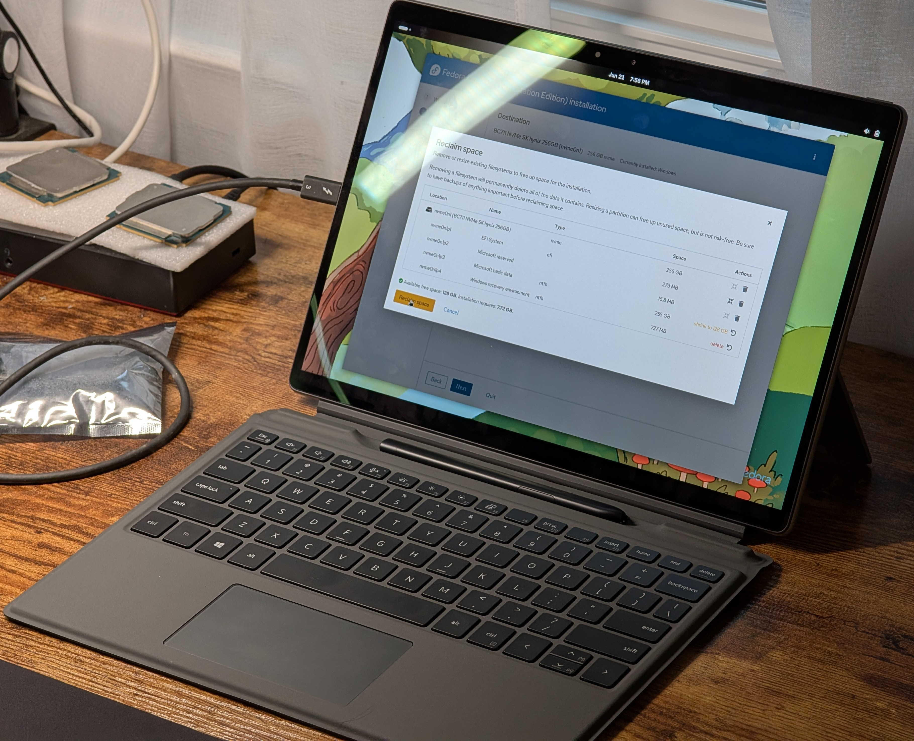
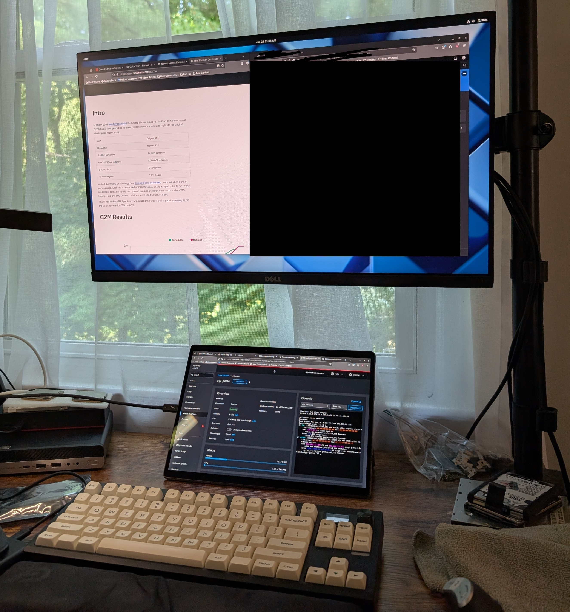
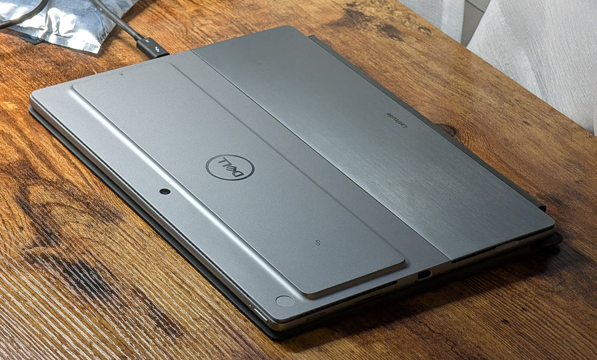
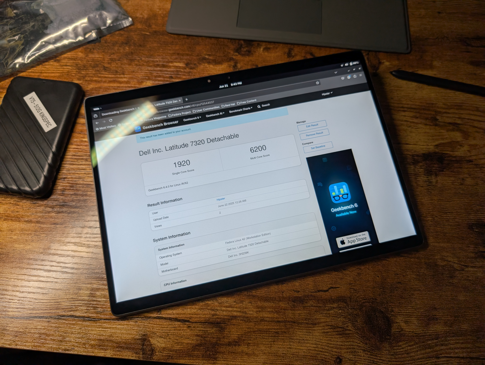
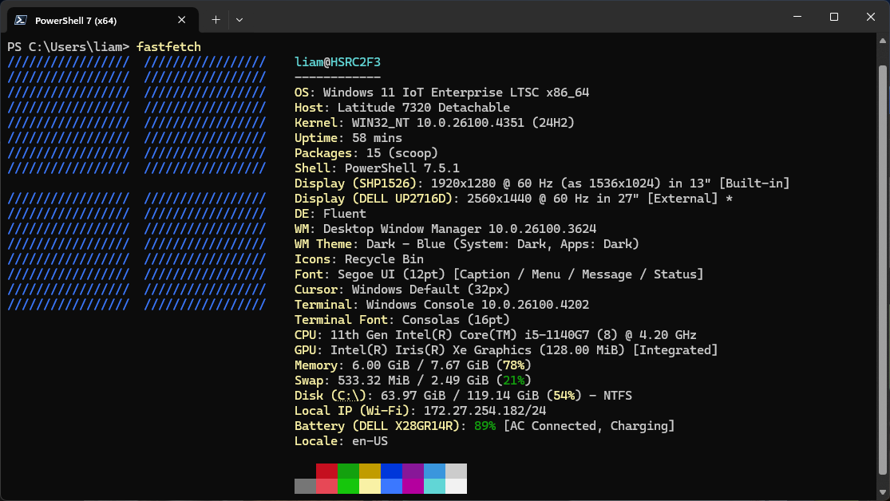
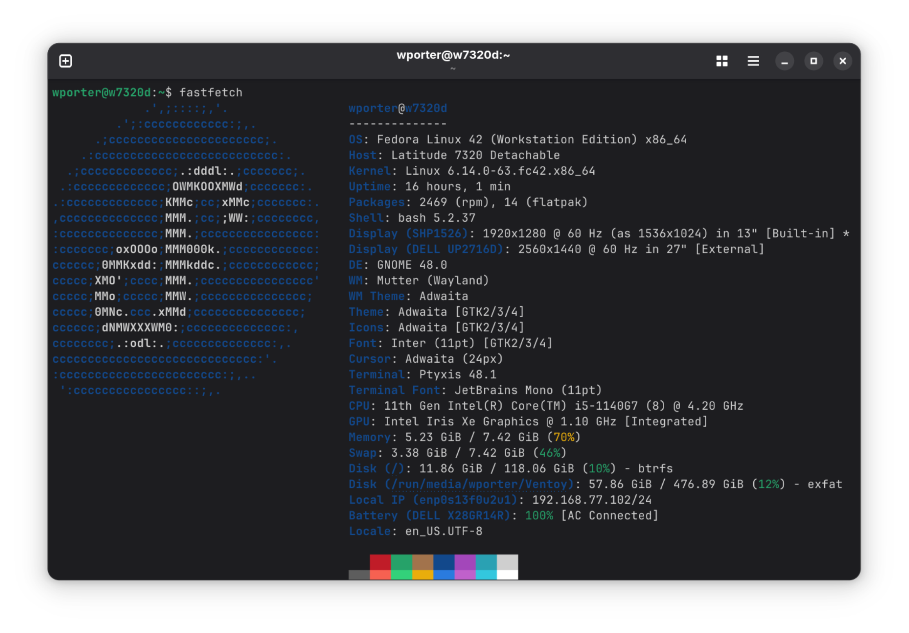
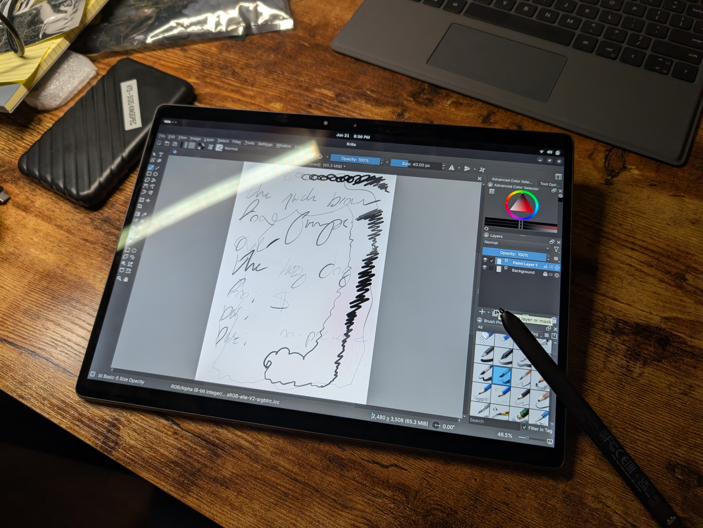
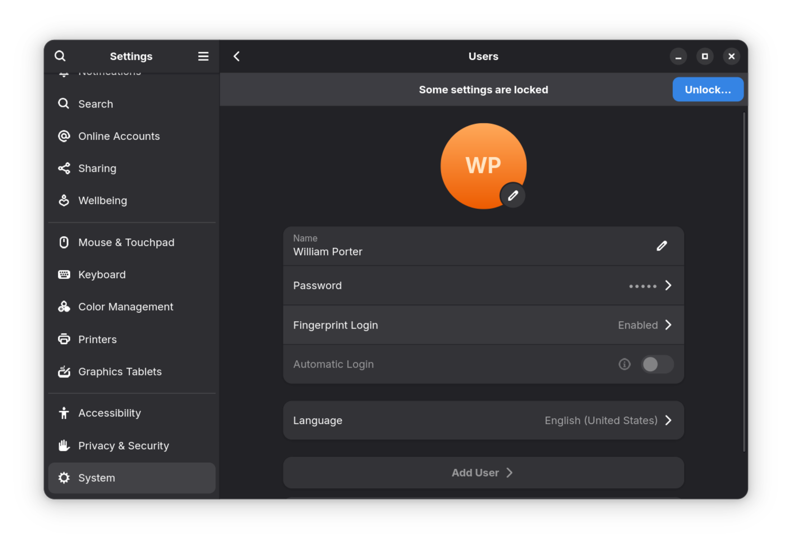

## Table of Contents

- Introduction
- Hardware
  - Display
  - Build
  - Peripherals
- Performance
- Windows (11 24H2 LTSC)
- Linux (Fedora 42, with GNOME)## Table of Contents

- Introduction
- Hardware
  - Display
  - Build
  - Peripherals
- Performance
- Windows (11 24H2 LTSC)
- Linux (Fedora 42, with GNOME)
- Conclusion

## Introduction

I've always liked the idea of a modern Windows tablet. It can double as a desktop, connected to a Thunderbolt dock, do the job of a laptop, with a (hopefully) decent keyboard and a kickstand, and do the job of a tablet - either for entertainment, or for a portable drawing pad. It would be perfect! See, I really don't want to throw a locked-down iPad into my mix of devices, and I really don't want a buggy, slow Android tablet, either. And if you don't like Windows, GNOME provides a pretty decent tablet interface, too!

I've never tried one before, but when I realized that Dell's premier Latitude 7300 tablets and Lenovo's X12s came apart with screws, not glue, I started looking around for one on the used market so I could give a Windows tablet a spin. I quickly found a 7320 in good shape for about $200, pulled the trigger, and, a few days later, pulled it out of its box.

Mine is specced with:

- An Intel Core i5-1140G7 (4c8t 7-15w Tiger Lake chip, with Iris XE 80eu graphics - quite snappy)
- 8gb of LPDDR4X-4267 memory (low-power DDR4... X - yes, the X stands for X. It's dual channel, and soldered to the board.)
- a 256gb Hynix SSD
- the only display option, a 1920x1280 (3:2) Sharp panel with 500 nits of brightness and coverage of the sRGB gamut
- a smart card reader and NFC
- a Qualcomm X20 4G LTE modem

Not bad, huh?

If you don't want to read the full review, here are my thoughts on the device:

### TL;DR

#### Pros

- Nice 3:2 display
- Strong performance for a four- or five-year-old tablet
- Excellent battery life
- Great pen experience
- Good build quality
- (Nearly) full-sized keyboard
- Repairable
- Runs Linux (almost) flawlessly
- Extremely cheap on the used market

#### Cons

- 8gb of memory isn't enough (buy a 16gb version)
- Dell firmware and drivers
- Display uses PWM
- Limited I/O (but, really, it's a tablet)

### Use cases

| Use Case                | Verdict                                                                                        |
| ----------------------- | ---------------------------------------------------------------------------------------------- |
| Browsing and media      | Thumbs-up: a great media machine                                                               |
| Office work             | Thumbs-up: Holds up well, but get a model with 16gb of memory                                  |
| Drawing and note-taking | Thumbs-up: Responsive pen, great aspect ratio, kickstand goes back ~300 degrees                |
| As a tablet             | So-so: a bit heavy, and desktop OSes need a keyboard - an iPad Pro is a much better 13" tablet |
| Light Linux machine     | Thumbs-up: excellent with Fedora 42                                                            |
| Second computer         | Thumbs-up: versatile, would compliment a more powerful tower nicely                            |

### Look elsewhere if

- You want to play games (This is a 7-watt i5 in a tablet, after all)
- You want a high-resolution, high-refresh screen (1920x1280 @ 60hz)
- You use the keyboard heavily (it's got a good type cover, but it's not a laptop)
- You're sensitive to PWM flicker
- You're not technical and/or not price-sensitive - firmware bugs and driver issues might drive you mad

## Hardware

### Display

At this point, I'll tell you that the display isn't *great*, but it's decent.

#### Resolution (1920x1280) and aspect ratio (3:2)

Don't get me wrong - it's not a *bad* screen. 1920x1280 pixels mean there's enough for laptop duty, though you might find it a little lacking up close, in tablet mode.

At 125% scale (my preferred setting), there's plenty of real-estate on this 7320's 13" internal display. There's oodles of vertical area, with the 3:2 aspect ratio providing nearly 20% more vertical space than a 16:9 display would, and about 7% more vertical space than there'd be on a comparable 16:10 panel.

And believe me, that squarer display pays dividends, especially when using the tablet in a portrait orientation to read a document - the extra width is very welcome (though there's not quite so much room as there is on an iPad, with their 4:3 aspect ratios). However, unlike on an iPad's squarer screen, when you need to get some work done in 'laptop mode', the 7320's 13" display is still wide enough to have two things side-by-side (though the iPad's disappointing OS won't let you try, anyway - not a problem for the 'real computer' Latitude Detachable or its PC tablet bretheren).

And, at a decent distance from the tablet's screen - e.g., under my external 27" 1440p monitor while the tablet is plugged into my dock - the glossy screen displays text nicely. Everything looks pretty good in this scenario.

#### Colors (sRGB) and contrast (1500:1)

The color gamut - nearly full coverage of the sRGB spectrum - is definitely wider than the bottom-of-the-barrel business laptop standard fare (that often fail to cover even 75% of sRGB), though, at my desk, it holds no candle to the wide-gamut (Adobe RGB) GBrLED-backlit UltraSharp UP2716D (my external monitor) sitting just above it, or a MacBook Air (which covers all of DCI-P3). Still, this screen looks far better than the office-drone tier displays in my ThinkPad T14 and T14s, and watching a YouTube video on it is pretty enjoyable.

Then, I popped the tablet off its keyboard and unplugged it from my dock to watch a very dim show that I was struggling to view on my desktop's monitors. The 7320's display performed admirably, and I was able to discern much more detail on its glossy, bright (500 nit), relatively high-contrast panel (the contrast rating is 1500:1 - and boy, do I believe it!)

#### PWM flicker, odd viewing angles, slow response time

However, there are some real negatives.

There's a bit of weirdness (color shift) and yellowing when you look at a white background from alternate angles. This is not noticeable with dark contents. The right and left edges of the display look slightly dim. It's short a few pixels for tablet usage. The touch matrix is quite visible on light backgrounds - this is also less noticeable in dark mode.

Unfortunately, there *is* PWM dimming to be found here. The backlight flickers enough to disturb my (sensitive) eyes, and I find myself closing the tablet and going to use something else because of it. I'm unusually sensitive to PWM flicker, so this is probably a moot point for most users - if you're fine with CRTs, laptop OLEDs, or CCFL-backlit monitors, you'll have no issues here. However, if you *are* sensitive to PWM, using this device might cause eyestrain or headaches.

As for *when* it uses PWM: Notebookcheck says their test device, with the same Sharp screen that's in mine (probably the only model Dell put in this tablet), only exhibits 2400hz PWM up to 42% brightness. However, I was able to discern flicker in a BlurBusters test at 100% (by pointing my phone at it in slo-mo video mode).

The screen is also quite slow - Notebookcheck says the response time is 30-50ms, and I believe that. The response time is so poor that it's perceptible on video. The only screens I've really seen that are remotely comparable have been MacBooks and my old Dell U3014T, an ancient, weird 30" 16:10 monitor (I love that thing, though). It's extremely noticeable under the UP2716D I've got at this dock (the UP2716D is pretty 'normal' in terms of response time.. consider it the average office monitor.) [I've uploaded a slow-motion video where the ghosting effect is clearly visible to YouTube - click here](https://youtube.com/shorts/bbLeHO8uOvw?feature=share).

I doubt these two are dealbreakers for most - the screen is still very usable so long as you're not bothered by ghosting or PWM, so they're, at best slight negatives.

Again, it's not amazing - it's short a few pixels; I'd love to see a real 'retina' style display that can be run at 200% scale, with pixel doubling for that perfect scaling in every application and dialog. And it's missing coverage of the wider gamuts that have become common on high end laptops - it's short about 30% of Adobe RGB or P3. But it's perfectly decent - I would not mind getting one of these puppies for a work machine; I'd likely be pleasantly surprised. Props to Dell for not finding a way to stick a 1366x768 TN in this one.

#### Display vs iPad Pro 12.9 (M1, 5th generation) and Surface Pro 7+

Comparing this 7320's screen to a Surface Pro or iPad is doing the Surface or iPad a great disservice - for example, here's a side-by-side spec comparison with a Surface Pro 7 Plus and the M1 iPad Pro:

| Spec                  | Latitude 7320 Detachable | Surface Pro 7+ | iPad Pro (13", M1)    |
| --------------------- | ------------------------ | -------------- | --------------------- |
| Type                  | IPS                      | IPS            | IPS (mini LED, FALD)  |
| Size (diagonal)       | 13.3"                    | 12.3"          | 12.9"                 |
| Resolution            | 1920x1280                | 2736x1824      | 2732x2048             |
| Pixels per inch (PPI) | 173.5                    | 267            | 264                   |
| Brightness (nits)     | ~500                     | ~400           | 600 (SDR), 1600 (HDR) |
| Contrast              | 1500:1                   | 1500:1         | up to 1,000,000:1     |
| Color gamut           | sRGB                     | sRGB           | DCI-P3                |
| Refresh rate (Hz)     | 60                       | 60             | 120                   |

The Surface and iPad have much higher resolution displays, with similar brightness when viewing SDR content. The iPad walks away with this comparison, however - not only is it the only display that properly supports HDR, with full-array dimming thanks to a mini-LED backlight, but it has a wider color gamut and a higher refresh rate, too.

The Latitude 7320 is in a different, worse, class - though I will say, the newer 7350 Detachable does not suffer from this same ailment, stepping up to match the Surface more closely. It exchanges the 1920x1280 panel in the 7320 for a 2880x1920 screen with the same color gamut and brightness, with slightly better contrast - 1800:1! If prices have come down since I've written this, I'd highly recommend trying one of those instead.

### Build & peripherals

The Latitude 7320 Detachable is a thin, light, and well-made little PC.

The only negative thing I have to say about the 7320's exterior is that the kickstand feels slightly flimsy. The device is light and feels nice in the hand. The tablet's front side is a sheet of smooth, glossy glass, that's easy to wipe down with a microfiber cloth to remove fingerprints. The device generally feels very solid - it is not poorly built. The body looks sleek, and is all metal. Note the gigantic smart-card reader hump on the back of mine - some do not have this, and have a flat back.

As a very nice bonus - these business tablets, namely the Dell 7300 Detachables and the Lenovo X12 - are screwed, not glued, together. That means this 7320 comes apart easily enough if you need to replace the battery, screen or drive. No glue here, meaning no early trips to the landfill. This is a very welcome departure from the Microsoft Surface or Apple iPad - Dell earns some serious points here, in my book.

#### Keyboard

The keyboard cover is adequate, and feels nearly as good as a clamshell laptop. It's a little bouncy when not lying flat, likely due to its thinness. While it's lacking a bit of travel, I'd be fine with using this for a few hours. I wrote the majority of this review using it and have no major complaints. It has all the keys you'd need; most are full-sized and properly spaced, and the backlight gets plenty bright.

#### Trackpad

The trackpad is cold to the touch and tracks accurately. I assume it's glass, but it might be a clever polycarbonate. Either way, it's good enough for daily use, if a bit short by modern standards. I have no complaints about the trackpad; multi-touch gestures work perfectly well and it's plenty large for something living on a tablet's type cover.

#### Pen

The 7320 has a half-flat, Surface-style/carpenter's pencil stylus that sits in the upper folding part of the keyboard (just like the Surface pen). It charges while the keyboard is plugged in via two pairs of pogo pins, and it magnetically snaps into place. The pen is comfortable enough, relatively accurate, and palm rejection is good.

This is a normal Wacom AES pen with 4096-level pressure sensitivity and support for tilt. Works fine for notes or sketches, and it charges quickly in its little dock on the keyboard.

## Performance

Don't intend to use Windows 11 on a device with 8gb of memory. Since memory in this tablet is soldered, don't buy an 8gb version (like I did) unless you really know what you're doing or intend to run Linux on it. We all know this by now. The OS's interface consists of about seventeen billion WebViews, and when you open a single tab of YouTube open, it's going to chew a gig of RAM up on its own.

Even Windows 11 LTSC 2024 IoT (what I'm running on this tablet) with *none* of the new fancy webapps that replaced Notepad.exe, no Gaming Bar App Thing, and much less telemetry running in the background idles at around 4 - 5g of memory.

Since these tablets have a reasonably fast drive, it'll page, and things will generally keep chugging along - but you will *certainly* notice when the machine runs out of memory (and it runs out of memory VERY quickly). Animations get choppy and things get slow. This is solvable by buying the correct config (the one with 16gb of memory), which I would highly recommend as the only config you should buy if you intend to use Windows.

The i5-1140G7 is perfectly capable for normal office work and some browsing. [My 7320, running Windows 11 24H2 LTSC, posted a Geekbench 6 score of 1869/5868](https://browser.geekbench.com/v6/cpu/12543370). Running Fedora 42, it managed a few more points, [for a score of 1920/6200](https://browser.geekbench.com/v6/cpu/12544037)).

While Geekbench isn't a good benchmark for heavier workloads, I find it to be an accurate representation of system responsiveness and performance for lighter tasks, like office work, text editing, scripting/web development or web browsing. Here's how that score stacks up with some other devices I had on hand over the past few months:

| Device               | CPU          | Single / Multi GB6                                            | Notes                       |
| -------------------- | ------------ | ------------------------------------------------------------- | --------------------------- |
| Dell Latitude 7320   | i5-1140G7    | [1869 / 5868](https://browser.geekbench.com/v6/cpu/12543370)  | Tablet with 7-15w CPU       |
| ThinkPad P1 Gen 4    | i9-11950H    | [2252 / 10069](https://browser.geekbench.com/v6/cpu/11384341) | 7320-era mobile workstation |
| Dell Pro 16 (2024)   | 5 120U       | [2462 / 7776](https://browser.geekbench.com/v6/cpu/12284882)  | Newer budget chip           |
| ThinkPad P14s Gen 5i | Ultra 7 155H | [2475 / 13587](https://browser.geekbench.com/v6/cpu/10170892) | Newer midrange workstation  |
| Custom Desktop       | i9-12900KS   | [2956 / 18759](https://browser.geekbench.com/v6/cpu/11566337) | As fast as it got in 2022   |

I think the main takeaway from this is that the little 7w tablet has *definitely* aged well!

Generally, the system is very responsive - it would be difficult to tell it apart from a newer Core Ultra CPU when the system is lightly loaded. Thanks to its low TDP, the 1140G7 will quickly throttle itself, so workloads that can use all your threads like compression or compilation will suffer, even when compared to its higher-wattage counterpart (the 1145G7) - never mind something newer with four times the core count. But this is a tablet, so I don't think that really matters. Performance is more than fine for someone doing tablet stuff. You can dock one of these and get some work done without noticing that you're using a tablet, then undock it and go do tablet stuff.

## Setting up Windows - not so smooth

Since this is just an amd64 PC like any other, setup is super easy. There's nothing weird like holding the volume buttons to get into the BIOS like a Surface - you can press F12 to bring up the Startup Interrupt menu like you would on any other Dell business machine, and you can boot off a Ventoy drive with no fuss at all.

The previous owner's IT department had already disabled Intel VMD (the Volume Management Device, also known as 'evil semi-fake RAID mode that won't let me install Windows and eats all the IOPS'), and Secure Boot for me - thanks, guys! Note that if VMD is *not* disabled, you may struggle to get Windows installed without feeding Setup the correct driver.

After a quick unattended install, I logged into Windows for the first time and, while touch and WiFi didn't work, the Realtek NIC in my dock did. Windows Update started pulling down a bunch of device drivers while I kicked off my post-install script. Once all my normal software had been installed (this took quite a while, due to the 1140G7's low power budget and the 7320's limited thermal envelope), and my normal registry tweaks were made, I slapped Dell Command Update on the tablet and gave it a run. This, of course, picked up a bunch of firmware updates. One reboot later..

### Firmware and driver disaster

Disaster strikes! We're getting Dell'd (verb - to be a source of entertainment for Michael Dell, who just pushed a bad firmware update and bricked a device at a site two hours away)!

#### Chipset firmware update breaks wireless connectivity

Unfortunately, after booting back into Windows, I realized that this little tablet had apparently decided to be evil, failed one of its many firmware updates, and now both WiFi and the Windows DNS client are totally broken!

It turned out that the DNS resolver had failed due to a broken network driver, so, while the wired NIC in my dock still worked, the system couldn't resolve hostnames.

Since the AX201 depends on the chipset on these devices (unlike the AX200, the AX201 card itself is just the physical interface - Intel built a significant portion of the wireless chipset into the PCH), I figured I'd try to throw newer chipset firmware at it, since that was probably the only update that could break the system's wireless NIC. This did the trick - one more reboot later, and...

#### Intel Smart Sound Technology audio pain

Now, my audio wasn't working. Ahh. That's the real Dell experience.

One trip to Dell's site later, I had the Realtek drivers for the Intel Smart Sound Technology audio device in this 7320 installed (apparently they'd not been properly delivered by Dell Command Update, perhaps because the version now provided by the main package in Winget is quite old).

Two reboots later (at Realtek's insistence), we were *finally* up and running. For about thirty seconds, before Windows Update screwed something and, now, my audio devices were disappearing and reappearing about every second.

One more reinstall of the Realtek driver, and two *more* reboots later, and everything was working. And for whatever reason, Windows Update stopped touching my audio driver. OK!

Does that feel like it took forever? Because it did. Anyway, now we can do tablet stuff! Let's move on.

Here's the obligatory Fastfetch.

Windows is generally.. fine.. with touch gestures. I find that the Start menu doesn't work particularly well with touch or pen input, often requiring a few presses to get the search box to do anything.

Sometimes, I had the taskbar switch from tablet to PC mode and back seemingly at random. At other times, the workspace switch gestures didn't work. I also had an Iris graphics bug - I couldn't see any command host window's content, just the floating titlebar. Weird!

The system seemed to settle down after getting some patches. Right now, I'm using that same 24H2 install without any of the weird bugs - but the Start menu still barely works.

Generally, the tablet experience is okay, but tablets do not feel like a first-class citizen on Windows 11. So, let's try something else!

## Setting up Linux - much more straightforward than Windows

So, we've established that this thing is fairly decent hardware-wise, but gets let down by its software. Let's see how it does with a proper OS (and help this poor little 8gb model do some proper computing). I first tried Intel's performance monster, Clear Linux* (for fun), which kernel panic'd after three seconds. So, I moved on to Fedora (Workstation 42, with the GNOME desktop).

Fedora installed without any fuss at all; after using the wizard to resize my Windows partitions (from Linux - what? In the wizard? Good job, Fedora maintainers! Fantastically easy to use) and clicking 'install', it took about five minutes for the 1140G7 to do its thing.

One reboot and one `curl` of my setup script later, I was staring at a fully configured Linux tablet with everything but the cameras working. The following things *did* work out of the box on Fedora 42, 6.14.0-63.fc42.x86_64:

- Pen
- Keyboard
- Trackpad
- Ambient light sensor
- Audio (out and in)
- 4G modem
- Touch
- Suspend
- Keyboard hotkeys
- Fingerprint reader

I immediately noticed that the display looks better than it did when I was running Windows on the tablet. Perhaps it's just down to the lack of subpixel antialiasing in most of Windows 11, but Fedora 42 looks brilliant. Everything I typically use was automatically scaled to 125% (per the default Wayland system settings), which is *much* better than the 200% that Windows decided to use out of the box. Text is perfectly sharp and the display gets even brighter now that the Intel power-saving settings are gone. There's no weird color-shifting thing to disable here, either.

I installed Krita to try out the pen. It's a standard Wacom AES device, as previously mentioned, so it works perfectly. Tilt and pressure work well, and I was able to draw some rude symbols as if I was writing on paper. The 3:2 aspect ratio is *perfect* for this type of thing - I never once felt that I was running out of vertical real estate.

Setting up the fingerprint reader on the rear of the device was very easy - just navigate to sign-in settings and tap or click on 'Fingerprint Login' to scan a finger:

No mucking about with drivers necessary. Once the reader's configured, it works flawlessly - this thing has one of the best fingerprint readers I've ever used on a Windows laptop, and you can even use it while it's closed, since it's on the top of the tablet! Authenticating a `sudo` becomes lifting your finger right past your external keyboard.

Then, I took the tablet off its keyboard. Turning the tablet to portait mode, I opened up a technical PDF - something that *can't* easily be read on a phone or smaller tablet - and started to read. While the subpixel antialiasing doesn't do quite so well in portrait mode, the experience is still enjoyable. It's very slightly heavier and thicker than I'd like a tablet to be, but the 7320 is still very usable. It never gets more than warm, and is typically cool to the touch while you're reading a PDF or playing back 1080p video (the Iris XE graphics' monster media decode engines are probably to thank for that one).

Running Linux, the device typically estimates between 6 - 9 hours on a charge at full brightness (500 nits). This is, frankly, excellent. Mine has 100% of its 40wh battery remaining, so this is a best-case - a more heavily used 7320 won't last quite as long.

My 8gb model is completely usable running Fedora 42 (rather than Windows 11). The device does swap (to a zram device - rather than writing to disk, it compresses things and writes them back to that super-fast LPDDR4X, as is Fedora convention) but it's unnoticeable. Unlike Windows, Fedora stays responsive, with all the animations staying smooth, even when there are a couple of things open.

That said, the memory footprint of Fedora 42 with GNOME 48 is rather substantial for a Linux distribution - I see over 2gb at idle. An older version of GNOME, like GNOME 40 packaged with AlmaLinux 10/EL10, might do even better - and this tablet is certainly old enough that a bleeding-edge kernel is no longer necessary. I'd still recommend getting the 16gb model unless you snag a great deal on an 8gb model.

## Final thoughts

This is a rare amd64 tablet, with healthy performance and decent build quality, but it has some asterisks. If you can snag one used, don't mind tinkering with Windows or learning to use Linux, and can live with the slightly low-resolution screen, it's a great value.

The 7320 Detachable is seriously hindered by poor firmware and driver QC - I would have been furious had I been the IT lead who forked over $2000 a pop for a fleet of these. This is the case with a lot of Dell business machines, but is excusable in a device that only costs around $200 used. And, since it's a Dell, be sure to do a clean Windows installation to knock out their buggy bloatware.

The 13" 3:2 screen is awfully big, bright, and reasonably nice to look at, though it appears to suffer from PWM at any brightness and has a very slow response time (likely to save power - this is a common characteristic with low-power IPS screens, though they're rarely *this* slow). This may or may not bug you.

The Tiger Lake chips hold up surprisingly well today, and Iris XE graphics backed by fast LPDDR4X 4267 means it'll happily drive one or two 1440p monitors (through the pair of Thunderbolt 4 ports - use whichever side you'd like to charge or dock). A pair of 4K screens might be pushing it.

Be sure to get a configuration with 16gb of memory, since you can't upgrade it later and 8gb isn't enough for modern Windows (and it's getting tight for modern Linux distributions).

The keyboard cover is surprisingly good - I don't mind using it, unlike most tablet keyboards. The keys that matter most are full-sized and, in terms of travel and feedback, I'd compare it to a MacBook. The pen is quite good. The trackpad feels great and tracks nicely, though it's a little short.

The build is generally very nice, though I found the kickstand a little flimsier than I expected. That said, it's supremely adjustable and can hold the display at nearly any angle.

The battery life is *excellent*. 6 - 9 hours can be expected on Linux; I'd reign that upper number in a bit and guesstimate 6 - 7 hours if you're running Windows 11 (my usage on Windows was lighter than it was on Linux). That's without any additional tuning or tweaking.

### Bottom line

As long as you know what you're getting yourself into, this would be a fine machine for lighter tasks, and would complement a tower workstation extremely well. The battery life is remarkable for a thin and light tablet. The type cover is nice, and you can flip the pen out to do some quick sketching. This thing feels like it was designed to live in conference rooms, and it excels at that type of work - quick notes, meeting agendas, portability, and versatility.

The Dell Latitude 7320 Detachable isn't perfect. It certainly caused me some pain with bad firmware and drivers, the screen isn't the best thing ever, and the camera doesn't work in Linux. But, for under $250, it doesn't need to be perfect. And the 7320 isn't just a cheap tablet! It's a capable little PC that can punch far above its price, so long as you're prepared to babysit it a bit.
