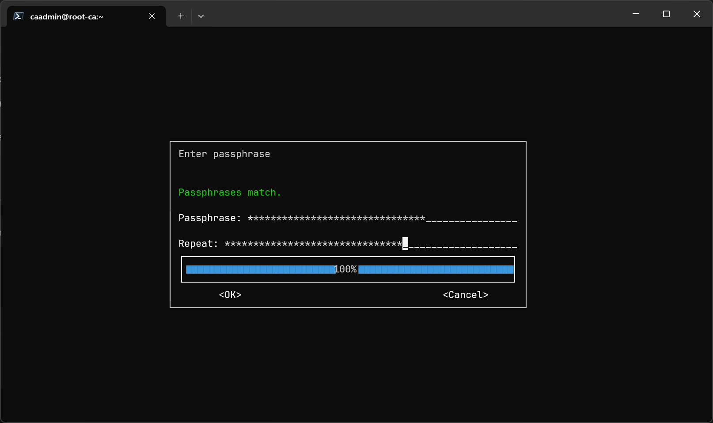
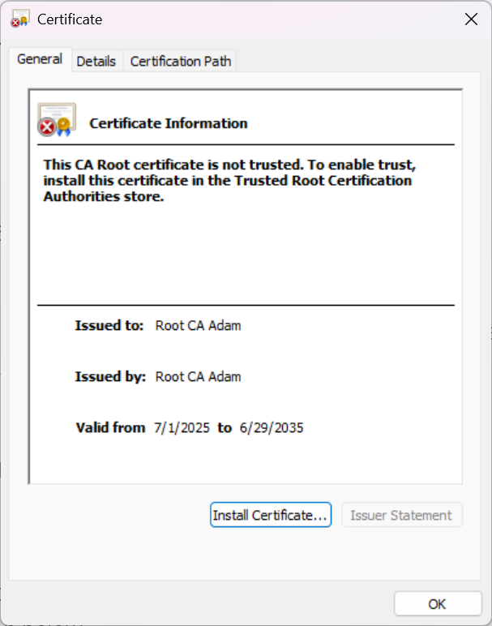
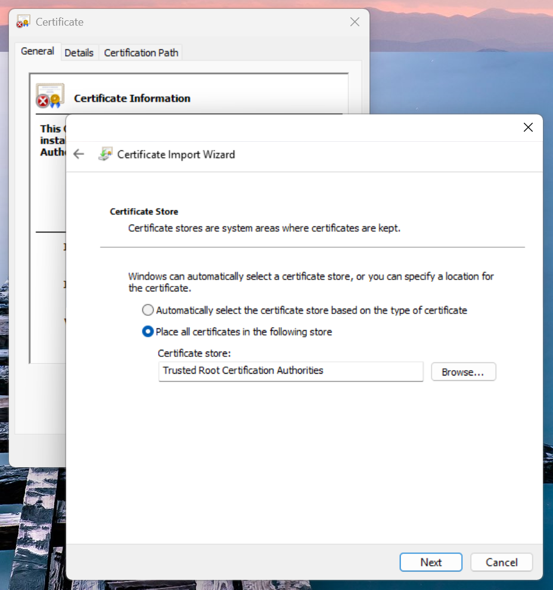
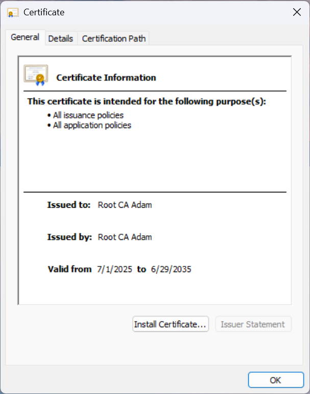
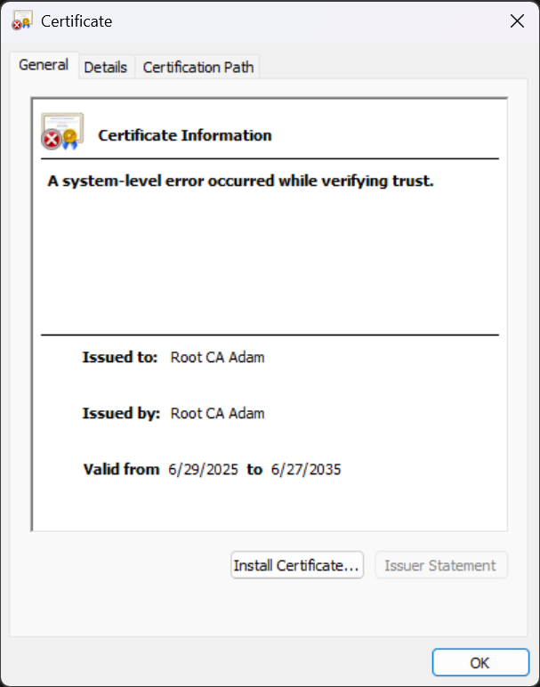

## Introduction

Certificates are often viewed as "black magic" - and, as with any cryptographic topic, that's entirely true! Cryptography is great.

Thankfully, you don’t need to be a cryptographer to use public key infrastructure (PKI) to establish trust between systems.

If you’ve ever created an SSH key pair, you're already familiar with the fundamentals! SSH key pairs and SSL certificates are extremely similar.

In a typical PKI setup, certificate authorities (CAs) act as the trust anchors. You can think of a certificate like an SSH public key: you distribute your public key, and devices that have it can verify that you - holding the corresponding private key - are who you say you are.

Now swap “device” for “browser” and “public key” for “certificate” - but drop the word “public,” because we’re now dealing with X.509 certificates. The private key is still private, though.

Creating a certificate authority is really just about generating a key pair and distributing the *public* part in the form of a certificate. Clients trust that certificate by adding it to their trust store - just like SSH does with `known_hosts` (but without the scary fingerprint warning every time).

Why don’t you get a warning when visiting most websites over HTTPS, you might ask? Well, because your browser and operating system already trust a set of built-in public CA certificates (public keys). When you generate your own, you're just adding another one to that store, and telling your system "hey, you can trust this, too".

That scary warning from a self-signed certificate? Exact same thing as SSH yelling about an unknown host.

Hopefully that gives you some helpful context. Now, let’s dive in and do (part of) the PKI.

## Creating a root CA

To create our root CA, we'll use OpenSSL on an AlmaLinux 10 VM to generate a private key and corresponding public key (certificate). The distribution does not particularly matter here; OpenSSL is a defacto standard.

The root certificate authority will be used only to issue a certificate to intermediates. Then, it'll be shut down until it's needed again.

Why? Exposure! If an attacker were to compromise your root certificate, they would potentially have the 'trust' of all of your client devices (compromising all your infrastructure). By locking up the root key pair, we limit its exposure to the world and reduce the risk of it being compromised.

We won't go over the process of creating an intermediate CA here, but there'll be another post on it sooner or later.

We're using OpenSSL directly because it's got a tiny footprint, is extremely simple, and is (relatively) well documented.

You can definitely use plain OpenSSL for your root certificate with other, more featureful CAs, such as `step-ca` or Active Directory Certificate Services, as intermediates (they all follow the X509 standard) - just install the root cert, have them produce a CSR, sign it with the root CA, and give it back to the intermediate to get off to the races. Same process you'd follow to get a SSL certificate for your website or SSL VPN server.

Anyway, off to the races!

### Initial setup

We'll create a specific user for CA stuff, create the CA a directory in `/srv`, and give the new user ownership of said directory.

```sh
sudo useradd caadmin -m
sudo mkdir -p /srv/ca
sudo chown caadmin:caadmin /srv/ca -R
```

If this was a production server, you should also lock down the `caadmin` user, require MFA for any kind of access to the system, and you should probably store the root key in a TPM so it cannot easily be exfiltrated. I would recommend against joining the root CA to any domain or using an external identity provider. This server is extremely important because its private key potentially grants an attacker the trust of all of your clients.

In my case, my normal user will play the role of the "sysadmin" - you should probably have separate users for administering the server and administering the CA.

Anyway, back to doing CA stuff. Let's hop over to the `caadmin` user and get going:

```sh
sudo passwd caadmin
su - caadmin
```

We'll first create a simple directory structure for the CA. Bear in mind that the `/srv/ca/private` directory stores private keys, and you should probably not allow things to read them.

Note the `$ca` variable - this is the name of the certificate authority that we'll define in a config file in a little bit.

```sh
mkdir -p /srv/ca/{private,certs,db}
chmod 700 /srv/ca/private
ca=root-ca-a
touch /srv/ca/db/"$ca".{serial,crl,index}
```

We'll have to create the database/index files manually:

```sh
echo 01 | tee /srv/ca/db/"$ca".{serial,crl} > /dev/null
```

### Writing a config file

Now, we can create an OpenSSL CA configuration file. This'll be a bunch of settings we can pass to our OpenSSL calls to generate CSRs or sign certificates.

I sourced this configuration file from [pki-tutorial.readthedocs.io](https://pki-tutorial.readthedocs.io/en/latest/simple/root-ca.conf.html), but made some adjustments to suit this environment, namely:

- Increasing the default RSA key size to 4096 bits
- Changing directories to remove some of the nesting
- Shrinking the default certification duration (for our intermediate CAs) to 365 days, from 3652 days
- Reducing the `default_crl_days` to 30 from 365
- Changing the `match_pol` `organizationName` policy to not strictly match the `ca_dn` `organizationName` value
- Filtering valid certs by DNS name rather than DN components
- Removed the unused `any_pol` block - we're matching
- Added a path length to the `root_ca_ext` block, disallowing signing anything but intermediate CAs with this root CA

```ini
tee /srv/ca/openssl.cnf > /dev/null << 'EOF'
# The [default] section contains global constants that can be referred to from
# the entire configuration file. It may also hold settings pertaining to more
# than one openssl command.

[ default ]
ca                      = root-ca-a             # CA name
dir                     = /srv/ca               # Top dir

# The next part of the configuration file is used by the openssl req command.
# It defines the CA's key pair, its DN, and the desired extensions for the CA
# certificate.

[ req ]
default_bits            = 4096                  # RSA key size
encrypt_key             = yes                   # Protect private key
default_md              = sha512                # MD to use
utf8                    = yes                   # Input is UTF-8
string_mask             = utf8only              # Emit UTF-8 strings
prompt                  = no                    # Don't prompt for DN
distinguished_name      = ca_dn                 # DN section

[ ca_dn ]
0.domainComponent       = "org"
1.domainComponent       = "wporter"
2.domainComponent       = "lab"
organizationName        = "wLab"
commonName              = "Root CA Adam"

# The remainder of the configuration file is used by the openssl ca command.
# The CA section defines the locations of CA assets, as well as the policies
# applying to the CA.

[ ca ]
default_ca              = root_ca               # The default CA section

[ root_ca ]
certificate             = $dir/$ca.crt          # The CA cert
private_key             = $dir/private/$ca.key  # CA private key
new_certs_dir           = $dir/certs            # Certificate archive
serial                  = $dir/db/$ca.serial    # Serial number file
crlnumber               = $dir/db/$ca.crl       # CRL number file
database                = $dir/db/$ca.index     # Index file
log_file                = $dir/logs/$ca.log
rand_serial             = yes                   # Use random serial numbers
unique_subject          = no                    # Require unique subject
default_days            = 365                   # How long to certify for
default_md              = sha512                # MD to use
policy                  = match_pol             # Default naming policy
email_in_dn             = no                    # Add email to cert DN
preserve                = no                    # Keep passed DN ordering
name_opt                = multiline,-esc_msb,utf8 # Subject DN display options
cert_opt                = ca_default            # Certificate display options
copy_extensions         = none                  # Copy extensions from CSR
x509_extensions         = signing_ca_ext        # Default cert extensions
default_crl_days        = 30                    # How long before next CRL
crl_extensions          = crl_ext               # CRL extensions

# Naming policies control which parts of a DN end up in the certificate and
# under what circumstances certification should be denied.

[ match_pol ]
organizationName        = optional              # Included if present
organizationalUnitName  = optional              # Included if present
commonName              = supplied              # Must be present

# Certificate extensions define what types of certificates the CA is able to
# create.

[ root_ca_ext ]
keyUsage                = critical,keyCertSign,cRLSign
basicConstraints        = critical,CA:true,pathlen:1
nameConstraints         = critical,permitted;DNS:.lab.wporter.org
subjectKeyIdentifier    = hash
authorityKeyIdentifier  = keyid:always,issuer

[ signing_ca_ext ]
keyUsage                = critical,digitalSignature,keyCertSign,cRLSign
basicConstraints        = critical,CA:true,pathlen:0
nameConstraints         = critical,permitted;DNS:.lab.wporter.org
subjectKeyIdentifier    = hash
authorityKeyIdentifier  = keyid:always,issuer
crlDistributionPoints   = URI:http://pki.lab.wporter.org/crl/root-ca.crl
authorityInfoAccess     = OCSP;URI:http://pki.lab.wporter.org/crl/ocsp

# CRL extensions exist solely to point to the CA certificate that has issued
# the CRL.

[ crl_ext ]
authorityKeyIdentifier  = keyid:always
EOF
```

This config file, essentially, contains some defaults for `openssl` commands and certificate generation. Let's go over each section.

#### req

This section specifies configuration options to feed `openssl-req` when creating our root certificate.

Here, we set a good default RSA key size, encrypt the private key by default, tell OpenSSL to default to SHA-512, use UTF8 formatting and refer to the `[ ca_dn ]` section of our config file for information about the CA's distinguished name.

```ini
[ req ]
default_bits       = 4096      # set RSA key size
encrypt_key        = yes       # Protect private key w/ passphrase
default_md         = sha512    # MD to use
utf8               = yes       # input is UTF-8
string_mask        = utf8only  # output only UTF-8 strings
prompt             = no        # don't prompt for DN
distinguished_name = ca_dn     # DN section
```

#### ca_dn

This section specifies the distinguished name in the certificate subject (metadata to identify the certificate's owner). In this case, mine uses domainComponents to reflect that it is authoritative for "lab.wporter.org" (though these are definitely not necessary). Root CAs don't typically use SANs, so we'd might as well use DCs.

The Org is a descriptive identifier of who owns the CA (can help differentiate between a public root cert for CN "Root Cert A" and a private cert for CN "Root Cert A").

The CN is the descriptive name of the root CA.

```ini
[ ca_dn ]
0.domainComponent = "org"           # DC=org
1.domainComponent = "wporter"       # DC=wporter
2.domainComponent = "lab"           # DC=lab
organizationName  = "wLab"          # O=wLab
commonName        = "Root CA Adam"  # CN=Root CA Adam
```

#### ca

We'll combine the sparse `[ ca ]` section and the less sparse `[ root_ca ]` section it points at.

This, as the comment helpfully states, defines the locations of the CA's assets:

- private key
- root certificate
- the directory to put new certs in
- the serial number database
- the signing log file
- whether to randomize serial numbers
  - yes, makes it harder for an adversary to predict a certificate and cause a collision attack, most relevant for certs with MD5 signatures - doesn't hurt security, so we'll keep it around
- Whether to require a unique subject
  - OpenSSL recommends setting this to "no", but the default is "yes" for backwards compatibility. There is probably no security impact, and this makes certificate replacement easier (you do not need a unique name for every new certificate).
- how long a certificate should last by default
  - I've set this to 365d for my intermediates
- what hashing algorithm to use
  - SHA-512 might have some compatibility issues with older clients, but we'll keep this consistent with req section
- naming policy (use what we've defined later on in `[ match_pol ]`)
- display options
- copy extensions = none - do not copy extensions from the CSR to the certificate by default
- X509 extensions - in this case, what will the default for our intermediates be?
- revocation list extensions - in this case, a section at the end of our config telling OpenSSL to always include the CA's key identifier in the CRL (linking CRL to a CA)

```ini
# The remainder of the configuration file is used by the openssl ca command.
# The CA section defines the locations of CA assets, as well as the policies
# applying to the CA.

[ ca ]
default_ca              = root_ca               # The default CA section

[ root_ca ]
certificate             = $dir/$ca.crt          # The CA cert
private_key             = $dir/private/$ca.key  # CA private key
new_certs_dir           = $dir/certs            # Certificate archive
serial                  = $dir/db/$ca.serial    # Serial number file
crlnumber               = $dir/db/$ca.crl       # CRL number file
database                = $dir/db/$ca.index     # Index file
log_file                = $dir/logs/$ca.log
rand_serial             = yes                   # Use random serial numbers
unique_subject          = no                    # Require unique subject
default_days            = 365                   # How long to certify for
default_md              = sha512                # MD to use - stay consistent
policy                  = match_pol             # Default naming policy
email_in_dn             = no                    # Add email to cert DN
preserve                = no                    # Keep passed DN ordering
name_opt                = multiline,-esc_msb,utf8 # Subject DN display options
cert_opt                = ca_default            # Certificate display options
copy_extensions         = none                  # Copy extensions from CSR
x509_extensions         = signing_ca_ext        # Default cert extensions
default_crl_days        = 30                    # How long before next CRL
crl_extensions          = crl_ext               # CRL extensions
```

#### match_pol

I've gutted this section since we're validating by DNS name instead, which is defined in the extensions for our signing and root CAs, not by DC. This is a more modern way to go about it (someone spoofing Google could just add our DC=lab, DC=wporter, DC=org to the DN and get by - most stuff filters by SAN nowadays).

All this says is that the org name and OU name may be included if they are present in the CSR, and that the commonName must be present.

```
# Naming policies control which parts of a DN end up in the certificate and
# under what circumstances certification should be denied.

[ match_pol ]
organizationName        = optional              # Included if present
organizationalUnitName  = optional              # Included if present
commonName              = supplied              # Must be present
```

#### extensions

Finally, we're at our extensions. I'll lump all three blocks in here.

The `root_ca_ext` and `signing_ca_ext` blocks are mostly the same. The differences are:

(Signing) path length - the root CA is allowed to sign an issuing certificate (one deep) per `basicConstraints` `pathlen:1`, rather than zero signing certificates (our intermediate).

Key usage - the root CA is NOT allowed to sign a TLS certificate (lacking `digitalSignature` option).

- The root CA can only sign revocation lists or certs (`cRLSign`, `keyCertSign`). You should not sign leaf certs or even use OCSP with the root CA. It should only sign intermediate certs.
- However, the intermediate CA that'll be issuing leaf certificates *can* sign TLS certs.

The intermediate (signing) CA has published CRL and OCSP URLs, but the root only has a CRL.

- Revocation lists for the root CA are going to be updated infrequently. Root CAs probably won't be online to run an OCSP responder.
- However, OCSP on the intermediate makes things more efficient - clients can look up a single cert's status without downloading the full CRL.

The only other part of note is that both CAs filter by a DNS nameConstraint for "lab.wporter.org" - if they were to sign something else, e.g., Google.com, it wouldn't be trusted.

There's also the `[ crl_ext ]` block, saying that whenever the root CA signs a CRL it should include the revoked key's ID.

```ini
# Certificate extensions define what types of certificates the CA is able to
# create.

[ root_ca_ext ]
keyUsage                = critical,keyCertSign,cRLSign
basicConstraints        = critical,CA:true,pathlen:1
nameConstraints         = critical,permitted;DNS:.lab.wporter.org
subjectKeyIdentifier    = hash
authorityKeyIdentifier  = keyid:always,issuer
crlDistributionPoints   = URI:http://pki.lab.wporter.org/crl/root.crl

[ signing_ca_ext ]
keyUsage                = critical,digitalSignature,keyCertSign,cRLSign
basicConstraints        = critical,CA:true,pathlen:0
nameConstraints         = critical,permitted;DNS:.lab.wporter.org
subjectKeyIdentifier    = hash
authorityKeyIdentifier  = keyid:always,issuer
crlDistributionPoints   = URI:http://pki.lab.wporter.org/crl/intermediate.crl
authorityInfoAccess     = OCSP;URI:http://pki.lab.wporter.org/crl/ocsp

# CRL extensions exist solely to point to the CA certificate that has issued
# the CRL.

[ crl_ext ]
authorityKeyIdentifier  = keyid:always
```

OK! We've got a config file. Now we can create a private key.

### Creating an Ed25519 private key

You *can* use the Ed25519 algorithm for your private key, but this **will not work with Windows systems**.

Modern OSes, however, do support Ed25519 - if you do not intend to use this root certificate on Windows machines and would prefer to use a more modern algorithm, go right ahead. Instead, I'd recommend using ECDSA (assuming you're not concerned about the NSA) or RSA (the difference probably isn't deserving of this much salt).

Scroll on past this section if you don't want to deal with compatibility issues.

```sh
openssl genpkey -algorithm Ed25519 -out /srv/ca/private/"$ca".key
chmod 400 /srv/ca/private/"$ca".key
```

OpenSSL doesn't automatically encrypt Ed25519 keys, so we'll have to do it with `gpg`. `gpg` will want to use `pinentry` to get the encryption passphrase, so if you're using Ed25519 keys and want to encrypt the key on disk, you'll need to install `pinentry`.

```sh
gpg --symmetric --cipher-algo AES256 /srv/ca/private/"$ca".key
```



This `gpg` action leaves the original, unencrypted key on disk:

```sh
[caadmin@root-ca ~]$ ls -l /srv/ca/private
total 8
-r--------. 1 caadmin caadmin 119 Jun 30 01:14 root-ca-a.key
-rw-r--r--. 1 caadmin caadmin 178 Jun 30 01:17 root-ca-a.key.gpg
```

So `shred` it (overwrite, then deallocate and remove):

```sh
shred -u /srv/ca/private/"$ca".key
```

To use the key, you'll have to manually decrypt it:

```sh
gpg --decrypt /srv/ca/private/"$ca".key.gpg > /srv/ca/private/"$ca".key
chmod 400 /srv/ca/private/"$ca".key
```

Remember to `shred` the unencrypted private key again when done.

### Creating a RSA private key

Generate the private key with OpenSSL, then restrict it to `caadmin` read only:

```sh
openssl genpkey -algorithm RSA -pkeyopt rsa_keygen_bits:4096 -out /srv/ca/private/"$ca".key
chmod 400 /srv/ca/private/"$ca".key
```

Anyway, we can finally generate our root certificate. Let's do it!

We'll specify:

- a ten-year validity period (this is fairly common for root CAs - feel free to go shorter!)
- SHA-256 rather than the default SHA-1
- Our `root_ca_ext` block of extensions (limits on usage)
- The configuration file for our CA in `/srv/ca`

```sh
openssl req -new -x509 \
  -days 3650 \
  -key /srv/ca/private/"$ca".key \
  -out /srv/ca/"$ca".crt \
  -sha512 \
  -extensions root_ca_ext \
  -config /srv/ca/openssl.cnf
```

That's done! We now have a root certificate. We can retrieve said certificate (`/srv/ca/$ca.crt`, in my case `/srv/ca/root-ca-a.crt`) and install it on whichever client we'd like to establish a trust relationship with our future intermediate certs. You might want to publish it somewhere for easy retrieval.

### Installing the root certificate

#### Windows

To install your root certificate on Windows, just run the file. Windows will pop up a window offering to install it:



To install your private root certificate in the Trusted Root Certificate store, you'll want to install it for the machine (requires elevation), select 'place all certificates in the following store', and browse to the Trusted Root Certification Authorities store:



Opening the cert again will allow you to verify that it's now trusted:



Alternatively, you can import it with PowerShell:

```PowerShell
$params = @{
	FilePath = '.\root-ca-a.crt'
	CertStoreLocation = 'Cert:\LocalMachine\Root'
}
Import-Certificate @params
```

E.g.:

```PowerShell
Administrator in ~
❯ $params = @{
∙ FilePath = '.\root-ca-a.crt'
∙ CertStoreLocation = 'Cert:\LocalMachine\Root'
∙ }

Administrator in ~
❯ Import-Certificate @params

   PSParentPath: Microsoft.PowerShell.Security\Certificate::LocalMachine\Root

Thumbprint                                Subject              EnhancedKeyUsageList
----------                                -------              --------------------
9AB6FFEA93ACA7E8911B02F84B2C37E90DC20A19  CN=Root CA Adam, O=…
```

To verify that the cert is in your certificate store, you can try to `Get-Item` for the thumbprint in the `Cert:` certificate PSDrive:

```PowerShell
Administrator in ~
❯ Get-Item Cert:LocalMachine\Root\9AB6FFEA93ACA7E8911B02F84B2C37E90DC20A19

   PSParentPath: Microsoft.PowerShell.Security\Certificate::LocalMachine\Root

Thumbprint                                Subject              EnhancedKeyUsageList
----------                                -------              --------------------
9AB6FFEA93ACA7E8911B02F84B2C37E90DC20A19  CN=Root CA Adam, O=…

```

A certificate with an Ed25519 (invalid, unsupported) signature in the chain will show the error "A system-level error occurred while validating trust" in the "Certificate Information" box in the cert viewer.



The PowerShell cmdlet will appear to succeed, and the cert will appear in the trust store, but the certificate will never be trusted.

```PowerShell
Administrator in ~
❯ $params = @{
∙ FilePath = '.\root-ca-a-ed25519.crt'
∙ CertStoreLocation = 'Cert:\LocalMachine\Root'
∙ }

Administrator in ~
❯ Import-Certificate @params

   PSParentPath: Microsoft.PowerShell.Security\Certificate::LocalMachine\Root

Thumbprint                                Subject              EnhancedKeyUsageList
----------                                -------              --------------------
654BF61CB978694875E5219FBA92A2728FC2162D  CN=Root CA Adam, O=…
```


#### Linux

Copy the certificate to `/usr/local/share/ca-certificates`, then run `update-ca-certificates`:

```sh
sudo mv root-ca-a.crt /usr/local/share/ca-certificates/
sudo update-ca-certificates
```

### What to do with our new root CA

It's best practice to shut down the root CA and/or leave it off the network entirely, unless it is needed to stand up an intermediate CA (even then, it should have greatly restricted access).

If anyone gains access to your root CA's private key, they can become anything that the private key (and corresponding public key that's trusted by all of your clients as the root certificate) says they can. If you don't do DNS filtering in the cert's extensions, for example, they might say that they've become outlook.com - and your client devices might not know any better!

You might consider exporting the root CA from your hypervisor if it's a VM, or physically unplugging the machine it's on if it's not.

It might also be a good idea to store the private key in a HSM or TPM, though this doesn't exactly allow for hardware failures.

Perhaps a pair of root CAs would be better for redundancy in a proper deployment where there is a serious dependency on PKI.

We're not quite at the point where we can shut our root CA down yet, though - we've got to get an intermediate up! That's coming soon.. TM.
