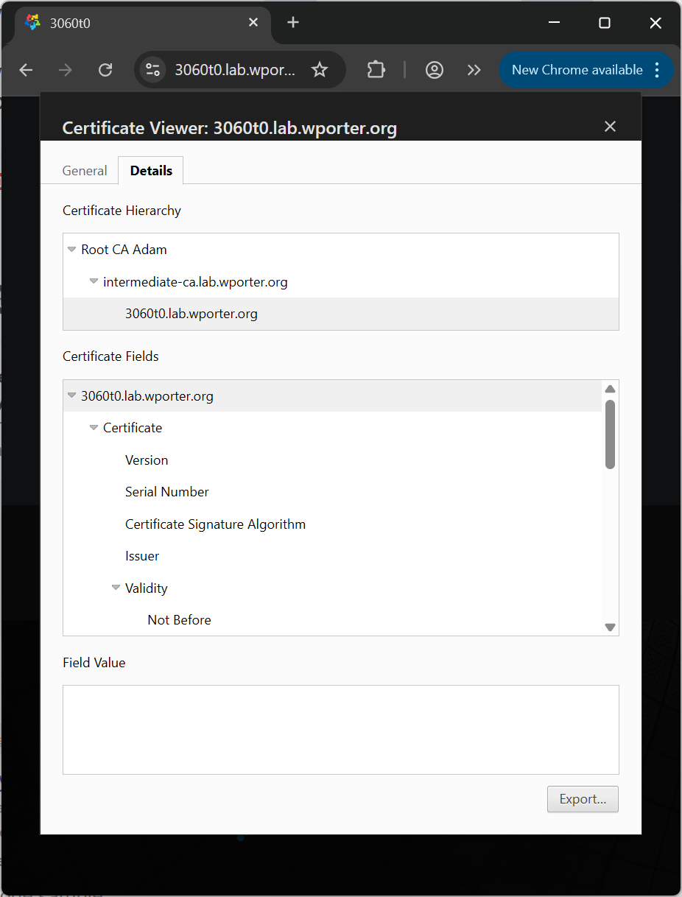

This is part two of a multi-part series. Today, I'll be configuring an intermediate CA under the root CA I set up [in this article](https://wporter.org/using-openssl-to-generate-a-root-certificate-using-openssl-on-a-linux-server-as-a-root-certificate-authority/).

`step-ca` is a modern online CA for automated certificate management. It's got reasonable defaults and is fairly easy to use as an intermediate CA for smaller environments.

To learn more about `step-ca` itself I recommend a trip over to [the step-ca docs at smallstep.com](https://smallstep.com/docs/step-ca/), but the highlights are the simple nature of the tool and the variety of built-in automated provisioners you can use (like OIDC SSO tokens, ACME challenges, identity documents, and JWK tokens). It's also a decent SSH CA.

We'll be configuring this as an intermediate (signing) certificate authority that can be used to automate short-lived certificates for internal services. Then, we'll use ACME to get a a trusted certificate for a Linux server running Cockpit (and configure automatic renewal, thanks to `certbot`) as a 'hello world' example.

I'll be using an AlmaLinux 10 system for the CA. You can likely follow along with any other EL9 or 10 system. The version of `step-ca` I've got is 0.28.3. The version of `certbot` I'll be using for my hello world example is 4.0.0.

I would highly recommend reading [Smallstep's 'Certificate Authority Production Considerations'](https://smallstep.com/docs/step-ca/certificate-authority-server-production) docs page before getting started ([primarily the 'Good Security Practices' section](https://smallstep.com/docs/step-ca/certificate-authority-server-production/index.html#good-security-practices)).

## Installing step-ca

### Windows

If you'd like to install `step-ca` and `step-cli` on Windows, Smallstep maintains a Winget package:

```cmd
winget install Smallstep.step-ca
```

You're on your own if you want to use Windows, though I imagine it's doable.

### Linux

Since I'm using Alma 10 (Fedora 42 will work just as well - my 'validation' run for this article was on Fedora), we'll use the RPM package from Smallstep's Yum repository. A Debian-based OS would likely generally be similar - just swap the `yum` repository for the `apt` repository. [Docs here](https://smallstep.com/docs/step-ca/installation/#debianubuntu).

First, add the Smallstep yum repository:

```sh
sudo tee /etc/yum.repos.d/smallstep.repo > /dev/null << 'EOT'
[smallstep]
name=Smallstep
baseurl=https://packages.smallstep.com/stable/fedora/
enabled=1
repo_gpgcheck=0
gpgcheck=1
gpgkey=https://packages.smallstep.com/keys/smallstep-0x889B19391F774443.gpg
EOT
```

Then, install the `step-cli` utility, and the `step-ca` itself:

```sh
sudo dnf install -y step-cli step-ca
```

We'll be using ["The Secure Way" from Smallstep's `step-ca` intermediate CA configuration tutorial](https://smallstep.com/docs/tutorials/intermediate-ca-new-ca/#the-secure-way). This means we'll:

1. Initialize a boilerplate configuration with `step-ca-init`
2. Replace the generated root cert with the one we've made earlier
3. Create a CSR
4. Sign the CSR
5. Replace the generated intermediate cert with one signed by the root CA
6. Configure Step as a daemon
7. Profit!

So.. let's get going! We've already got the CA, so initialize it:

```txt
[wporter@intermediate-ca ~]$ step ca init
✔ Deployment Type: Standalone
What would you like to name your new PKI?
✔ (e.g. Smallstep): intermediate-ca
What DNS names or IP addresses will clients use to reach your CA?
✔ (e.g. ca.example.com[,10.1.2.3,etc.]): intermediate-ca,intermediate-ca.lab.wporter.org
What IP and port will your new CA bind to? (:443 will bind to 0.0.0.0:443)
✔ (e.g. :443 or 127.0.0.1:443): :443
What would you like to name the CA's first provisioner?
✔ (e.g. you@smallstep.com): noc@wporter.org
Choose a password for your CA keys and first provisioner.
✔ [leave empty and we'll generate one]:

Generating root certificate... done!
Generating intermediate certificate... done!

✔ Root certificate: /home/wporter/.step/certs/root_ca.crt
✔ Root private key: /home/wporter/.step/secrets/root_ca_key
✔ Root fingerprint: bf5d359785fdffdc98931af3072cb1d7c9c0a849e3fb195f190ae25695fd171c
✔ Intermediate certificate: /home/wporter/.step/certs/intermediate_ca.crt
✔ Intermediate private key: /home/wporter/.step/secrets/intermediate_ca_key
✔ Database folder: /home/wporter/.step/db
✔ Default configuration: /home/wporter/.step/config/defaults.json
✔ Certificate Authority configuration: /home/wporter/.step/config/ca.json

Your PKI is ready to go. To generate certificates for individual services see 'step help ca'.

FEEDBACK 😍 🍻
  The step utility is not instrumented for usage statistics. It does not phone
  home. But your feedback is extremely valuable. Any information you can provide
  regarding how you’re using `step` helps. Please send us a sentence or two,
  good or bad at feedback@smallstep.com or join GitHub Discussions
  https://github.com/smallstep/certificates/discussions and our Discord
  https://u.step.sm/discord.
```

Per the docs, we'll shred the generated root key:

```sh
shred -u ~/.step/secrets/root_ca_key
```

Now that we have a template config and directory structure, let's get `step-ca` set up as a daemon.

### Installing step-ca as a service

[Docs here](https://smallstep.com/docs/step-ca/certificate-authority-server-production/#running-step-ca-as-a-daemon).

Create a user for the service:

```sh
sudo useradd --system --no-create-home --shell /usr/sbin/nologin step-ca
```

Since I intend to bind `step-ca` to port 443, we'll need to give it the capability to bind to privileged ports:

```sh
sudo setcap CAP_NET_BIND_SERVICE=+eip $(which step-ca)
```

Move the initialized .step path to `/etc`:

```sh
sudo mv ~/.step /etc/step-ca
```

Replace references to the old path in `step-ca`'s config files:

```sh
for file in /etc/step-ca/config/*; do
  sudo sed -i 's|/home/wporter/.step|/etc/step-ca|g' "$file"
done
```

Set ownership for the new step directory to the service's user:

```sh
sudo chown -R step-ca:step-ca /etc/step-ca
```

Create a unit file for the service:

```sh
sudo tee /etc/systemd/system/step-ca.service > /dev/null << 'EOT'
[Unit]
Description=step-ca service
Documentation=https://smallstep.com/docs/step-ca
Documentation=https://smallstep.com/docs/step-ca/certificate-authority-server-production
After=network-online.target
Wants=network-online.target
StartLimitIntervalSec=30
StartLimitBurst=3
ConditionFileNotEmpty=/etc/step-ca/config/ca.json
ConditionFileNotEmpty=/etc/step-ca/password.txt

[Service]
Type=simple
User=step-ca
Group=step-ca
Environment=STEPPATH=/etc/step-ca
WorkingDirectory=/etc/step-ca
ExecStart=/usr/bin/step-ca /etc/step-ca/config/ca.json --password-file /etc/step-ca/password.txt
ExecReload=/bin/kill --signal HUP $MAINPID
Restart=on-failure
RestartSec=5
TimeoutStopSec=30
StartLimitInterval=30
StartLimitBurst=3

; Process capabilities & privileges
AmbientCapabilities=CAP_NET_BIND_SERVICE
CapabilityBoundingSet=CAP_NET_BIND_SERVICE
SecureBits=keep-caps
NoNewPrivileges=yes

; Sandboxing
ProtectSystem=full
ProtectHome=true
RestrictNamespaces=true
RestrictAddressFamilies=AF_UNIX AF_INET AF_INET6
PrivateTmp=true
PrivateDevices=true
ProtectClock=true
ProtectControlGroups=true
ProtectKernelTunables=true
ProtectKernelLogs=true
ProtectKernelModules=true
LockPersonality=true
RestrictSUIDSGID=true
RemoveIPC=true
RestrictRealtime=true
SystemCallFilter=@system-service
SystemCallArchitectures=native
MemoryDenyWriteExecute=true
ReadWriteDirectories=/etc/step-ca/db

[Install]
WantedBy=multi-user.target
EOT
```

Then, I'll copy the root certificate from my Windows workstation (mind the backslashes if you're using a better OS) to the intermediate CA we're building. I'll drop the root certificate at `$step/certs/root_ca.crt`.

```txt
C:\> scp caadmin@root-ca:/srv/ca/root-ca-a.crt .\root-ca-a.crt
C:\> scp .\root-ca-a.crt intermediate-ca:~/
C:\> ssh intermediate-ca
[~]$ sudo mv root-ca-a.crt /etc/step-ca/certs/root_ca.crt
```

### Creating and signing the CSR for our intermediate CA

Hop back over to the intermediate CA, and we'll create a CSR with the `step certificate create --csr` command:

```txt
[wporter@intermediate-ca ~]$ step certificate create "intermediate-ca.lab.wporter.org" intermediate.csr intermediate.key --csr
Please enter the password to encrypt the private key:
Your certificate signing request has been saved in intermediate.csr.
Your private key has been saved in intermediate_ca_key.
```

Move the private key to `/etc/step-ca/secrets/intermediate_ca_key` (if you'd like to rename it, edit `.step/config/ca.json`), then fix ownership:

```sh
sudo mv intermediate.key /etc/step-ca/secrets/intermediate_ca_key
sudo chown step-ca:step-ca /etc/step-ca/secrets/intermediate_ca_key
sudo chmod 0400 /etc/step-ca/secrets/intermediate_ca_key
```

Populate the `/etc/step-ca/password.txt` file with the encryption passphrase for your intermediate key, then set permissions to 0400 so nothing but the `step-ca` user can read it:

```sh
sudo vi /etc/step-ca/password.txt
sudo chown step-ca:step-ca /etc/step-ca/password.txt
sudo chmod 0400 /etc/step-ca/password.txt
```

Note that, in production, you might not want to do this - there are risks to keeping credentials in plaintext on disk. Consider using `systemd-creds` or your preferred secrets vault instead.

Then, get this CSR over to the root CA:

```sh
scp intermediate-ca:~/intermediate.csr caadmin@root-ca:~/
```

On the root CA, sign the CSR with OpenSSL to create a trusted certificate. We'll be using the "`signing_ca_ext`" set of extensions (limits) [defined in this earlier post where we built out this root CA](https://wporter.org/using-openssl-to-generate-a-root-certificate-using-openssl-on-a-linux-server-as-a-root-certificate-authority/):

```sh
openssl ca -config /srv/ca/openssl.cnf \
  -extensions signing_ca_ext \
  -days 365 -notext -md sha512 \
  -in intermediate.csr \
  -out intermediate.crt
```

```txt
[caadmin@root-ca ~]$ openssl ca -config /srv/ca/openssl.cnf \
  -extensions signing_ca_ext \
  -days 365 -notext -md sha512 \
  -in intermediate.csr \
  -out intermediate.crt
Using configuration from /srv/ca/openssl.cnf
Check that the request matches the signature
Signature ok
Certificate Details:
        Serial Number:
            3d:0a:d8:c5:fb:da:7a:ee:c5:6f:81:5d:a2:61:c5:35:4c:50:85:d9
        Validity
            Not Before: Jul  6 20:16:48 2025 GMT
            Not After : Jul  6 20:16:48 2026 GMT
        Subject:
            commonName                = intermediate-ca.lab.wporter.org
        X509v3 extensions:
            X509v3 Key Usage: critical
                Digital Signature, Certificate Sign, CRL Sign
            X509v3 Basic Constraints: critical
                CA:TRUE, pathlen:0
            X509v3 Name Constraints: critical
                Permitted:
                  DNS:.lab.wporter.org
            X509v3 Subject Key Identifier:
                57:E3:3F:CD:80:06:F9:D6:47:DE:43:66:B6:44:F0:F1:4E:1D:12:73
            X509v3 Authority Key Identifier:
                4A:17:4C:27:E4:38:98:17:E0:D0:C1:D0:52:D7:9F:5F:3F:0C:A0:5A
            X509v3 CRL Distribution Points:
                Full Name:
                  URI:http://pki.lab.wporter.org/crl/root-ca.crl
            Authority Information Access:
                OCSP - URI:http://pki.lab.wporter.org/crl/ocsp
Certificate is to be certified until Jul  6 20:16:48 2026 GMT (365 days)
Sign the certificate? [y/n]:y


1 out of 1 certificate requests certified, commit? [y/n]y
Write out database with 1 new entries
Database updated
```

You'll now have an `intermediate.crt` certificate:

```txt
[caadmin@root-ca ~]$ ll
total 8
-rw-r--r--. 1 caadmin caadmin 1594 Jul  6 20:16 intermediate.crt
-rw-r--r--. 1 caadmin caadmin  469 Jul  6 20:15 intermediate.csr
```

Get the certificate back over to the intermediate CA:

```sh
scp caadmin@root-ca:~/intermediate.crt intermediate-ca:~/
```

Then copy it to `/etc/step-ca/certs/intermediate_ca.crt`:

```sh
sudo mv ~/intermediate.crt /etc/step-ca/certs/intermediate_ca.crt
sudo chown step-ca:step-ca /etc/step-ca/certs/intermediate_ca.crt
```

If you'd like to have a look at the cert, you can use `step certificate inspect`:

```txt
[wporter@intermediate-ca ~]$ sudo step certificate inspect /etc/step-ca/certs/intermediate_ca.crt
Certificate:
    Data:
        Version: 3 (0x2)
        Serial Number: 348490328096397701876342255809379338720046515673 (0x3d0ad8c5fbda7aeec56f815da261c5354c5085d9)
    Signature Algorithm: SHA512-RSA
        Issuer: DC=org,DC=wporter,DC=lab,O=lab.wporter.org,CN=Root CA Adam
        Validity
            Not Before: Jul 6 20:16:48 2025 UTC
            Not After : Jul 6 20:16:48 2026 UTC
        Subject: CN=intermediate-ca.lab.wporter.org
        Subject Public Key Info:
            Public Key Algorithm: ECDSA
                Public-Key: (256 bit)
                X:
                    ed:30:74:d5:ce:8c:7a:a1:e1:88:34:cd:9c:d8:e9:
                    e1:2c:63:c3:15:41:1d:8d:f4:61:09:d3:64:ed:36:
                    67:87
                Y:
                    50:26:96:a3:6e:e4:f0:e9:fc:66:15:d1:cb:c1:c3:
                    1b:c2:0b:cf:85:e3:8f:7b:e2:b6:45:09:45:2a:3a:
                    71:99
                Curve: P-256
        X509v3 extensions:
            X509v3 Key Usage: critical
                Digital Signature, Certificate Sign, CRL Sign
            X509v3 Basic Constraints: critical
                CA:TRUE, pathlen:0
            X509v3 Name Constraints: critical
                Permitted:
                  DNS: .lab.wporter.org
            X509v3 Subject Key Identifier:
                57:E3:3F:CD:80:06:F9:D6:47:DE:43:66:B6:44:F0:F1:4E:1D:12:73
            X509v3 Authority Key Identifier:
                keyid:4A:17:4C:27:E4:38:98:17:E0:D0:C1:D0:52:D7:9F:5F:3F:0C:A0:5A
            X509v3 CRL Distribution Points:
                Full Name:
                  URI:http://pki.lab.wporter.org/crl/root-ca.crl
            Authority Information Access:
                OCSP - URI:http://pki.lab.wporter.org/crl/ocsp
    Signature Algorithm: SHA512-RSA
         8f:7b:cd:8c:06:d8:dc:0e:23:3f:a4:df:c6:7f:51:11:53:80:
```

Note the root CA's signature is now present (that last bit). I've truncated it because it's a big ugly block of hexadecimal.

### Testing the intermediate CA

```sh
sudo systemctl daemon-reload
# confirm the service was loaded
systemctl status step-ca
```

Enable and start the CA service:

```sh
sudo systemctl enable --now step-ca
```

Verify that it's started:

```sh
systemctl status step-ca
```

If it hasn't started, you can view its logs with:

```sh
journalctl -xeu step-ca
```

Should work! Try to `curl`, `iwr`, or connect from a browser - you should receive a 404, not a certificate error (though the version of Curl for Windows that I've got will die, complaining about a failed revocation check, since I don't actually have the OCSP responder or CRL endpoint up).

To add the ACME provisioner to Step, run the `step ca provisioner add acme --type ACME` command. Be sure to specify the `--ca-url`, `--root`, and `--ca-config` parameters, since the CA isn't in the default location.

```txt
[wporter@intermediate-ca ~]$ sudo step ca provisioner add acme --type ACME --ca-url intermediate-ca.lab.wporter.org --root /etc/step-ca/certs/root_ca.crt --ca-config /etc/step-ca/config/ca.json
✔ CA Configuration: /etc/step-ca/config/ca.json

Success! Your `step-ca` config has been updated. To pick up the new configuration SIGHUP (kill -1 <pid>) or restart the step-ca process.
```

This will add a provisioner to your `ca.json` configuration file:

```txt
{
  "type": "ACME",
  "name": "acme",
  "claims": {
    "enableSSHCA": true,
    "disableRenewal": false,
    "allowRenewalAfterExpiry": false,
    "disableSmallstepExtensions": false
  },
  "options": {
    "x509": {},
    "ssh": {}
  }
}
```

Apply the change with a `reload`:

```sh
sudo systemctl reload step-ca
```

Verify that the ACME provisioner is now available by navigating to `https://ca-url/acme/name/directory`. In my case, this is `https://intermediate-ca.lab.wporter.org/acme/acme/directory`:

```txt
~
❯ (iwr https://intermediate-ca.lab.wporter.org/acme/acme/directory).Content
{"newNonce":"https://intermediate-ca.lab.wporter.org/acme/acme/new-nonce","newAccount":"https://intermediate-ca.lab.wporter.org/acme/acme/new-account","newOrder":"https://intermediate-ca.lab.wporter.org/acme/acme/new-order","revokeCert":"https://intermediate-ca.lab.wporter.org/acme/acme/revoke-cert","keyChange":"https://intermediate-ca.lab.wporter.org/acme/acme/key-change"}
```

## Hello, world - setting up certbot on a systemd timer to renew certificates automatically

I have a server running Cockpit that I'd like to use a valid SSL certificate from my CA. I'd like it to renew its own certificate. Let's do that.

First, be sure to install the root certificate on the system. Since this is a machine running AlmaLinux 10, that looks something like this:

```sh
sudo mv root-ca-a.crt /etc/pki/ca-trust/source/anchors/
sudo update-ca-trust
```

Install Certbot:

```sh
sudo dnf install -y certbot
```

Get a certificate. This will stand up a webserver serving the challenge on port 80. If you're using the machine as a webserver (and it's listening on 80) you will probably need to use `--webroot` rather than `--standalone` for your HTTP challenge. Be sure to open port 80 in your system's firewall.

```sh
sudo certbot certonly \
  --standalone \
  --preferred-challenges http \
  --email noc@wporter.org \
  --server https://intermediate-ca.lab.wporter.org/acme/acme/directory \
  --no-eff-email \
  -d 3060t0.lab.wporter.org \
  --agree-tos \
  --non-interactive
```

This will drop a certificate and key at `/etc/letsencrypt/live/fqdn/fullchain.pem` and `/etc/letsencrypt/live/fqdn/privkey.pem`. Symlink them to `/etc/cockpit/ws-certs.d`:

```sh
fqdn="3060t0.lab.wporter.org"

sudo ln -s /etc/letsencrypt/live/"$fqdn"/fullchain.pem /etc/cockpit/ws-certs.d/0-"$fqdn".crt
sudo chmod 0644 /etc/cockpit/ws-certs.d/0-"$fqdn".crt

sudo ln -s /etc/letsencrypt/live/"$fqdn"/privkey.pem /etc/cockpit/ws-certs.d/0-"$fqdn".key
sudo chmod 0600 /etc/cockpit/ws-certs.d/0-"$fqdn".key
```

Then, remove the preexisting self-signed CA, cert, and key:

```sh
sudo rm /etc/cockpit/ws-certs.d/0-self-signed*
```

Once you've restarted Cockpit:

```sh
sudo systemctl restart cockpit
```

Try to connect to the web UI. It should automagically pick up the new certificate, and now be trusted (unless you're using Microsoft Edge.. Edge gives mine the stink-eye):



The AlmaLinux 10 package for Certbot includes a service (`/usr/lib/systemd/system/certbot-renew.service`) and associated timer (`/usr/lib/systemd/system/certbot-renew.timer`).

The `certbot-renew` service has an EnvironmentFile (`/etc/sysconfig/certbot`) defined by default. This just contains a few variables that are called in the unit file as arguments to `certbot` in the unit file, so we don't need to modify the unit file (and deal with package changes breaking it).

Instead, we'll set our parameters in the environment file. We won't reinvent the wheel - just edit the preexisting DEPLOY_HOOK variable in the environment file:

```sh
sudo sed -i "s|^DEPLOY_HOOK=\".*|DEPLOY_HOOK=\"--deploy-hook 'systemctl restart cockpit'\"|" /etc/sysconfig/certbot
```

This `sed` call replaces the line(s) in our EnvironmentFile beginning with `DEPLOY_HOOK="` with `DEPLOY_HOOK="--deploy-hook 'systemctl restart cockpit'"`.

I'm using the deploy hook rather than the post hook because there's no reason to restart Cockpit if we haven't successfully updated the certificate.

The package creates and enables a timer, but doesn't start it:

```txt
[wporter@3060t0 ~]$ systemctl status certbot-renew.timer
○ certbot-renew.timer - This is the timer to set the schedule for automated renewals
     Loaded: loaded (/usr/lib/systemd/system/certbot-renew.timer; enabled; preset: enabled)
     Active: inactive (dead)
    Trigger: n/a
   Triggers: ● certbot-renew.service
```

If you want the systemd timer to run before you reboot, you'll have to start it:

```sh
sudo systemctl start certbot-renew.timer
```

Once you've done this, you can examine the timer with a normal `systemctl status` command:

```txt
[wporter@3060t0 ~]$ systemctl status certbot-renew.timer
● certbot-renew.timer - This is the timer to set the schedule for automated renewals
     Loaded: loaded (/usr/lib/systemd/system/certbot-renew.timer; enabled; preset: enabled)
     Active: active (waiting) since Sun 2025-07-06 21:55:57 EDT; 1s ago
 Invocation: 04e091bd06dd4ccdafddf67170c669de
    Trigger: Mon 2025-07-07 01:18:10 EDT; 3h 22min left
   Triggers: ● certbot-renew.service

Jul 06 21:55:57 3060t0 systemd[1]: Started certbot-renew.timer - This is the timer to set the schedule for automated re>
```

Isn't that nice? No more line in a text file.

To test Certbot's renewal, do a `--dry-run`:

```sh
sudo certbot renew \
  --server https://intermediate-ca.lab.wporter.org/acme/acme/directory \
  --dry-run \
  --deploy-hook "echo '[HOOK] Would restart cockpit now'" \
  --verbose
```

That command's output should look something like this:

```txt
[wporter@3060t0 ~]$ sudo certbot renew --server https://intermediate-ca.lab.wporter.org/acme/acme/directory --dry-run --deploy-hook "echo '[HOOK] Would restart cockpit now'" --verbose
Saving debug log to /var/log/letsencrypt/letsencrypt.log

- - - - - - - - - - - - - - - - - - - - - - - - - - - - - - - - - - - - - - - -
Processing /etc/letsencrypt/renewal/3060t0.lab.wporter.org.conf
- - - - - - - - - - - - - - - - - - - - - - - - - - - - - - - - - - - - - - - -
Cannot extract OCSP URI from /etc/letsencrypt/archive/3060t0.lab.wporter.org/cert1.pem
Certificate is due for renewal, auto-renewing...
Plugins selected: Authenticator standalone, Installer None
Simulating renewal of an existing certificate for 3060t0.lab.wporter.org
Performing the following challenges:
http-01 challenge for 3060t0.lab.wporter.org
Waiting for verification...
Cleaning up challenges
Dry run: skipping deploy hook command: echo '[HOOK] Would restart cockpit now'

- - - - - - - - - - - - - - - - - - - - - - - - - - - - - - - - - - - - - - - -
Congratulations, all simulated renewals succeeded:
  /etc/letsencrypt/live/3060t0.lab.wporter.org/fullchain.pem (success)
- - - - - - - - - - - - - - - - - - - - - - - - - - - - - - - - - - - - - - - -
```

Be sure you specified your internal `--server` - by default, Certbot will try to hit Let's Encrypt (which will fail if the ACME client is not reachable over the Internet).

## Conclusion

Alright.. today, we put together a private signing CA that supports the ACME protocol for automated certificate renewal. Neat! Now, we can establish private public key infrastructure to properly authenticate that our servers are who they say they are.

If you're done following along here, be sure to shut down and archive your root CA until you need it again. Do not leave it exposed! Shut it down and store it (securely) offline - ideally it'll be encrypted and access-controlled. Bury it in the backyard if you must.

Next up for the CA expedition will probably be sticking `step-ca` behind NGINX (I love NGINX) and securing the ACME endpoint with some sort of authentication, then setting up an Active Directory Certificate Services intermediate... and, possibly, we'll take a detour to SSH certificate authorities. But those are topics for another post! Well, minus the proxying `step-ca` one. I'll probably dump that here.
