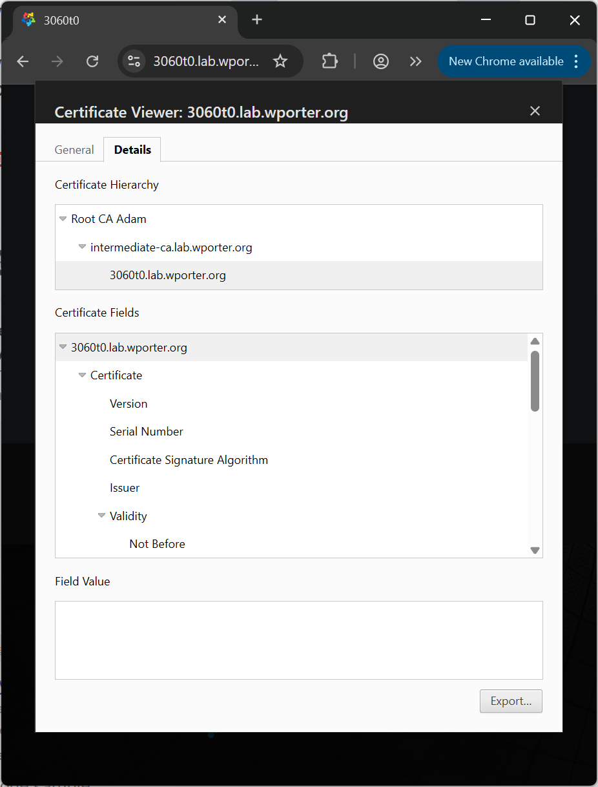

This is an excerpt from [my `step-ca` post](https://wporter.org/building-out-a-signing-certificate-authority-that-supports-acme-with-step-ca-and-an-openssl-root/) that I felt is useful enough to have its own post.

I have a server running Cockpit that I'd like to use a valid SSL certificate from my CA. I'd like it to renew its own certificate. Let's do that.

First, be sure to install the root certificate on the system. Since this is a machine running AlmaLinux 10, that looks something like this:

```sh
sudo mv root-ca-a.crt /etc/pki/ca-trust/source/anchors/
sudo update-ca-trust
```

Install Certbot:

```sh
sudo dnf install -y certbot
```

Get a certificate. This will stand up a webserver serving the challenge on port 80. If you're using the machine as a webserver (and it's listening on 80) you will probably need to use `--webroot` rather than `--standalone` for your HTTP challenge. Be sure to open port 80 in your system's firewall.

```sh
sudo certbot certonly \
  --standalone \
  --preferred-challenges http \
  --email noc@wporter.org \
  --server https://intermediate-ca.lab.wporter.org/acme/acme/directory \
  --no-eff-email \
  -d 3060t0.lab.wporter.org \
  --agree-tos \
  --non-interactive
```

This will drop a certificate and key at `/etc/letsencrypt/live/fqdn/fullchain.pem` and `/etc/letsencrypt/live/fqdn/privkey.pem`. Symlink them to `/etc/cockpit/ws-certs.d`:

```sh
fqdn="3060t0.lab.wporter.org"

sudo ln -s /etc/letsencrypt/live/"$fqdn"/fullchain.pem /etc/cockpit/ws-certs.d/0-"$fqdn".crt
sudo chmod 0644 /etc/cockpit/ws-certs.d/0-"$fqdn".crt

sudo ln -s /etc/letsencrypt/live/"$fqdn"/privkey.pem /etc/cockpit/ws-certs.d/0-"$fqdn".key
sudo chmod 0600 /etc/cockpit/ws-certs.d/0-"$fqdn".key
```

Then, remove the preexisting self-signed CA, cert, and key:

```sh
sudo rm /etc/cockpit/ws-certs.d/0-self-signed*
```

Once you've restarted Cockpit:

```sh
sudo systemctl restart cockpit
```

Try to connect to the web UI. It should automagically pick up the new certificate, and now be trusted (unless you're using Microsoft Edge.. Edge gives mine the stink-eye):



The AlmaLinux 10 package for Certbot includes a service (`/usr/lib/systemd/system/certbot-renew.service`) and associated timer (`/usr/lib/systemd/system/certbot-renew.timer`).

The `certbot-renew` service has an EnvironmentFile (`/etc/sysconfig/certbot`) defined by default. This just contains a few variables that are called in the unit file as arguments to `certbot` in the unit file, so we don't need to modify the unit file (and deal with package changes breaking it).

Instead, we'll set our parameters in the environment file. We won't reinvent the wheel - just edit the preexisting DEPLOY_HOOK variable in the environment file:

```sh
sudo sed -i "s|^DEPLOY_HOOK=\".*|DEPLOY_HOOK=\"--deploy-hook 'systemctl restart cockpit'\"|" /etc/sysconfig/certbot
```

This `sed` call replaces the line(s) in our EnvironmentFile beginning with `DEPLOY_HOOK="` with `DEPLOY_HOOK="--deploy-hook 'systemctl restart cockpit'"`.

I'm using the deploy hook rather than the post hook because there's no reason to restart Cockpit if we haven't successfully updated the certificate.

The package creates and enables a timer, but doesn't start it:

```txt
[wporter@3060t0 ~]$ systemctl status certbot-renew.timer
○ certbot-renew.timer - This is the timer to set the schedule for automated renewals
     Loaded: loaded (/usr/lib/systemd/system/certbot-renew.timer; enabled; preset: enabled)
     Active: inactive (dead)
    Trigger: n/a
   Triggers: ● certbot-renew.service
```

If you want the systemd timer to run before you reboot, you'll have to start it:

```sh
sudo systemctl start certbot-renew.timer
```

Once you've done this, you can examine the timer with a normal `systemctl status` command:

```txt
[wporter@3060t0 ~]$ systemctl status certbot-renew.timer
● certbot-renew.timer - This is the timer to set the schedule for automated renewals
     Loaded: loaded (/usr/lib/systemd/system/certbot-renew.timer; enabled; preset: enabled)
     Active: active (waiting) since Sun 2025-07-06 21:55:57 EDT; 1s ago
 Invocation: 04e091bd06dd4ccdafddf67170c669de
    Trigger: Mon 2025-07-07 01:18:10 EDT; 3h 22min left
   Triggers: ● certbot-renew.service

Jul 06 21:55:57 3060t0 systemd[1]: Started certbot-renew.timer - This is the timer to set the schedule for automated re>
```

Isn't that nice? No more line in a text file.

To test Certbot's renewal, do a `--dry-run`:

```sh
sudo certbot renew \
  --server https://intermediate-ca.lab.wporter.org/acme/acme/directory \
  --dry-run \
  --deploy-hook "echo '[HOOK] Would restart cockpit now'" \
  --verbose
```

That command's output should look something like this:

```txt
[wporter@3060t0 ~]$ sudo certbot renew --server https://intermediate-ca.lab.wporter.org/acme/acme/directory --dry-run --deploy-hook "echo '[HOOK] Would restart cockpit now'" --verbose
Saving debug log to /var/log/letsencrypt/letsencrypt.log

- - - - - - - - - - - - - - - - - - - - - - - - - - - - - - - - - - - - - - - -
Processing /etc/letsencrypt/renewal/3060t0.lab.wporter.org.conf
- - - - - - - - - - - - - - - - - - - - - - - - - - - - - - - - - - - - - - - -
Cannot extract OCSP URI from /etc/letsencrypt/archive/3060t0.lab.wporter.org/cert1.pem
Certificate is due for renewal, auto-renewing...
Plugins selected: Authenticator standalone, Installer None
Simulating renewal of an existing certificate for 3060t0.lab.wporter.org
Performing the following challenges:
http-01 challenge for 3060t0.lab.wporter.org
Waiting for verification...
Cleaning up challenges
Dry run: skipping deploy hook command: echo '[HOOK] Would restart cockpit now'

- - - - - - - - - - - - - - - - - - - - - - - - - - - - - - - - - - - - - - - -
Congratulations, all simulated renewals succeeded:
  /etc/letsencrypt/live/3060t0.lab.wporter.org/fullchain.pem (success)
- - - - - - - - - - - - - - - - - - - - - - - - - - - - - - - - - - - - - - - -
```

Be sure you specified your internal `--server` - by default, Certbot will try to hit Let's Encrypt (which will fail if the ACME client is not reachable over the Internet).
