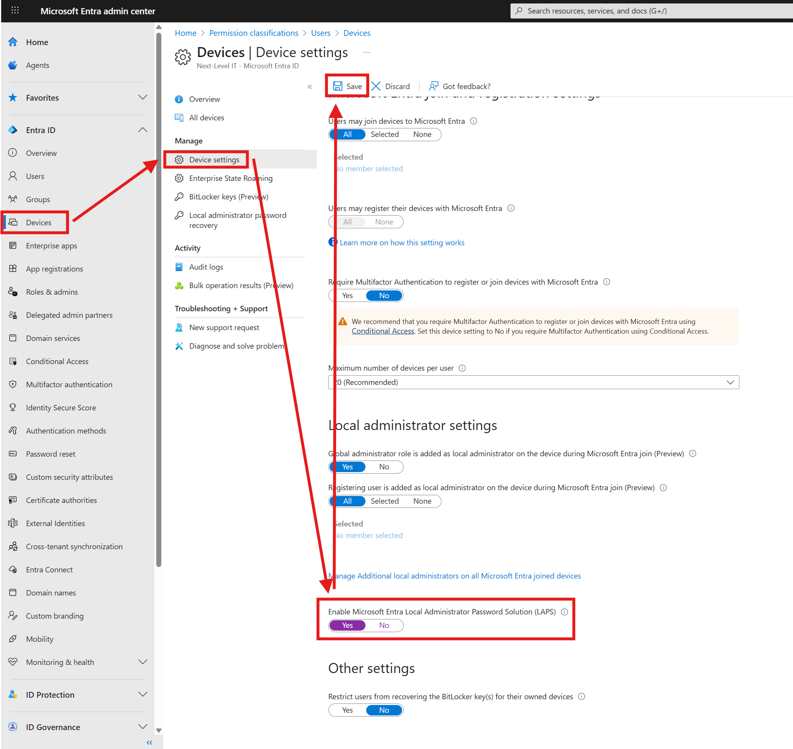
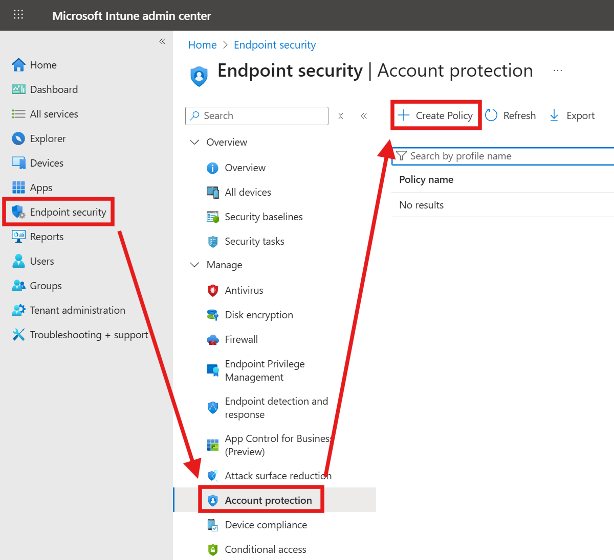
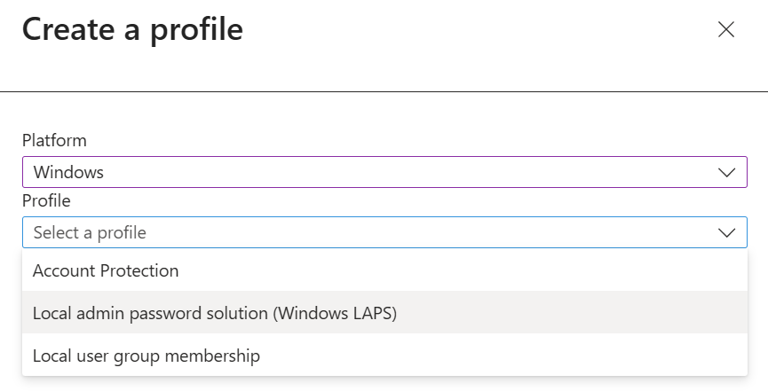
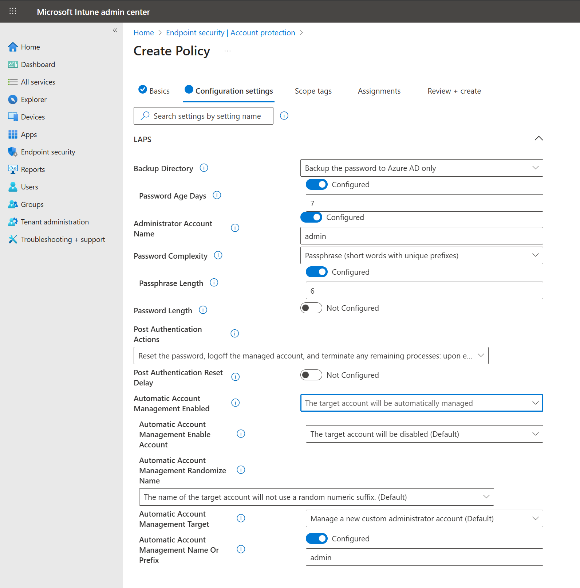
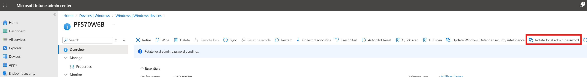
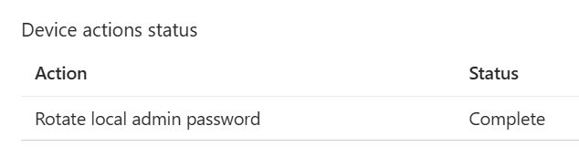
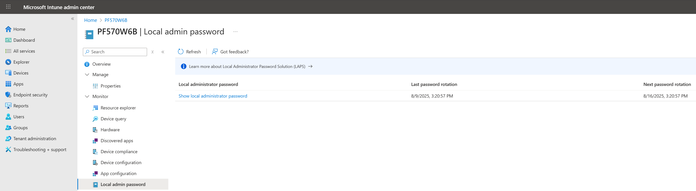
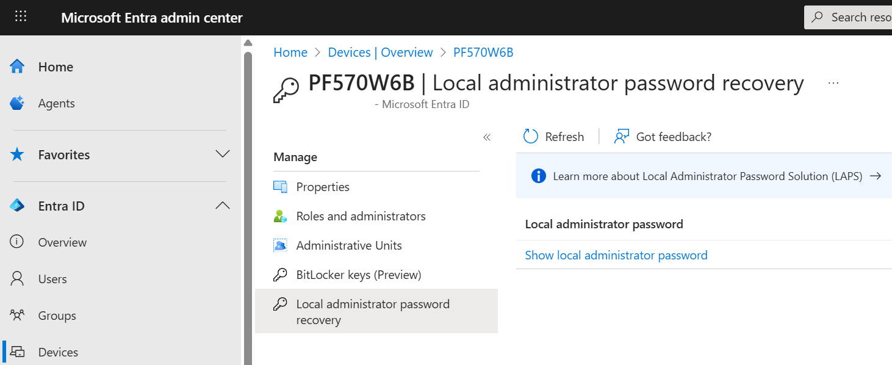

## Introduction

The Windows Local Administrator Password Solution (LAPS) allows administrators to configure a randomized, automatically rotated administrative password for Windows devices. This is a distinct feature from macOS LAPS.

Windows LAPS, integrated with Entra ID, replaces the older 'legacy' Microsoft LAPS solution as of Windows 11 23H2. Microsoft is no longer updating 'legacy' LAPS and its .msi package will be blocked from installing on Windows 11 24H2, Server 2025, and newer OSes.

It's possible to configure Windows LAPS in 'emulation' mode (so older policies apply to the newer software) and you can run the two side-by-side (e.g., you still have some Server 2016 around). [There are, of course, some caveats - see the docs](https://learn.microsoft.com/en-us/windows-server/identity/laps/laps-scenarios-legacy).

It's recommended to deploy LAPS with Intune, but it's possible to do so either manually (via the registry) or with Group Policy. The prerequisites for using Intune to configure LAPS are Entra ID Free and Intune P1 (the normal Intune subscription).

LAPS is supported on Windows 10, 20H2 (or LTSC 2019) and newer, including Server 2019. Windows Home SKUs are not explicitly mentioned, but I would assume Home is not supported because it cannot be joined to Entra ID.

For more info on Windows LAPS with Windows Server (it can even be used for managing the DSRM account on a DC) [see the Windows Server LAPS docs](https://learn.microsoft.com/en-us/windows-server/identity/laps/laps-scenarios-windows-server-active-directory).

When Windows LAPS ingests policy, it prefers the CSP, then Group Policy, then Local Configuration, then legacy LAPS. For more on this, [see the docs](https://learn.microsoft.com/en-us/windows-server/identity/laps/laps-management-policy-settings).

LAPS can configure a device to back up keys to:

- The cloud, if the device is Entra joined or hybrid joined
- Active Directory (if the system is domain or hybrid joined)

You can use either directory type, but *not* both.

Let's set it up!

## Configuring Windows LAPS

First, you must [enable LAPS in Entra ID](https://learn.microsoft.com/en-us/entra/identity/devices/howto-manage-local-admin-passwords#enabling-windows-laps-with-azure-ad).

To do so, navigate to Devices > Device Settings in the Entra admin center, and flip the 'Enable Microsoft Entra Local Administrator Password Solution (LAPS)' toggle, then click Save:

Helpfully, the MS documentation for the feature mentions that you can also use the [MS Graph Update deviceRegistrationPolicy API endpoint](https://learn.microsoft.com/en-us/graph/api/deviceregistrationpolicy-update?view=graph-rest-beta&preserve-view=true&tabs=http) to do the same thing with an API call.

Then, hop on over to the Intune admin center. You'll need access to at least the Security Baselines category in Intune RBAC (e.g., an Endpoint Security Manager).

### Creating a LAPS policy

Navigate to Endpoint security > Account protection, and create a new policy for Windows, with the LAPS profile:

### LAPS policy options

#### Password age

You can configure the password age to any value between 7 - 365 days. Unfortunately, a week is the shortest period possible at present.

#### Password complexity

The Password Complexity values are pretty self-explanatory. You can use passphrases composed of short or long words, or randomized passwords composed of capital letters, capital and lowercase letters, letters and numbers, or letters, numbers and special characters. Standard fare.

#### Post-authentication actions

Post-authentication actions can be used to control reuse of the managed local account password. The available actions are, basically:

- Reset the password after the configured grace period
- Reset the password, log off the account after the configured grace period
- Reset the password, reboot after the configured grace period
- Reset the password, log off the account, and terminate any remaining processes after the grace period

The grace period may be set to anything from 0 (disables actions) to 24 hours.

#### Automatic Account Management

Automatic Account Management is new for 24H2 (W11 or Server 2025). In 'manual' mode, Windows LAPS just rotates the account's password. You need to create and configure the account manually.

With 'automatic' mode, LAPS configures everything - it will create, delete, or set the account's properties as required. This includes the ability to disable the account, though you'll obviously need to enable it via MDM before it can be used, so I'm not sure exactly how useful this is.

Assuming you just need the account present and enabled, automatic management should reduce overhead a bit, which is great!

If you've already applied the Microsoft Windows configuration baseline, this account will automatically be blocked from signing in over the network, too (when deploying a fake LAPS solution with PowerShell and our RMM at $DayJob, I wound up editing secpol to accomplish the same thing with our admin accounts).

If you have not applied the configuration baseline, it might be a good idea to restrict NT AUTHORITY\Local Account sign-ins over the network via security policy.

### Using LAPS

The built-in roles capable of reading passwords are, per Microsoft, 'Cloud Device Administrator' and 'Intune Service Administrator'. The specific permission required to read device passwords is 'DeviceLocalCredential.ReadBasic'.

Once LAPS policy has been configured and synced to your devices, you can initiate your first password rotation by queuing it up from the Device Overview page in the Intune admin center, or waiting for your set PW aging timer. 

It does not appear that LAPS will immediately do anything until the first scheduled rotation if you're configuring policy post-enrollment of the device, so you'll probably want to manually rotate the password for testing from the Intune device page:

It will take a reboot for the password to be rotated. When complete, you'll see the banner updated and the Device Action status updated to 'complete':

In Intune, you're able to retrieve the admin password (and see the time it's set to rotate next) from the Device > Local admin password blade:

You can see the same info in the Entra admin center, by navigating to Devices > the device, and selecting 'Local administrator password recovery':

To use the new password... type it in!

Not too bad. Not too great, either, but hey, it works. Kind of. That's all for now!
