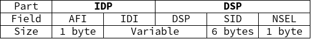
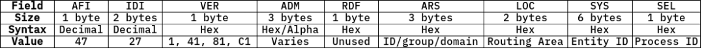

# CLNS & CLNP - The ‘Future Network’, other tidbits

Exploring some old standards and the pieces they left behind

This post will likely grow over time. I’ll make this site’s repository public once it’s cleaned up a bit so diffs are accessible, and I will update this introductory paragraph to reflect any changes. I don’t intend to keep looking into CLNS at the moment, but I expect to pick it back up at some point.

I also apologize about the use of image tables in this post. That's a stopgap measure that I'll fix at a later date.

# Overview

## What are they?

Sort of the ISO equivalent/failed alternative to the Internet Protocol (IP). See [RFC 1561](https://datatracker.ietf.org/doc/html/rfc1561) for one (of several) examples of it being proposed as an alternative to the Internet Protocol, and RFC 926/941 for definitions of the protocol and address format respectively.

### Definitions

Connection-less Network Service (CLNS) is the service supplied to higher-level applications by CLNP.

Connection-less Network Protocol (CLNP) is a Layer 3 protocol specified in ISO/IEC 8473-1.

CLNP and CLNS were essentially designed to be the OSI model’s network layer protocol (”This Protocol provides the connectionless-mode Network Service as defined in ISO 8341/DAD1”, from RFC 926.) They provide logical addressing and are the reason IS-IS (link state routing protocol similar to OSPF) and IDRP (path-vector routing protocol similar to BGP) exist.

### Where will you see them used?

CLNS addresses are most prominently used for router identification addresses in the IS-IS routing protocol.

Interestingly, CLNP is apparently widely used with SONET/SDH [[ANSI T1.105](https://web.archive.org/web/20120306013548/http://webstore.ansi.org/RecordDetail.aspx?sku=ANSI+T1.105.07-1996+%28R2005%29)] - synchronous optical networking/synchronous digital hierarchy, both nearly equivalent protocols developed as replacements for older protocols for transporting telecom data (plesiochronous digital hierarchy). SDH/SONET are essentially the same, primarily designed to support real-time, uncompressed voice data encoded with PCM (pulse-code modulation), which results in systems that are not completely synchronized - thus the need for SONET/SDH. (Source for most of the above is [Wikipedia](https://en.wikipedia.org/wiki/Synchronous_optical_networking)) ([Useful technical overview](https://web.archive.org/web/19990127120448/http://www.techfest.com/networking/wan/sonet.htm))

CLNS/CLNP were likely used for SONET’s management networks because, during the 1980s, the TCP/IP protocol stack was not widely used, and the OSI stack (including CLNS) was *the* emerging standard ([according to this whitepaper](https://web.archive.org/web/20230809223230/https://www.marben-products.com/migration-to-ip-management-of-sonet-sdh-networks/) from Marben, a telecom equipment supplier, about phasing out CLNS/CLNP for IP in SONET).

## CLNS addressing

The addressing system used with CLNS is the “Network Service Access Point” (NSAP) format specified by [ISO/IEC 8348](https://webstore.iec.ch/preview/info_isoiec8348%7Bed3.0%7Den.pdf) as part of the “Future Network” architecture.

Unfortunately, it costs 194 CHF (about $220) as with most ISO documentation, so I haven’t read it. The following section is pieced together from many different sources (mostly RFC 941), so please bear with me.

According to Cisco, NSAP addresses can be considered a ‘combination of IP address and upper-layer protocol in an IP header.’

The structure of a traditional NSAP address is as follows:

A Network Entity Title (NET, router address) has a NSEL of 0.

Field descriptions:

- IDP - the Initial Domain Part - is similar to an IP network address.
    - AFI - Authority and Format Identifier
        - one octet in length
            - integer value between 0 and 99
            - assigned by issuing authority
        - specifies:
            - format of the IDI
            - authority responsible for allocating IDI values
            - abstract syntax of the DSP
    - IDI - Initial Domain Identifier
        - variable length
        - first part of the Area Address, specifying subdomain
        - specifies authority responsible for allocating subdomain DSP values
- DSP - the Domain Specific Part
    - syntax determined by issuing authority
    - HO-DSP/DSP - Higher Order Domain Specific Part
        - variable length
        - part of the Area Address specifying master domain
    - ID - System Identifier
    - SEL - NSAP Selector

Area Addresses: IDI and HO-DSP

- identifies area and routing domain, like an OSPF area but applied to general IP addresses
- HPE routers can typically have three area addresses “to support smooth area merging, partitioning, and switching”

### IDI Format and Allocation

Per RFC 941, standard AFI values indicating IDI format and DSP syntax:

There are four total possible formats for the IDI:

1. Binary
2. Decimal
3. Character (standard, no national variants)
4. National Character (from a set determined by the issuing authority)

An AFI value in the “decimal” column implies that the DSP is using that (decimal) format type. Data format specification is why there are multiple AFI IDs per DSP syntax.

RFC 941 does not specify any formats that use the ‘character’ or ‘national character’ DSP syntax. All formats listed in RFC 941 have varying maximum lengths, but the overall maximum for a NSAP address of one of the types defined in RFC 941 is 20 bytes or 40 decimal digits in length.

## Other CLNP Implementations

### DOD IP Address in CLNP format (RFC 986):

Likely serves the same purpose as backwards compatible IPv6 addresses.

### Aeronautical Telecommunication Network

The ATN is an example of a network architecture that closely follows the OSI reference model, unlike the Internet. I was able to scrounge up [a document detailing the Asia/Pacific ATN network’s addressing plan](https://www.icao.int/APAC/Documents/edocs/cns/ATN_%20NSAP.pdf). This is their standardized NSAP address format (note it matches the 20 octet maximum defined in RFC 941):

Another table with full field titles (too long to fit in the one above):

I highly recommend anyone interested in a more thorough description of the ATN’s NSAP addresses reads the document linked above - it goes into detail about each field.

## A Brief Conclusion

You, like me, may be wondering just why you’ve never heard of this before (well, I sure hadn’t.) Why didn’t CLNS take off? 

CLNS addresses are of variable length. [According to this excellent post from 2008](https://web.archive.org/web/20231002181317/https://blog.ipspace.net/2008/04/what-is-clns.html), this makes them difficult to handle in hardware and thus required additional hardware expense (likely significant, back in the early 1990s) to achieve wire-speed L3 forwarding. A lack of available hardware could have certainly influenced the path of the early Internet (towards the well supported IPv4.) This explanation sounds reasonable enough to me - it seems service providers and industry leaders would not be especially interested in replacing IPv4 with anything that causes additional cost.

Hopefully this was at least somewhat interesting. I’ll be going back to reading textbooks now.

# References

## Relevant RFCs

- [RFC 926 "Protocol for Providing the Connectionless-Mode Network Services”](https://web.archive.org/web/20230824072437/https://datatracker.ietf.org/doc/html/rfc926)
- [RFC 941 “Addendum to the Network Service Definition Covering Network Layer Addressing”](https://web.archive.org/web/20230925144049/https://datatracker.ietf.org/doc/html/rfc941)
- [RFC 982 “Guidelines for the Specification of the Structure of the Domain Specific Part (DSP) of the ISO Standard NSAP Address”](https://web.archive.org/web/20230501221436/https://datatracker.ietf.org/doc/html/rfc982)
- [RFC 986 “Guidelines for the use of Internet-IP addresses in the ISO Connectionless-Mode Network Protocol”](https://web.archive.org/web/20231011154548/https://datatracker.ietf.org/doc/html/rfc986)
- [RFC 1142 “OSI IS-IS Intra-domain Routing Protocol”](https://web.archive.org/web/20231209080044/https://datatracker.ietf.org/doc/html/rfc1142)
- [RFC 1561 “Use of ISO CLNP in TUBA Environments”](https://web.archive.org/web/20231003144704/https://datatracker.ietf.org/doc/html/rfc1561.html)
- [RFC 1629 “Guidelines for OSI NSAP Allocation in the Internet”](https://web.archive.org/web/20231003220059/https://datatracker.ietf.org/doc/rfc1629/)
- [RFC 1888 “OSI NSAPs and IPv6”](https://web.archive.org/web/20240111173207/https://datatracker.ietf.org/doc/html/rfc1888)

## Web Resources

- [IETF Inter-Domain Routing Charter](https://www.ietf.org/proceedings/31/charters/idr-charter.html) (up to date as of Dec 5, 1994 - IETF 31)
    - Also see [IETF 35’s IDR Charter](https://www.ietf.org/proceedings/35/charters/idr-charter.html)
- [What Is CLNS? by Ivan Pepelnjak (CCIE#1354 Emeritus)](https://web.archive.org/web/20231002181317/https://blog.ipspace.net/2008/04/what-is-clns.html) - posted Apr 2008
- [Amit N. Bhagat’s knowledgebase - NSAP Addresses](https://sites.google.com/site/amitsciscozone/is-is/nsap-addresses?authuser=0)
- [HPE 5820x-5800 Config Guide](https://techhub.hpe.com/eginfolib/networking/docs/switches/5820x-5800/5998-7389r_l3-ip-rtng_cg/content/index.htm) - NSAP Address Format section - published 2016
- [ISO 8348](https://webstore.iec.ch/preview/info_isoiec8348%7Bed3.0%7Den.pdf)
- [IS-IS Network Design Solutions ch4lev1sec6](https://www.oreilly.com/library/view/is-is-network-design/1578702208/1578702208_ch04lev1sec6.html) by Abe Martey, Scott Sturgess

All data retrieved Jan 2024 unless otherwise specified. [Archive.org](http://Archive.org) links should, at worst, mostly represent what I looked at (they’re scrapes from a few months before retrieval)