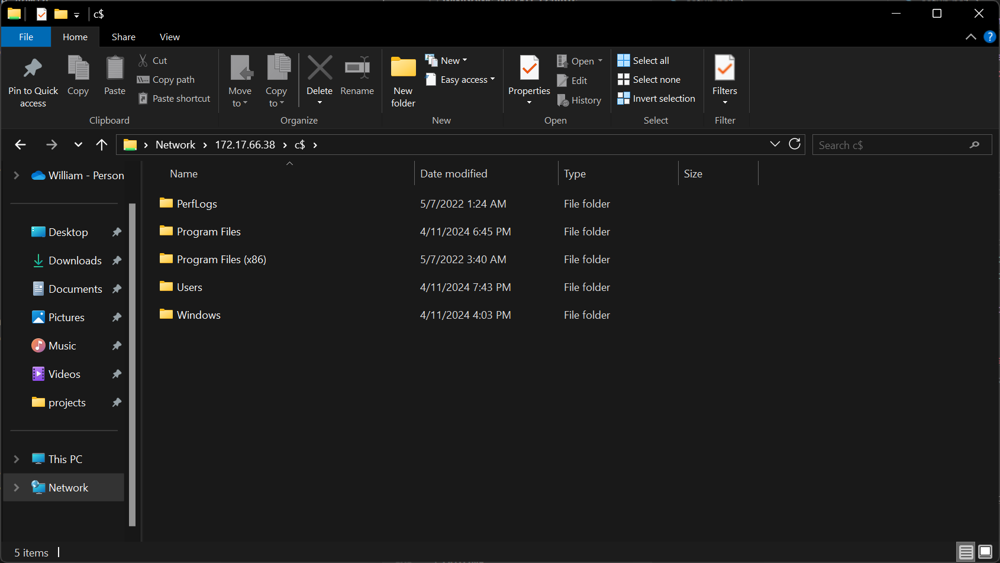

# C$

There are hidden 'administrative' drive shares on every Windows installation. You can view a list of configured shares with the `net share` command:

```txt
C:\Users\liam>net share

Share name   Resource                        Remark

-------------------------------------------------------------------------------
C$           C:\                             Default share
IPC$                                         Remote IPC
ADMIN$       C:\Windows                      Remote Admin
```

I use it for (fairly) direct filesystem access to guest VMs from my workstations (over an inaccessible internal network).

# Enabling

Do this on the guest - the machine hosting the share you want access to.

File and Printer Sharing must be enabled for the network you're using. You can do this with Powershell:

```Powershell
Set-NetFirewallRule -DisplayGroup "File And Printer Sharing" -Enabled True -Profile Any
```

netsh:
```txt
netsh advfirewall firewall set rule group="File and Printer Sharing" new enable=Yes
```

If you would like to connect using local account credentials from the guest, the "LocalAccountTokenFilterPolicy" (controls remote access to members of the Administrators group) 32 bit Registry key must be set to "1". This sidesteps remote access restrictions for privileged accounts which is obviously a security risk. Do not do this in a production environment.

```Powershell
New-ItemProperty "HKLM:\SOFTWARE\Microsoft\Windows\CurrentVersion\Policies\System" -Name LocalAccountTokenFilterPolicy -Value 1 -PropertyType DWORD -Force
```

```Powershell
Set-NetFirewallRule -DisplayGroup "File And Printer Sharing" -Enabled True -Profile Any & New-ItemProperty "HKLM:\SOFTWARE\Microsoft\Windows\CurrentVersion\Policies\System" -Name LocalAccountTokenFilterPolicy -Value 1 -PropertyType DWORD -Force
```

You can access the administrative shares by navigating to `\\computer\drive-letter$` (here `\\172.17.66.38\C$`):



# Disabling

```Powershell
Remove-ItemProperty "HKLM:\SOFTWARE\Microsoft\Windows\CurrentVersion\Policies\System" -Name LocalAccountTokenFilterPolicy
```

Optionally, disable file and printer sharing:

```Powershell
Set-NetFirewallRule -DisplayGroup "File And Printer Sharing" -Enabled False -Profile Any
```